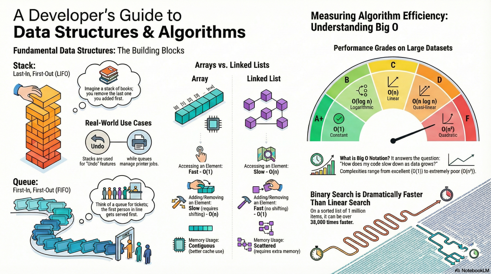

# Data Structures and Algorithms in C++

> “Talk is cheap. Show me the time complexity.”

- Author: [Kintsugi-Programmer](https://github.com/kintsugi-programmer)



> Disclaimer: The content presented here is a curated blend of my personal learning journey, experiences, open-source documentation, and invaluable knowledge gained from diverse sources. I do not claim sole ownership over all the material; this is a community-driven effort to learn, share, and grow together.

## Table of Contents
- [Data Structures and Algorithms in C++](#data-structures-and-algorithms-in-c)
  - [Table of Contents](#table-of-contents)
- [Basics to Intermediate Data Structures and Algorithms in C++](#basics-to-intermediate-data-structures-and-algorithms-in-c)
  - [Introduction](#introduction)
    - [What is a Data Structure?](#what-is-a-data-structure)
    - [What is an Algorithm?](#what-is-an-algorithm)
    - [Why Learn Data Structures and Algorithms?](#why-learn-data-structures-and-algorithms)
  - [Data Structures](#data-structures)
    - [Stack (LIFO - Last In First Out)](#stack-lifo---last-in-first-out)
      - [Stack Operations:](#stack-operations)
      - [Stack Implementation in C++:](#stack-implementation-in-c)
      - [Stack Methods:](#stack-methods)
      - [Real-World Uses of Stacks:](#real-world-uses-of-stacks)
    - [Queue (FIFO - First In First Out)](#queue-fifo---first-in-first-out)
      - [Queue Operations:](#queue-operations)
      - [Queue Implementation in C++:](#queue-implementation-in-c)
      - [Queue Methods:](#queue-methods)
      - [Real-World Uses of Queues:](#real-world-uses-of-queues)
    - [Priority Queue](#priority-queue)
      - [Priority Queue Implementation in C++:](#priority-queue-implementation-in-c)
      - [Real-World Applications:](#real-world-applications)
    - [Linked List](#linked-list)
      - [Linked List Node Structure:](#linked-list-node-structure)
      - [Singly Linked List Implementation:](#singly-linked-list-implementation)
      - [Advantages of Linked Lists:](#advantages-of-linked-lists)
      - [Disadvantages of Linked Lists:](#disadvantages-of-linked-lists)
    - [Dynamic Array (Vector)](#dynamic-array-vector)
      - [Vector Implementation in C++:](#vector-implementation-in-c)
      - [Custom Dynamic Array Implementation:](#custom-dynamic-array-implementation)
      - [Operations Time Complexity:](#operations-time-complexity)
  - [Algorithms](#algorithms)
    - [Big O Notation](#big-o-notation)
      - [Common Big O Complexities (Best to Worst):](#common-big-o-complexities-best-to-worst)
  - [Search Algorithms](#search-algorithms)
    - [Linear Search](#linear-search)
      - [Implementation:](#implementation)
      - [Characteristics:](#characteristics)
    - [Binary Search](#binary-search)
      - [Implementation:](#implementation-1)
      - [Characteristics:](#characteristics-1)
  - [Sorting Algorithms](#sorting-algorithms)
    - [Bubble Sort](#bubble-sort)
      - [Implementation:](#implementation-2)
      - [Characteristics:](#characteristics-2)
    - [Selection Sort](#selection-sort)
      - [Implementation:](#implementation-3)
      - [Characteristics:](#characteristics-3)
    - [Quick Sort](#quick-sort)
      - [Implementation:](#implementation-4)
      - [Characteristics:](#characteristics-4)
    - [Merge Sort](#merge-sort)
      - [Implementation:](#implementation-5)
      - [Characteristics:](#characteristics-5)
  - [Advanced Data Structures](#advanced-data-structures)
    - [Graph](#graph)
      - [Adjacency List Implementation:](#adjacency-list-implementation)
    - [Binary Search Tree (BST)](#binary-search-tree-bst)
      - [Implementation:](#implementation-6)
      - [BST Time Complexities:](#bst-time-complexities)
  - [Conclusion](#conclusion)
  - [Quick Reference: Time Complexities](#quick-reference-time-complexities)
    - [Data Structures Access Patterns:](#data-structures-access-patterns)
    - [Sorting Algorithms Comparison:](#sorting-algorithms-comparison)
- [Advanced Data Structures and Algorithms in C++](#advanced-data-structures-and-algorithms-in-c)
  - [Hash Table / Unordered Map / Unordered Set](#hash-table--unordered-map--unordered-set)
    - [Concepts](#concepts)
      - [Key Terminology:](#key-terminology)
    - [C++ STL Implementation (Recommended)](#c-stl-implementation-recommended)
    - [Custom Hash Table Implementation](#custom-hash-table-implementation)
    - [Common Interview Problems](#common-interview-problems)
    - [Time Complexities (Hash Tables)](#time-complexities-hash-tables)
  - [Heaps (Min Heap \& Max Heap)](#heaps-min-heap--max-heap)
    - [Heap Properties](#heap-properties)
      - [Key Operations:](#key-operations)
    - [Min Heap Implementation](#min-heap-implementation)
    - [Max Heap Implementation](#max-heap-implementation)
  - [Balanced Trees (AVL \& Red-Black Trees)](#balanced-trees-avl--red-black-trees)
    - [AVL Tree Concepts](#avl-tree-concepts)
      - [Balance Factor:](#balance-factor)
      - [Rotations:](#rotations)
    - [AVL Tree Implementation](#avl-tree-implementation)
    - [Red-Black Tree Concepts](#red-black-tree-concepts)
  - [Trie (Prefix Tree)](#trie-prefix-tree)
    - [Trie Node Structure](#trie-node-structure)
    - [Common Trie Problems](#common-trie-problems)
  - [Disjoint Set Union (Union-Find / DSU)](#disjoint-set-union-union-find--dsu)
    - [Union-Find Implementation](#union-find-implementation)
    - [DSU Applications](#dsu-applications)
  - [Heap Sort](#heap-sort)
    - [Time Complexities (Heap Sort)](#time-complexities-heap-sort)
  - [Two-Pointer Techniques](#two-pointer-techniques)
  - [Sliding Window](#sliding-window)
  - [Backtracking](#backtracking)
  - [Dynamic Programming](#dynamic-programming)
  - [Advanced Graph Algorithms](#advanced-graph-algorithms)
    - [Dijkstra's Algorithm](#dijkstras-algorithm)
    - [Prim's Algorithm (MST)](#prims-algorithm-mst)
    - [Topological Sort (Kahn's Algorithm)](#topological-sort-kahns-algorithm)
    - [Floyd-Warshall Algorithm](#floyd-warshall-algorithm)
  - [Segment Tree](#segment-tree)
  - [Time Complexity Summary Table](#time-complexity-summary-table)
  - [Key Interview Takeaways](#key-interview-takeaways)
- [Expert DSA in C++](#expert-dsa-in-c)
  - [1. Advanced Graph Theory](#1-advanced-graph-theory)
    - [1.1 Bellman-Ford Algorithm (Handles Negative Weights)](#11-bellman-ford-algorithm-handles-negative-weights)
    - [1.2 Topological Sort using DFS](#12-topological-sort-using-dfs)
    - [1.3 Tarjan's Algorithm (Strongly Connected Components)](#13-tarjans-algorithm-strongly-connected-components)
    - [1.4 Bridges in Graph (Tarjan's Algorithm)](#14-bridges-in-graph-tarjans-algorithm)
    - [1.5 Bipartite Graph Check](#15-bipartite-graph-check)
  - [2. Advanced Trees \& LCA Techniques](#2-advanced-trees--lca-techniques)
    - [2.1 Lowest Common Ancestor (Binary Lifting)](#21-lowest-common-ancestor-binary-lifting)
    - [2.2 Fenwick Tree (Binary Indexed Tree)](#22-fenwick-tree-binary-indexed-tree)
    - [2.3 Sparse Table (Static RMQ)](#23-sparse-table-static-rmq)
  - [3. String Algorithms](#3-string-algorithms)
    - [3.1 KMP (Knuth-Morris-Pratt)](#31-kmp-knuth-morris-pratt)
    - [3.2 Z-Algorithm](#32-z-algorithm)
    - [3.3 Rabin-Karp (Rolling Hash)](#33-rabin-karp-rolling-hash)
    - [3.4 Manacher's Algorithm (Longest Palindromic Substring)](#34-manachers-algorithm-longest-palindromic-substring)
  - [4. Advanced Dynamic Programming](#4-advanced-dynamic-programming)
    - [4.1 DP on Trees](#41-dp-on-trees)
    - [4.2 Digit DP](#42-digit-dp)
    - [4.3 Bitmask DP (Travelling Salesman Problem)](#43-bitmask-dp-travelling-salesman-problem)
    - [4.4 Matrix Exponentiation](#44-matrix-exponentiation)
  - [5. Mathematics for DSA](#5-mathematics-for-dsa)
    - [5.1 Sieve of Eratosthenes](#51-sieve-of-eratosthenes)
    - [5.2 Modular Exponentiation](#52-modular-exponentiation)
    - [5.3 Modular Inverse (Fermat's Little Theorem)](#53-modular-inverse-fermats-little-theorem)
    - [5.4 Extended Euclidean Algorithm](#54-extended-euclidean-algorithm)
    - [5.5 Combinatorics (nCr with Modular Arithmetic)](#55-combinatorics-ncr-with-modular-arithmetic)
  - [6. Advanced Greedy Algorithms](#6-advanced-greedy-algorithms)
    - [6.1 Activity Selection / Interval Scheduling](#61-activity-selection--interval-scheduling)
    - [6.2 Job Sequencing with Deadlines](#62-job-sequencing-with-deadlines)
    - [6.3 Gas Station Problem](#63-gas-station-problem)
  - [7. C++ STL Mastery](#7-c-stl-mastery)
    - [7.1 Custom Comparators](#71-custom-comparators)
    - [7.2 Lower Bound, Upper Bound, Equal Range](#72-lower-bound-upper-bound-equal-range)
    - [7.3 Monotonic Stack \& Queue](#73-monotonic-stack--queue)
    - [7.4 Multiset \& Multimap](#74-multiset--multimap)
  - [8. Problem-Solving Techniques](#8-problem-solving-techniques)
    - [8.1 Binary Search on Answer](#81-binary-search-on-answer)
    - [8.2 Meet-in-the-Middle](#82-meet-in-the-middle)
    - [8.3 Floyd Cycle Detection (Linked List)](#83-floyd-cycle-detection-linked-list)
    - [8.4 Two Heap Technique (Median Finder)](#84-two-heap-technique-median-finder)
  - [Complete Time Complexity Reference](#complete-time-complexity-reference)
    - [Data Structures](#data-structures-1)
    - [Algorithms](#algorithms-1)
  - [Interview Mastery Checklist](#interview-mastery-checklist)
- [DSA Rabbit Holes: Advanced Topics Beyond Core Algorithms](#dsa-rabbit-holes-advanced-topics-beyond-core-algorithms)
  - [1. Advanced Trees (Missing Pieces)](#1-advanced-trees-missing-pieces)
    - [Splay Tree](#splay-tree)
      - [Splay Tree Implementation:](#splay-tree-implementation)
    - [Treap (Tree + Heap Hybrid)](#treap-tree--heap-hybrid)
      - [Treap Implementation:](#treap-implementation)
    - [Cartesian Tree](#cartesian-tree)
      - [Cartesian Tree Construction:](#cartesian-tree-construction)
    - [K-D Tree (For Multidimensional Queries)](#k-d-tree-for-multidimensional-queries)
      - [K-D Tree (2D Example):](#k-d-tree-2d-example)
  - [2. Advanced Graph Theory](#2-advanced-graph-theory)
    - [Johnson's Algorithm (All-Pairs Shortest Paths)](#johnsons-algorithm-all-pairs-shortest-paths)
    - [Max Flow (Edmonds-Karp \& Dinic's)](#max-flow-edmonds-karp--dinics)
      - [Edmonds-Karp (BFS-based Ford-Fulkerson):](#edmonds-karp-bfs-based-ford-fulkerson)
      - [Dinic's Algorithm (More Efficient):](#dinics-algorithm-more-efficient)
    - [Min-Cost Max-Flow](#min-cost-max-flow)
    - [Hungarian Algorithm (Assignment Problem)](#hungarian-algorithm-assignment-problem)
    - [Eulerian Path / Circuit](#eulerian-path--circuit)
    - [Articulation Points (Cut Vertices)](#articulation-points-cut-vertices)
    - [Biconnected Components](#biconnected-components)
  - [3. Advanced DP](#3-advanced-dp)
    - [DP with Bitsets](#dp-with-bitsets)
    - [DP with Convex Hull Trick (CHT)](#dp-with-convex-hull-trick-cht)
    - [Knuth Optimization](#knuth-optimization)
    - [Divide \& Conquer Optimization](#divide--conquer-optimization)
    - [SOS DP (Sum Over Subsets)](#sos-dp-sum-over-subsets)
    - [DP on Bitmasks (General Forms)](#dp-on-bitmasks-general-forms)
  - [4. Geometry Algorithms](#4-geometry-algorithms)
    - [Convex Hull (Graham Scan)](#convex-hull-graham-scan)
    - [Line Intersection \& Orientation](#line-intersection--orientation)
    - [Closest Pair of Points](#closest-pair-of-points)
    - [Sweep Line Algorithms](#sweep-line-algorithms)
    - [Polygon Area](#polygon-area)
  - [5. Probability / Randomized Algorithms](#5-probability--randomized-algorithms)
    - [Randomized QuickSort](#randomized-quicksort)
    - [Reservoir Sampling](#reservoir-sampling)
    - [Monte Carlo vs Las Vegas](#monte-carlo-vs-las-vegas)
    - [Bloom Filters](#bloom-filters)
  - [6. Advanced Hashing](#6-advanced-hashing)
    - [Double Hashing](#double-hashing)
    - [Polynomial Rolling Hash (Deep)](#polynomial-rolling-hash-deep)
  - [7. Compression / Encoding](#7-compression--encoding)
    - [Huffman Coding](#huffman-coding)
    - [Run-Length Encoding](#run-length-encoding)
  - [8. Memory \& Low-Level DSA Concepts](#8-memory--low-level-dsa-concepts)
    - [Cache-Friendly Algorithms](#cache-friendly-algorithms)
    - [Amortized Analysis (Potential Method)](#amortized-analysis-potential-method)
    - [Custom Allocators (C++)](#custom-allocators-c)
  - [Summary: Master Map](#summary-master-map)
- [DSA Black Hole](#dsa-black-hole)
  - [1. Advanced Persistent Structures](#1-advanced-persistent-structures)
    - [Persistent Segment Tree](#persistent-segment-tree)
    - [Persistent Disjoint Set Union (DSU)](#persistent-disjoint-set-union-dsu)
    - [Persistent Fenwick Tree](#persistent-fenwick-tree)
  - [2. Heavy-Light Decomposition (HLD)](#2-heavy-light-decomposition-hld)
  - [3. Mo's Algorithm](#3-mos-algorithm)
  - [4. Suffix Array / Suffix Tree](#4-suffix-array--suffix-tree)
  - [5. Advanced Graph Algorithms](#5-advanced-graph-algorithms)
    - [Centroid Decomposition](#centroid-decomposition)
    - [2-SAT with Kosaraju](#2-sat-with-kosaraju)
  - [6. Number Theory Deep](#6-number-theory-deep)
    - [Miller-Rabin Primality Test](#miller-rabin-primality-test)
    - [Pollard's Rho Factorization](#pollards-rho-factorization)
    - [Chinese Remainder Theorem (CRT)](#chinese-remainder-theorem-crt)
  - [7. Range Query Data Structures](#7-range-query-data-structures)
    - [Wavelet Tree](#wavelet-tree)
  - [8. Polynomial Algorithms](#8-polynomial-algorithms)
    - [Lagrange Interpolation](#lagrange-interpolation)

---

# Basics to Intermediate Data Structures and Algorithms in C++

---

## Introduction

### What is a Data Structure?

- **data structure** is a named location that can be used to store and organize da It's a way to manage and structure information efficiently.

**Real-life Example:**
- A family tree is a data structure that represents a hierarchy of family relationships
- Arrays are collections of elements stored at contiguous memory locations
- Trees organize data hierarchically

**Key Concept:** Different data structures store and organize data in different ways, each with their own advantages and disadvantages.

### What is an Algorithm?

An **algorithm** is a collection of steps to solve a probl It's a set of instructions to reach a solution.

### Why Learn Data Structures and Algorithms?
 Write code that is both **time and memory efficient** **Commonly asked questions** in coding job interviews Improve problem-solving skills in technical assessments

---

## Data Structures

### Stack (LIFO - Last In First Out)

A **stack** is a LIFO data structure that stores objects in a vertical tower-like structure, similar to a stack of books or CDs.

#### Stack Operations:
- **Push:** Add an object to the top of the stack
- **Pop:** Remove an object from the top of the stack
- **Peek:** View the object at the top without removing it
- **Empty:** Check if the stack is empty
- **Size:** Get the number of elements

#### Stack Implementation in C++:

```cpp
#include <iostream>
#include <stack>
#include <string>

using namespace std;

int main() {
    stack<string> gameStack;
    
    // Push elements
    gameStack.push("Minecraft");
    gameStack.push("Skyrim");
    gameStack.push("Doom");
    gameStack.push("Borderlands");
    gameStack.push("Final Fantasy VII");
    
    // Check if empty
    cout << "Empty: " << (gameStack.empty() ? "true" : "false") << endl; // false
    
    // Get size
    cout << "Size: " << gameStack.size() << endl; // 5
    
    // Pop element (removes and returns)
    string game = gameStack.top(); // Returns "Final Fantasy VII"
    cout << "Top: " << game << endl;
    gameStack.pop();
    
    // Peek at top element (view without removing)
    cout << "New top: " << gameStack.top() << endl; // Borderlands
    
    // Print all elements by popping
    while (!gameStack.empty()) {
        cout << gameStack.top() << " ";
        gameStack.pop();
    }
    cout << endl;
    
    return 0;
}
```

#### Stack Methods:
| Method | Description | Returns |
|--------|-------------|---------| 
| `push(E)` | Add element to top | void |
| `pop()` | Remove top element | void |
| `top()` | View top element | Element |
| `empty()` | Check if stack is empty | bool |
| `size()` | Get number of elements | size_t |

#### Real-World Uses of Stacks:
- **Undo/Redo Features** - Text editors use stacks to track changes
- **Browser History** - Back button navigation
- **Backtracking Algorithms** - Maze navigation, file directory searches
- **Function Calls** - Call stack in programming languages

---

### Queue (FIFO - First In First Out)

A- **queue** is a FIFO data structure designed for holding elements prior to processing.

#### Queue Operations:
- **Push/Enqueue:** Add an element to the back/end of the queue
- **Pop/Dequeue:** Remove an element from the front of the queue
- **Front:** Examine the front element without removing it
- **Empty:** Check if the queue is empty
- **Size:** Get the number of elements

#### Queue Implementation in C++:

```cpp
#include <iostream>
#include <queue>
#include <string>

using namespace std;

int main() {
    queue<string> peopleQueue;
    
    // Enqueue (add to back)
    peopleQueue.push("Karen");
    peopleQueue.push("Chad");
    peopleQueue.push("Steve");
    peopleQueue.push("Harold");
    
    // Display front
    cout << "Front: " << peopleQueue.front() << endl; // Karen
    
    // Dequeue (remove from front)
    peopleQueue.pop(); // Karen removed
    cout << "Front after pop: " << peopleQueue.front() << endl; // Chad
    
    // Check if empty
    cout << "Empty: " << (peopleQueue.empty() ? "true" : "false") << endl; // false
    
    // Get size
    cout << "Size: " << peopleQueue.size() << endl; // 3
    
    // Print all elements by dequeuing
    while (!peopleQueue.empty()) {
        cout << peopleQueue.front() << " ";
        peopleQueue.pop();
    }
    cout << endl;
    
    return 0;
}
```

#### Queue Methods:
| Method | Description | Returns |
|--------|-------------|---------| 
| `push(E)` | Add element to back | void |
| `pop()` | Remove and return front | void |
| `front()` | View front element | Element |
| `back()` | View back element | Element |
| `empty()` | Check if queue is empty | bool |
| `size()` | Get number of elements | size_t |

#### Real-World Uses of Queues:
- **Keyboard Buffers** - Characters typed are processed in order
- **Printer Queues** - Print jobs completed in order
- **Breadth-First Search (BFS)** - Graph traversal algorithm
- **Process Scheduling** - Operating systems

---

### Priority Queue

A **priority queue** is a queue where elements are served based on their priority rather than simple FIFO order.

#### Priority Queue Implementation in C++:

```cpp
#include <iostream>
#include <queue>

using namespace std;

int main() {
    // Default - max-heap (largest first)
    priority_queue<double> pQueue;
    
    pQueue.push(3.0);
    pQueue.push(2.5);
    pQueue.push(4.0);
    pQueue.push(1.5);
    pQueue.push(2.0);
    
    // Popping returns elements in descending order
    while (!pQueue.empty()) {
        cout << pQueue.top() << " ";
        pQueue.pop();
    }
    cout << endl; // Output: 4 3 2.5 2 1.5
    
    // For ascending order (min-heap)
    priority_queue<double, vector<double>, greater<double>> minPQueue;
    
    minPQueue.push(3.0);
    minPQueue.push(2.5);
    minPQueue.push(4.0);
    
    while (!minPQueue.empty()) {
        cout << minPQueue.top() << " ";
        minPQueue.pop();
    }
    cout << endl; // Output: 1.5 2 2.5 3 4
    
    return 0;
}
```

#### Real-World Applications:
- Task scheduling with priority levels
- Dijkstra's shortest path algorithm
- Huffman coding
- Load balancing in systems

---

### Linked List

A **linked list** is a data structure consisting of a chain of nod Each node contains data and a pointer to the next node.

#### Linked List Node Structure:

```cpp
template <typename T>
struct Node {
    T data;
    Node* next;
    
    Node(T value) : data(value), next(nullptr) {}
};

template <typename T>
struct DoublyNode {
    T data;
    DoublyNode* next;
    DoublyNode* prev;
    
    DoublyNode(T value) : data(value), next(nullptr), prev(nullptr) {}
};
```

#### Singly Linked List Implementation:

```cpp
#include <iostream>
using namespace std;

template <typename T>
struct Node {
    T data;
    Node* next;
    Node(T value) : data(value), next(nullptr) {}
};

template <typename T>
class SinglyLinkedList {
private:
    Node<T>* head;
    
public:
    SinglyLinkedList() : head(nullptr) {}
    
    // Add to front
    void addFront(T value) {
        Node<T>* newNode = new Node<T>(value);
        newNode->next = head;
        head = newNode;
    }
    
    // Add to end
    void addEnd(T value) {
        Node<T>* newNode = new Node<T>(value);
        if (head == nullptr) {
            head = newNode;
            return;
        }
        
        Node<T>* current = head;
        while (current->next != nullptr) {
            current = current->next;
        }
        current->next = newNode;
    }
    
    // Insert at specific position
    void insertAt(int position, T value) {
        if (position == 0) {
            addFront(value);
            return;
        }
        
        Node<T>* current = head;
        for (int i = 0; i < position - 1 && current != nullptr; i++) {
            current = current->next;
        }
        
        if (current == nullptr) return;
        
        Node<T>* newNode = new Node<T>(value);
        newNode->next = current->next;
        current->next = newNode;
    }
    
    // Remove from front
    void removeFront() {
        if (head == nullptr) return;
        Node<T>* temp = head;
        head = head->next;
        delete temp;
    }
    
    // Remove specific element
    void remove(T value) {
        if (head == nullptr) return;
        
        if (head->data == value) {
            Node<T>* temp = head;
            head = head->next;
            delete temp;
            return;
        }
        
        Node<T>* current = head;
        while (current->next != nullptr) {
            if (current->next->data == value) {
                Node<T>* temp = current->next;
                current->next = current->next->next;
                delete temp;
                return;
            }
            current = current->next;
        }
    }
    
    // Search for element
    int search(T value) {
        Node<T>* current = head;
        int position = 0;
        
        while (current != nullptr) {
            if (current->data == value) {
                return position;
            }
            current = current->next;
            position++;
        }
        return -1; // Not found
    }
    
    // Display list
    void display() {
        Node<T>* current = head;
        while (current != nullptr) {
            cout << current->data << " -> ";
            current = current->next;
        }
        cout << "nullptr" << endl;
    }
    
    // Check if empty
    bool isEmpty() {
        return head == nullptr;
    }
    
    // Destructor
    ~SinglyLinkedList() {
        while (head != nullptr) {
            removeFront();
        }
    }
};

int main() {
    SinglyLinkedList<string> list;
    
    list.addFront("C");
    list.addFront("B");
    list.addFront("A");
    list.addEnd("D");
    list.addEnd("E");
    
    list.display(); // A -> B -> C -> D -> E -> nullptr
    
    cout << "Search B: " << list.search("B") << endl; // 1
    cout << "Search Z: " << list.search("Z") << endl; // -1
    
    list.insertAt(2, "X");
    list.display(); // A -> B -> X -> C -> D -> E -> nullptr
    
    list.remove("X");
    list.display(); // A -> B -> C -> D -> E -> nullptr
    
    return 0;
}
```

#### Advantages of Linked Lists:
- **Dynamic data structure** - Allocates memory during runtime
- **Easy insertion/deletion** - O(1) constant time (no shifting)
- **No memory waste** - Uses only what's needed

#### Disadvantages of Linked Lists:
- **Greater memory usage** - Must store additional pointers
- **No random access** - Must traverse from head
- **Slow searching** - O(n) linear time

---

### Dynamic Array (Vector)

A **dynamic array** is an array with resizable capaci In C++, this is represented by `vector`.

#### Vector Implementation in C++:

```cpp
#include <iostream>
#include <vector>

using namespace std;

int main() {
    vector<string> vec;
    
    // Add elements
    vec.push_back("A");
    vec.push_back("B");
    vec.push_back("C");
    
    // Insert at specific index
    vec.insert(vec.begin(), "X"); // Insert X at index 0
    
    // Remove element
    vec.erase(vec.begin()); // Remove first element
    vec.erase(vec.begin() + 1); // Remove at index 1
    
    // Access by index
    cout << "First: " << vec[0] << endl;
    cout << "Last: " << vec[vec.size() - 1] << endl;
    
    // Search
    auto it = find(vec.begin(), vec.end(), "B");
    if (it != vec.end()) {
        cout << "Found at index: " << distance(vec.begin(), it) << endl;
    }
    
    // Get size and capacity
    cout << "Size: " << vec.size() << endl;
    cout << "Capacity: " << vec.capacity() << endl;
    
    // Display
    for (const auto& element : vec) {
        cout << element << " ";
    }
    cout << endl;
    
    return 0;
}
```

#### Custom Dynamic Array Implementation:

```cpp
#include <iostream>
using namespace std;

template <typename T>
class DynamicArray {
private:
    T* array;
    int size;
    int capacity;
    
    void grow() {
        int newCapacity = capacity * 2;
        T* newArray = new T[newCapacity];
        
        for (int i = 0; i < size; i++) {
            newArray[i] = array[i];
        }
        
        delete[] array;
        array = newArray;
        capacity = newCapacity;
    }
    
    void shrink() {
        int newCapacity = capacity / 2;
        T* newArray = new T[newCapacity];
        
        for (int i = 0; i < size; i++) {
            newArray[i] = array[i];
        }
        
        delete[] array;
        array = newArray;
        capacity = newCapacity;
    }
    
public:
    DynamicArray(int initialCapacity = 10) 
        : capacity(initialCapacity), size(0) {
        array = new T[capacity];
    }
    
    // Add element
    void add(T data) {
        if (size >= capacity) {
            grow();
        }
        array[size] = data;
        size++;
    }
    
    // Insert at specific index
    void insert(int index, T data) {
        if (size >= capacity) {
            grow();
        }
        
        for (int i = size - 1; i >= index; i--) {
            array[i + 1] = array[i];
        }
        
        array[index] = data;
        size++;
    }
    
    // Delete element
    void deleteElement(T data) {
        for (int i = 0; i < size; i++) {
            if (array[i] == data) {
                for (int j = i; j < size - 1; j++) {
                    array[j] = array[j + 1];
                }
                size--;
                
                if (size <= capacity / 3) {
                    shrink();
                }
                break;
            }
        }
    }
    
    // Get element at index
    T get(int index) {
        if (index >= 0 && index < size) {
            return array[index];
        }
        throw out_of_range("Index out of bounds");
    }
    
    // Search for element
    int search(T data) {
        for (int i = 0; i < size; i++) {
            if (array[i] == data) {
                return i;
            }
        }
        return -1;
    }
    
    // Check if empty
    bool isEmpty() {
        return size == 0;
    }
    
    // Get size
    int getSize() {
        return size;
    }
    
    // Get capacity
    int getCapacity() {
        return capacity;
    }
    
    // Display
    void display() {
        cout << "[";
        for (int i = 0; i < size; i++) {
            cout << array[i];
            if (i < size - 1) cout << ", ";
        }
        cout << "]" << endl;
    }
    
    // Destructor
    ~DynamicArray() {
        delete[] array;
    }
};

int main() {
    DynamicArray<int> arr;
    
    arr.add(10);
    arr.add(20);
    arr.add(30);
    arr.add(40);
    
    arr.display(); // [10, 20, 30, 40]
    
    arr.insert(2, 25);
    arr.display(); // [10, 20, 25, 30, 40]
    
    cout << "Search 25: " << arr.search(25) << endl; // 2
    
    arr.deleteElement(25);
    arr.display(); // [10, 20, 30, 40]
    
    return 0;
}
```

#### Operations Time Complexity:
| Operation | Time Complexity |
|-----------|-----------------| 
| Random access (by index) | O(1) |
| Search | O(n) |
| Insert at end | O(1) - amortized |
| Insert at beginning | O(n) - requires shifting |
| Delete | O(n) - requires shifting |

---

## Algorithms

### Big O Notation

**Definition:** A notation that describes the performance of an algorithm as the amount of data increases.

#### Common Big O Complexities (Best to Worst):
| Complexity | Name | Example |
|-----------|------|---------| 
| O(1) | Constant | Accessing array element by index |
| O(log n) | Logarithmic | Binary search |
| O(n) | Linear | Loop through array |
| O(n log n) | Quasi-linear | Quick sort, merge sort |
| O(n²) | Quadratic | Bubble sort, nested loops |
| O(2ⁿ) | Exponential | Recursive fibonacci |
| O(n!) | Factorial | Permutations |

---

## Search Algorithms

### Linear Search

**Definition:** An algorithm that checks each element sequentially until the target is found.

#### Implementation:

```cpp
#include <iostream>
#include <vector>

using namespace std;

int linearSearch(const vector<int>& array, int value) {
    for (int i = 0; i < array.size(); i++) {
        if (array[i] == value) {
            return i; // Element found
        }
    }
    return -1; // Element not found
}

int main() {
    vector<int> array = {5, 2, 8, 1, 9, 3, 7};
    
    int index = linearSearch(array, 1);
    
    if (index != -1) {
        cout << "Element found at index: " << index << endl;
    } else {
        cout << "Element not found" << endl;
    }
    
    return 0;
}
```

#### Characteristics:
- Time Complexity: **O(n)**
- Works with **unsorted data**
- Simple to implement

---

### Binary Search

**Definition:** An algorithm that eliminates half of the remaining elements with each comparis Only works on **sorted data**.

#### Implementation:

```cpp
#include <iostream>
#include <vector>

using namespace std;

int binarySearch(const vector<int>& array, int target) {
    int low = 0;
    int high = array.size() - 1;
    
    while (low <= high) {
        int middle = low + (high - low) / 2;
        int value = array[middle];
        
        if (value == target) {
            return middle; // Found
        } else if (value < target) {
            low = middle + 1; // Search right
        } else {
            high = middle - 1; // Search left
        }
    }
    
    return -1; // Not found
}

// Recursive implementation
int binarySearchRecursive(const vector<int>& array, int target, int low, int high) {
    if (low > high) {
        return -1; // Not found
    }
    
    int middle = low + (high - low) / 2;
    
    if (array[middle] == target) {
        return middle;
    } else if (array[middle] < target) {
        return binarySearchRecursive(array, target, middle + 1, high);
    } else {
        return binarySearchRecursive(array, target, low, middle - 1);
    }
}

int main() {
    vector<int> array = {1, 3, 5, 7, 9, 11, 13, 15, 17, 19};
    
    int index = binarySearch(array, 7);
    
    if (index != -1) {
        cout << "Element found at index: " << index << endl;
    } else {
        cout << "Element not found" << endl;
    }
    
    return 0;
}
```

#### Characteristics:
- Time Complexity: **O(log n)**
- **MUST be sorted**
- **Much faster** for large datasets

---

## Sorting Algorithms

### Bubble Sort

**Definition:** A sorting algorithm that repeatedly compares adjacent elements and swaps them if they're in the wrong order.

#### Implementation:

```cpp
#include <iostream>
#include <vector>

using namespace std;

void bubbleSort(vector<int>& array) {
    for (int i = 0; i < array.size() - 1; i++) {
        for (int j = 0; j < array.size() - i - 1; j++) {
            if (array[j] > array[j + 1]) {
                // Swap
                int temp = array[j];
                array[j] = array[j + 1];
                array[j + 1] = temp;
            }
        }
    }
}

// For descending order
void bubbleSortDescending(vector<int>& array) {
    for (int i = 0; i < array.size() - 1; i++) {
        for (int j = 0; j < array.size() - i - 1; j++) {
            if (array[j] < array[j + 1]) { // Changed operator
                // Swap
                int temp = array[j];
                array[j] = array[j + 1];
                array[j + 1] = temp;
            }
        }
    }
}

void display(const vector<int>& array) {
    for (int element : array) {
        cout << element << " ";
    }
    cout << endl;
}

int main() {
    vector<int> array = {5, 2, 8, 1, 9};
    
    bubbleSort(array);
    
    cout << "Sorted: ";
    display(array); // 1 2 5 8 9
    
    return 0;
}
```

#### Characteristics:
- Time Complexity: **O(n²)**
- Space Complexity: **O(1)** - In-place
- **Simple but inefficient** for large datasets

---

### Selection Sort

**Definition:** A sorting algorithm that repeatedly finds the minimum element and places it at the beginning.

#### Implementation:

```cpp
#include <iostream>
#include <vector>

using namespace std;

void selectionSort(vector<int>& array) {
    for (int i = 0; i < array.size() - 1; i++) {
        int minIndex = i;
        
        // Find minimum in remaining array
        for (int j = i + 1; j < array.size(); j++) {
            if (array[j] < array[minIndex]) {
                minIndex = j;
            }
        }
        
        // Swap if needed
        if (minIndex != i) {
            int temp = array[i];
            array[i] = array[minIndex];
            array[minIndex] = temp;
        }
    }
}

void display(const vector<int>& array) {
    for (int element : array) {
        cout << element << " ";
    }
    cout << endl;
}

int main() {
    vector<int> array = {9, 1, 8, 2, 7, 3, 6, 4, 5};
    
    selectionSort(array);
    
    cout << "Sorted: ";
    display(array); // 1 2 3 4 5 6 7 8 9
    
    return 0;
}
```

#### Characteristics:
- Time Complexity: **O(n²)**
- Space Complexity: **O(1)** - In-place
- Minimal number of swaps

---

### Quick Sort

**Definition:** A divide-and-conquer sorting algorithm that partitions the array and recursively sorts sub-arrays.

#### Implementation:

```cpp
#include <iostream>
#include <vector>

using namespace std;

int partition(vector<int>& array, int low, int high) {
    int pivot = array[high];
    int i = low - 1;
    
    for (int j = low; j < high; j++) {
        if (array[j] < pivot) {
            i++;
            // Swap
            int temp = array[i];
            array[i] = array[j];
            array[j] = temp;
        }
    }
    
    // Swap pivot to correct position
    int temp = array[i + 1];
    array[i + 1] = array[high];
    array[high] = temp;
    
    return i + 1;
}

void quickSort(vector<int>& array, int low, int high) {
    if (low < high) {
        int pi = partition(array, low, high);
        
        quickSort(array, low, pi - 1);   // Sort left partition
        quickSort(array, pi + 1, high);  // Sort right partition
    }
}

void display(const vector<int>& array) {
    for (int element : array) {
        cout << element << " ";
    }
    cout << endl;
}

int main() {
    vector<int> array = {5, 2, 8, 1, 9, 3, 7};
    
    quickSort(array, 0, array.size() - 1);
    
    cout << "Sorted: ";
    display(array); // 1 2 3 5 7 8 9
    
    return 0;
}
```

#### Characteristics:
- Average Time Complexity: **O(n log n)**
- Worst Case: **O(n²)**
- Space Complexity: **O(log n)** (recursion stack)
- **Very efficient** in practice

---

### Merge Sort

**Definition:** A divide-and-conquer sorting algorithm that divides array in half and recursively merges sorted sub-arrays.

#### Implementation:

```cpp
#include <iostream>
#include <vector>

using namespace std;

void merge(vector<int>& array, int left, int mid, int right) {
    int leftSize = mid - left + 1;
    int rightSize = right - mid;
    
    vector<int> leftArray(leftSize);
    vector<int> rightArray(rightSize);
    
    // Copy data to temp arrays
    for (int i = 0; i < leftSize; i++) {
        leftArray[i] = array[left + i];
    }
    for (int i = 0; i < rightSize; i++) {
        rightArray[i] = array[mid + 1 + i];
    }
    
    // Merge the arrays
    int i = 0, j = 0, k = left;
    
    while (i < leftSize && j < rightSize) {
        if (leftArray[i] <= rightArray[j]) {
            array[k] = leftArray[i];
            i++;
        } else {
            array[k] = rightArray[j];
            j++;
        }
        k++;
    }
    
    // Copy remaining elements
    while (i < leftSize) {
        array[k] = leftArray[i];
        i++;
        k++;
    }
    while (j < rightSize) {
        array[k] = rightArray[j];
        j++;
        k++;
    }
}

void mergeSort(vector<int>& array, int left, int right) {
    if (left < right) {
        int mid = left + (right - left) / 2;
        
        mergeSort(array, left, mid);      // Sort left half
        mergeSort(array, mid + 1, right); // Sort right half
        merge(array, left, mid, right);   // Merge
    }
}

void display(const vector<int>& array) {
    for (int element : array) {
        cout << element << " ";
    }
    cout << endl;
}

int main() {
    vector<int> array = {5, 2, 8, 1, 9, 3, 7};
    
    mergeSort(array, 0, array.size() - 1);
    
    cout << "Sorted: ";
    display(array); // 1 2 3 5 7 8 9
    
    return 0;
}
```

#### Characteristics:
- Time Complexity: **O(n log n)** - Always
- Space Complexity: **O(n)** - Requires extra space
- **Guaranteed** good performance
- **Stable sort**

---

## Advanced Data Structures

### Graph

A **graph** is a collection of nodes (vertices) connected by edges (links).

#### Adjacency List Implementation:

```cpp
#include <iostream>
#include <vector>
#include <queue>

using namespace std;

class Graph {
private:
    int vertices;
    vector<vector<int>> adjacencyList;
    
public:
    Graph(int vertices) {
        this->vertices = vertices;
        adjacencyList.resize(vertices);
    }
    
    // Add edge (undirected)
    void addEdge(int u, int v) {
        adjacencyList[u].push_back(v);
        adjacencyList[v].push_back(u); // For undirected graph
    }
    
    // Add edge (directed)
    void addDirectedEdge(int u, int v) {
        adjacencyList[u].push_back(v);
    }
    
    // Check if edge exists
    bool hasEdge(int u, int v) {
        for (int neighbor : adjacencyList[u]) {
            if (neighbor == v) return true;
        }
        return false;
    }
    
    // Display graph
    void display() {
        for (int i = 0; i < vertices; i++) {
            cout << i << " -> ";
            for (int neighbor : adjacencyList[i]) {
                cout << neighbor << " ";
            }
            cout << endl;
        }
    }
    
    // Depth-First Search
    void dfs(int startVertex) {
        vector<bool> visited(vertices, false);
        dfsHelper(startVertex, visited);
    }
    
private:
    void dfsHelper(int vertex, vector<bool>& visited) {
        if (visited[vertex]) return;
        
        visited[vertex] = true;
        cout << vertex << " ";
        
        for (int neighbor : adjacencyList[vertex]) {
            if (!visited[neighbor]) {
                dfsHelper(neighbor, visited);
            }
        }
    }
    
public:
    // Breadth-First Search
    void bfs(int startVertex) {
        vector<bool> visited(vertices, false);
        queue<int> q;
        
        q.push(startVertex);
        visited[startVertex] = true;
        
        while (!q.empty()) {
            int vertex = q.front();
            q.pop();
            
            cout << vertex << " ";
            
            for (int neighbor : adjacencyList[vertex]) {
                if (!visited[neighbor]) {
                    q.push(neighbor);
                    visited[neighbor] = true;
                }
            }
        }
    }
};

int main() {
    Graph graph(5);
    
    graph.addDirectedEdge(0, 1);
    graph.addDirectedEdge(0, 2);
    graph.addDirectedEdge(1, 3);
    graph.addDirectedEdge(2, 3);
    graph.addDirectedEdge(3, 4);
    
    cout << "Graph:" << endl;
    graph.display();
    
    cout << "
    DFS from 0: ";
    graph.dfs(0);
    cout << endl;
    
    cout << "BFS from 0: ";
    graph.bfs(0);
    cout << endl;
    
    return 0;
}
```

---

### Binary Search Tree (BST)

A **Binary Search Tree** is a binary tree where each node has at most two children, and values follow the BST property.

#### Implementation:

```cpp
#include <iostream>
#include <queue>

using namespace std;

struct Node {
    int data;
    Node* left;
    Node* right;
    
    Node(int value) : data(value), left(nullptr), right(nullptr) {}
};

class BST {
private:
    Node* root;
    
    Node* insertHelper(Node* root, int data) {
        if (root == nullptr) {
            return new Node(data);
        }
        
        if (data < root->data) {
            root->left = insertHelper(root->left, data);
        } else if (data > root->data) {
            root->right = insertHelper(root->right, data);
        }
        
        return root;
    }
    
    bool searchHelper(Node* root, int data) {
        if (root == nullptr) return false;
        
        if (root->data == data) {
            return true;
        } else if (data < root->data) {
            return searchHelper(root->left, data);
        } else {
            return searchHelper(root->right, data);
        }
    }
    
    void inOrderHelper(Node* root) {
        if (root == nullptr) return;
        
        inOrderHelper(root->left);
        cout << root->data << " ";
        inOrderHelper(root->right);
    }
    
    void preOrderHelper(Node* root) {
        if (root == nullptr) return;
        
        cout << root->data << " ";
        preOrderHelper(root->left);
        preOrderHelper(root->right);
    }
    
    void postOrderHelper(Node* root) {
        if (root == nullptr) return;
        
        postOrderHelper(root->left);
        postOrderHelper(root->right);
        cout << root->data << " ";
    }
    
    int findMinHelper(Node* root) {
        while (root->left != nullptr) {
            root = root->left;
        }
        return root->data;
    }
    
    int findMaxHelper(Node* root) {
        while (root->right != nullptr) {
            root = root->right;
        }
        return root->data;
    }
    
    Node* removeHelper(Node* root, int data) {
        if (root == nullptr) return nullptr;
        
        if (data < root->data) {
            root->left = removeHelper(root->left, data);
        } else if (data > root->data) {
            root->right = removeHelper(root->right, data);
        } else {
            // Case 1: Leaf node
            if (root->left == nullptr && root->right == nullptr) {
                delete root;
                return nullptr;
            }
            
            // Case 2: Node has right child
            if (root->right != nullptr) {
                int successor = findMinHelper(root->right);
                root->data = successor;
                root->right = removeHelper(root->right, successor);
            }
            // Case 3: Node has only left child
            else {
                int predecessor = findMaxHelper(root->left);
                root->data = predecessor;
                root->left = removeHelper(root->left, predecessor);
            }
        }
        
        return root;
    }
    
    void deleteTreeHelper(Node* root) {
        if (root == nullptr) return;
        
        deleteTreeHelper(root->left);
        deleteTreeHelper(root->right);
        delete root;
    }
    
public:
    BST() : root(nullptr) {}
    
    void insert(int data) {
        root = insertHelper(root, data);
    }
    
    bool search(int data) {
        return searchHelper(root, data);
    }
    
    void inOrder() {
        inOrderHelper(root);
        cout << endl;
    }
    
    void preOrder() {
        preOrderHelper(root);
        cout << endl;
    }
    
    void postOrder() {
        postOrderHelper(root);
        cout << endl;
    }
    
    int findMin() {
        if (root == nullptr) throw runtime_error("Tree is empty");
        return findMinHelper(root);
    }
    
    int findMax() {
        if (root == nullptr) throw runtime_error("Tree is empty");
        return findMaxHelper(root);
    }
    
    void remove(int data) {
        if (!search(data)) {
            cout << data << " could not be found" << endl;
            return;
        }
        root = removeHelper(root, data);
    }
    
    ~BST() {
        deleteTreeHelper(root);
    }
};

int main() {
    BST bst;
    
    bst.insert(50);
    bst.insert(30);
    bst.insert(70);
    bst.insert(20);
    bst.insert(40);
    bst.insert(60);
    bst.insert(80);
    
    cout << "In-Order (sorted): ";
    bst.inOrder();
    
    cout << "Pre-Order: ";
    bst.preOrder();
    
    cout << "Post-Order: ";
    bst.postOrder();
    
    cout << "Min: " << bst.findMin() << endl;
    cout << "Max: " << bst.findMax() << endl;
    
    cout << "Search 40: " << (bst.search(40) ? "Found" : "Not found") << endl;
    
    bst.remove(20);
    cout << "After removing 20 - In-Order: ";
    bst.inOrder();
    
    return 0;
}
```

#### BST Time Complexities:
| Operation | Average | Worst Case |
|-----------|---------|-----------| 
| Search | O(log n) | O(n) |
| Insert | O(log n) | O(n) |
| Delete | O(log n) | O(n) |
| Traversal | O(n) | O(n) |

---

## Conclusion

This comprehensive C++ guide covers fundamental data structures and algorithms equivalent to the Java version.

**Data Structures Covered:**
- Stack (LIFO)
- Queue (FIFO)
- Priority Queue
- Linked List
- Dynamic Array/Vector
- Graph (Adjacency List)
- Binary Search Tree

**Algorithms Covered:**
- Linear Search - O(n)
- Binary Search - O(log n)
- Bubble Sort - O(n²)
- Selection Sort - O(n²)
- Quick Sort - O(n log n)
- Merge Sort - O(n log n)
- Depth-First Search - O(V + E)
- Breadth-First Search - O(V + E)

**Key Takeaways:** Choose the right data structure for your use case Understand time and space complexity Consider whether data needs to be sorted Know when to use each algorithm Practice implementing from scratch to understand deeply

Remember: The best data structure/algorithm depends on your specific problem requirements!

---

## Quick Reference: Time Complexities

### Data Structures Access Patterns:

| Operation | Array | Linked List | BST | Hash Table |
|-----------|-------|-------------|-----|-----------| 
| Access | O(1) | O(n) | O(log n) | O(1) avg |
| Search | O(n) | O(n) | O(log n) | O(1) avg |
| Insert | O(n) | O(1) | O(log n) | O(1) avg |
| Delete | O(n) | O(1) | O(log n) | O(1) avg |

### Sorting Algorithms Comparison:

| Algorithm | Best | Average | Worst | Space | Stable |
|-----------|------|---------|-------|-------|--------| 
| Bubble | O(n) | O(n²) | O(n²) | O(1) | Yes |
| Selection | O(n²) | O(n²) | O(n²) | O(1) | No |
| Quick | O(n log n) | O(n log n) | O(n²) | O(log n) | No |
| Merge | O(n log n) | O(n log n) | O(n log n) | O(n) | Yes |

---

# Advanced Data Structures and Algorithms in C++

---

## Hash Table / Unordered Map / Unordered Set

### Concepts

**Hash Table** uses a hash function to map keys to array indices, enabling O(1) average-case lookup.

#### Key Terminology:
- **Hash Function:** Converts key to array index
- **Collision:** Two keys hash to same index
- **Load Factor:** Elements / Array size
- **Rehashing:** Resizing table when load factor exceeds threshold

### C++ STL Implementation (Recommended)

```cpp
#include <iostream>
#include <unordered_map>
#include <unordered_set>
#include <vector>

using namespace std;

int main() {
    // ===== UNORDERED_MAP =====
    unordered_map<string, int> frequencyMap;
    
    // Insert elements
    frequencyMap["apple"] = 3;
    frequencyMap["banana"] = 2;
    frequencyMap["cherry"] = 1;
    
    // Access elements
    cout << "Apple: " << frequencyMap["apple"] << endl;
    
    // Check if key exists
    if (frequencyMap.find("apple") != frequencyMap.end()) {
        cout << "Apple found!" << endl;
    }
    
    // Iterate
    for (auto& pair : frequencyMap) {
        cout << pair.first << ": " << pair.second << endl;
    }
    
    // Count frequency of characters
    string text = "hello world";
    unordered_map<char, int> charFreq;
    for (char c : text) {
        if (c != ' ') {
            charFreq[c]++;
        }
    }
    
    cout << "
    Character Frequencies:" << endl;
    for (auto& p : charFreq) {
        cout << p.first << ": " << p.second << endl;
    }
    
    // ===== UNORDERED_SET =====
    unordered_set<int> uniqueNumbers;
    
    vector<int> numbers = {5, 2, 8, 2, 5, 1, 8, 3};
    
    // Insert unique elements
    for (int num : numbers) {
        uniqueNumbers.insert(num);
    }
    
    cout << "
    Unique numbers: ";
    for (int num : uniqueNumbers) {
        cout << num << " ";
    }
    cout << endl;
    
    // Check membership
    cout << "5 exists: " << (uniqueNumbers.count(5) ? "Yes" : "No") << endl;
    
    return 0;
}
```

### Custom Hash Table Implementation

```cpp
#include <iostream>
#include <vector>
#include <list>
#include <utility>

using namespace std;

template <typename K, typename V>
class HashTable {
private:
    static const int TABLE_SIZE = 10;
    vector<list<pair<K, V>>> table;
    
    int hash(K key) {
        return key % TABLE_SIZE;
    }
    
public:
    HashTable() {
        table.resize(TABLE_SIZE);
    }
    
    void insert(K key, V value) {
        int index = hash(key);
        
        // Check if key already exists and update
        for (auto& p : table[index]) {
            if (p.first == key) {
                p.second = value;
                return;
            }
        }
        
        // Insert new key-value pair
        table[index].push_back({key, value});
    }
    
    V get(K key) {
        int index = hash(key);
        
        for (auto& p : table[index]) {
            if (p.first == key) {
                return p.second;
            }
        }
        
        throw runtime_error("Key not found");
    }
    
    bool contains(K key) {
        int index = hash(key);
        
        for (auto& p : table[index]) {
            if (p.first == key) {
                return true;
            }
        }
        
        return false;
    }
    
    void remove(K key) {
        int index = hash(key);
        
        for (auto it = table[index].begin(); it != table[index].end(); ++it) {
            if (it->first == key) {
                table[index].erase(it);
                return;
            }
        }
    }
    
    void display() {
        for (int i = 0; i < TABLE_SIZE; i++) {
            cout << "Index " << i << ": ";
            for (auto& p : table[i]) {
                cout << "[" << p.first << ": " << p.second << "] ";
            }
            cout << endl;
        }
    }
};

int main() {
    HashTable<int, string> hashtable;
    
    hashtable.insert(1, "One");
    hashtable.insert(11, "Eleven");
    hashtable.insert(21, "Twenty-one");
    hashtable.insert(2, "Two");
    
    hashtable.display();
    
    cout << "
    Get key 1: " << hashtable.get(1) << endl;
    
    cout << "Contains 11: " << (hashtable.contains(11) ? "Yes" : "No") << endl;
    
    hashtable.remove(11);
    cout << "
    After removing 11:" << endl;
    hashtable.display();
    
    return 0;
}
```

### Common Interview Problems

```cpp
// Problem 1: Find duplicates in array
vector<int> findDuplicates(vector<int>& nums) {
    unordered_set<int> seen, duplicates;
    vector<int> result;
    
    for (int num : nums) {
        if (seen.count(num)) {
            if (!duplicates.count(num)) {
                duplicates.insert(num);
                result.push_back(num);
            }
        } else {
            seen.insert(num);
        }
    }
    
    return result;
}

// Problem 2: Two Sum
vector<int> twoSum(vector<int>& nums, int target) {
    unordered_map<int, int> map; // value -> index
    
    for (int i = 0; i < nums.size(); i++) {
        int complement = target - nums[i];
        
        if (map.find(complement) != map.end()) {
            return {map[complement], i};
        }
        
        map[nums[i]] = i;
    }
    
    return {};
}

// Problem 3: Valid Anagram
bool isAnagram(string s, string t) {
    if (s.length() != t.length()) return false;
    
    unordered_map<char, int> freq;
    
    for (char c : s) {
        freq[c]++;
    }
    
    for (char c : t) {
        if (freq[c] == 0) return false;
        freq[c]--;
    }
    
    return true;
}

// Problem 4: First Unique Character
int firstUniqChar(string s) {
    unordered_map<char, int> freq;
    
    for (char c : s) {
        freq[c]++;
    }
    
    for (int i = 0; i < s.length(); i++) {
        if (freq[s[i]] == 1) {
            return i;
        }
    }
    
    return -1;
}
```

### Time Complexities (Hash Tables)

| Operation | Average | Worst Case |
|-----------|---------|------------|
| Search | O(1) | O(n) |
| Insert | O(1) | O(n) |
| Delete | O(1) | O(n) |
| Space | O(n) | O(n) |

---

## Heaps (Min Heap & Max Heap)

### Heap Properties

A **heap** is a complete binary tree where:
- **Max Heap:** Parent ≥ Children
- **Min Heap:** Parent ≤ Children

#### Key Operations:
- **Heapify:** Maintain heap property
- **Push:** Add element and restore heap
- **Pop:** Remove root and restore heap
- **Build Heap:** O(n) heap construction

### Min Heap Implementation

```cpp
#include <iostream>
#include <vector>
#include <algorithm>

using namespace std;

class MinHeap {
private:
    vector<int> heap;
    
    int parent(int i) { return (i - 1) / 2; }
    int leftChild(int i) { return 2 * i + 1; }
    int rightChild(int i) { return 2 * i + 2; }
    
    void swap(int& a, int& b) {
        int temp = a;
        a = b;
        b = temp;
    }
    
    void heapifyDown(int i) {
        int smallest = i;
        int left = leftChild(i);
        int right = rightChild(i);
        
        if (left < heap.size() && heap[left] < heap[smallest]) {
            smallest = left;
        }
        
        if (right < heap.size() && heap[right] < heap[smallest]) {
            smallest = right;
        }
        
        if (smallest != i) {
            swap(heap[i], heap[smallest]);
            heapifyDown(smallest);
        }
    }
    
    void heapifyUp(int i) {
        if (i > 0 && heap[parent(i)] > heap[i]) {
            swap(heap[parent(i)], heap[i]);
            heapifyUp(parent(i));
        }
    }
    
public:
    void push(int value) {
        heap.push_back(value);
        heapifyUp(heap.size() - 1);
    }
    
    int pop() {
        if (heap.empty()) throw runtime_error("Heap is empty");
        
        int root = heap[0];
        heap[0] = heap[heap.size() - 1];
        heap.pop_back();
        
        if (!heap.empty()) {
            heapifyDown(0);
        }
        
        return root;
    }
    
    int peek() {
        if (heap.empty()) throw runtime_error("Heap is empty");
        return heap[0];
    }
    
    bool isEmpty() {
        return heap.empty();
    }
    
    // Build heap from array in O(n)
    void buildHeap(vector<int>& arr) {
        heap = arr;
        for (int i = heap.size() / 2 - 1; i >= 0; i--) {
            heapifyDown(i);
        }
    }
    
    void display() {
        for (int val : heap) {
            cout << val << " ";
        }
        cout << endl;
    }
};

int main() {
    MinHeap minHeap;
    
    minHeap.push(10);
    minHeap.push(5);
    minHeap.push(20);
    minHeap.push(3);
    minHeap.push(8);
    
    cout << "Min Heap: ";
    minHeap.display();
    
    cout << "Peek (min): " << minHeap.peek() << endl;
    
    cout << "Pop order: ";
    while (!minHeap.isEmpty()) {
        cout << minHeap.pop() << " ";
    }
    cout << endl;
    
    // Build heap from array
    vector<int> arr = {10, 5, 20, 3, 8, 15};
    MinHeap heap2;
    heap2.buildHeap(arr);
    cout << "Built heap: ";
    heap2.display();
    
    return 0;
}
```

### Max Heap Implementation

```cpp
class MaxHeap {
private:
    vector<int> heap;
    
    int parent(int i) { return (i - 1) / 2; }
    int leftChild(int i) { return 2 * i + 1; }
    int rightChild(int i) { return 2 * i + 2; }
    
    void swap(int& a, int& b) {
        int temp = a;
        a = b;
        b = temp;
    }
    
    void heapifyDown(int i) {
        int largest = i;
        int left = leftChild(i);
        int right = rightChild(i);
        
        if (left < heap.size() && heap[left] > heap[largest]) {
            largest = left;
        }
        
        if (right < heap.size() && heap[right] > heap[largest]) {
            largest = right;
        }
        
        if (largest != i) {
            swap(heap[i], heap[largest]);
            heapifyDown(largest);
        }
    }
    
    void heapifyUp(int i) {
        if (i > 0 && heap[parent(i)] < heap[i]) {
            swap(heap[parent(i)], heap[i]);
            heapifyUp(parent(i));
        }
    }
    
public:
    void push(int value) {
        heap.push_back(value);
        heapifyUp(heap.size() - 1);
    }
    
    int pop() {
        if (heap.empty()) throw runtime_error("Heap is empty");
        
        int root = heap[0];
        heap[0] = heap[heap.size() - 1];
        heap.pop_back();
        
        if (!heap.empty()) {
            heapifyDown(0);
        }
        
        return root;
    }
    
    int peek() {
        if (heap.empty()) throw runtime_error("Heap is empty");
        return heap[0];
    }
    
    bool isEmpty() {
        return heap.empty();
    }
};

// Kth largest element
int findKthLargest(vector<int>& nums, int k) {
    MinHeap minHeap;
    
    for (int num : nums) {
        minHeap.push(num);
        if (minHeap.heap.size() > k) {
            minHeap.pop();
        }
    }
    
    return minHeap.peek();
}
```

---

## Balanced Trees (AVL & Red-Black Trees)

### AVL Tree Concepts

An **AVL Tree** is a self-balancing BST where:
- Height difference (balance factor) ≤ 1
- Rebalances automatically with rotations

#### Balance Factor:
```
balance_factor = height(left_subtree) - height(right_subtree)
Valid: -1, 0, 1
```

#### Rotations: 
- **Left Rotation:** Right-heavy case 
- **Right Rotation:** Left-heavy case 
- **Left-Right Rotation:** Left child is right-heavy 
- **Right-Left Rotation:** Right child is left-heavy

### AVL Tree Implementation

```cpp
#include <iostream>
#include <algorithm>

using namespace std;

struct AVLNode {
    int data;
    AVLNode* left;
    AVLNode* right;
    int height;
    
    AVLNode(int value) 
        : data(value), left(nullptr), right(nullptr), height(1) {}
};

class AVLTree {
private:
    AVLNode* root;
    
    int getHeight(AVLNode* node) {
        return node ? node->height : 0;
    }
    
    int getBalance(AVLNode* node) {
        return node ? getHeight(node->left) - getHeight(node->right) : 0;
    }
    
    void updateHeight(AVLNode* node) {
        if (node) {
            node->height = 1 + max(getHeight(node->left), getHeight(node->right));
        }
    }
    
    // Left rotation
    AVLNode* rotateLeft(AVLNode* x) {
        AVLNode* y = x->right;
        AVLNode* T2 = y->left;
        
        y->left = x;
        x->right = T2;
        
        updateHeight(x);
        updateHeight(y);
        
        return y;
    }
    
    // Right rotation
    AVLNode* rotateRight(AVLNode* y) {
        AVLNode* x = y->left;
        AVLNode* T2 = x->right;
        
        x->right = y;
        y->left = T2;
        
        updateHeight(y);
        updateHeight(x);
        
        return x;
    }
    
    AVLNode* insertHelper(AVLNode* node, int data) {
        if (node == nullptr) {
            return new AVLNode(data);
        }
        
        if (data < node->data) {
            node->left = insertHelper(node->left, data);
        } else if (data > node->data) {
            node->right = insertHelper(node->right, data);
        } else {
            return node; // Duplicate
        }
        
        updateHeight(node);
        int balance = getBalance(node);
        
        // Left-Left case
        if (balance > 1 && data < node->left->data) {
            return rotateRight(node);
        }
        
        // Right-Right case
        if (balance < -1 && data > node->right->data) {
            return rotateLeft(node);
        }
        
        // Left-Right case
        if (balance > 1 && data > node->left->data) {
            node->left = rotateLeft(node->left);
            return rotateRight(node);
        }
        
        // Right-Left case
        if (balance < -1 && data < node->right->data) {
            node->right = rotateRight(node->right);
            return rotateLeft(node);
        }
        
        return node;
    }
    
    bool searchHelper(AVLNode* node, int data) {
        if (node == nullptr) return false;
        
        if (data == node->data) return true;
        if (data < node->data) return searchHelper(node->left, data);
        return searchHelper(node->right, data);
    }
    
    void inOrderHelper(AVLNode* node) {
        if (node == nullptr) return;
        
        inOrderHelper(node->left);
        cout << node->data << " ";
        inOrderHelper(node->right);
    }
    
public:
    AVLTree() : root(nullptr) {}
    
    void insert(int data) {
        root = insertHelper(root, data);
    }
    
    bool search(int data) {
        return searchHelper(root, data);
    }
    
    void inOrder() {
        inOrderHelper(root);
        cout << endl;
    }
};

int main() {
    AVLTree avl;
    
    avl.insert(10);
    avl.insert(20);
    avl.insert(30);
    avl.insert(40);
    avl.insert(50);
    avl.insert(25);
    
    cout << "AVL Tree (In-Order): ";
    avl.inOrder();
    
    cout << "Search 25: " << (avl.search(25) ? "Found" : "Not found") << endl;
    
    return 0;
}
```

### Red-Black Tree Concepts

**Red-Black Trees** are easier to implement than AVL with relaxed balance conditions:
- Every node is RED or BLACK
- Root is BLACK
- Leaves are BLACK
- RED nodes have BLACK children
- All paths have same BLACK node count

**In C++:** Use `std::set` and `std::map` (implemented as Red-Black Trees)

```cpp
#include <set>
#include <map>

int main() {
    // Internally implemented as Red-Black Tree
    set<int> rbtSet;
    rbtSet.insert(50);
    rbtSet.insert(30);
    rbtSet.insert(70);
    rbtSet.insert(20);
    
    // Guaranteed O(log n) operations
    cout << "Set contains 30: " << (rbtSet.find(30) != rbtSet.end()) << endl;
    
    // Map (also Red-Black Tree)
    map<string, int> rbtMap;
    rbtMap["apple"] = 3;
    rbtMap["banana"] = 2;
    
    return 0;
}
```

---

## Trie (Prefix Tree)

A **Trie** is a tree-based data structure for efficient string searching and prefix matching.

### Trie Node Structure

```cpp
#include <iostream>
#include <unordered_map>
#include <vector>

using namespace std;

struct TrieNode {
    unordered_map<char, TrieNode*> children;
    bool isEndOfWord = false;
};

class Trie {
private:
    TrieNode* root;
    
public:
    Trie() {
        root = new TrieNode();
    }
    
    // Insert word into trie
    void insert(string word) {
        TrieNode* node = root;
        
        for (char c : word) {
            if (node->children.find(c) == node->children.end()) {
                node->children[c] = new TrieNode();
            }
            node = node->children[c];
        }
        
        node->isEndOfWord = true;
    }
    
    // Search for exact word
    bool search(string word) {
        TrieNode* node = root;
        
        for (char c : word) {
            if (node->children.find(c) == node->children.end()) {
                return false;
            }
            node = node->children[c];
        }
        
        return node->isEndOfWord;
    }
    
    // Search for prefix
    bool startsWith(string prefix) {
        TrieNode* node = root;
        
        for (char c : prefix) {
            if (node->children.find(c) == node->children.end()) {
                return false;
            }
            node = node->children[c];
        }
        
        return true;
    }
    
    // Get all words with given prefix
    void getAllWordsWithPrefix(string prefix, vector<string>& result) {
        TrieNode* node = root;
        
        for (char c : prefix) {
            if (node->children.find(c) == node->children.end()) {
                return; // Prefix not found
            }
            node = node->children[c];
        }
        
        dfsHelper(node, prefix, result);
    }
    
private:
    void dfsHelper(TrieNode* node, string word, vector<string>& result) {
        if (node->isEndOfWord) {
            result.push_back(word);
        }
        
        for (auto& p : node->children) {
            dfsHelper(p.second, word + p.first, result);
        }
    }
};

int main() {
    Trie trie;
    
    // Insert words
    trie.insert("apple");
    trie.insert("app");
    trie.insert("application");
    trie.insert("apply");
    trie.insert("banana");
    
    // Search
    cout << "Search 'apple': " << (trie.search("apple") ? "Found" : "Not found") << endl;
    cout << "Search 'app': " << (trie.search("app") ? "Found" : "Not found") << endl;
    cout << "Search 'appl': " << (trie.search("appl") ? "Found" : "Not found") << endl;
    
    // Prefix search
    cout << "Starts with 'app': " << (trie.startsWith("app") ? "Yes" : "No") << endl;
    cout << "Starts with 'ban': " << (trie.startsWith("ban") ? "Yes" : "No") << endl;
    
    // Autocomplete
    vector<string> suggestions;
    trie.getAllWordsWithPrefix("app", suggestions);
    cout << "Words starting with 'app': ";
    for (string& word : suggestions) {
        cout << word << " ";
    }
    cout << endl;
    
    return 0;
}
```

### Common Trie Problems

```cpp
// Problem 1: Longest Common Prefix
string longestCommonPrefix(vector<string>& strs) {
    if (strs.empty()) return "";
    
    Trie trie;
    for (string& s : strs) {
        trie.insert(s);
    }
    
    string prefix = "";
    for (int i = 0; i < strs[0].length(); i++) {
        prefix += strs[0][i];
        if (!trie.startsWith(prefix)) {
            prefix.pop_back();
            break;
        }
    }
    
    return prefix;
}

// Problem 2: Word Dictionary
class WordDictionary {
private:
    TrieNode* root;
    
    bool searchHelper(TrieNode* node, string& word, int index) {
        if (index == word.length()) {
            return node->isEndOfWord;
        }
        
        if (word[index] == '.') {
            for (auto& p : node->children) {
                if (searchHelper(p.second, word, index + 1)) {
                    return true;
                }
            }
            return false;
        } else {
            if (node->children.find(word[index]) == node->children.end()) {
                return false;
            }
            return searchHelper(node->children[word[index]], word, index + 1);
        }
    }
    
public:
    WordDictionary() {
        root = new TrieNode();
    }
    
    void addWord(string word) {
        TrieNode* node = root;
        for (char c : word) {
            if (node->children.find(c) == node->children.end()) {
                node->children[c] = new TrieNode();
            }
            node = node->children[c];
        }
        node->isEndOfWord = true;
    }
    
    bool search(string word) {
        return searchHelper(root, word, 0);
    }
};
```

---

## Disjoint Set Union (Union-Find / DSU)

**DSU** efficiently handles set union and membership queries using path compression and union by rank.

### Union-Find Implementation

```cpp
#include <iostream>
#include <vector>

using namespace std;

class DSU {
private:
    vector<int> parent;
    vector<int> rank;
    
public:
    DSU(int n) {
        parent.resize(n);
        rank.resize(n, 0);
        
        // Initially, each element is its own parent
        for (int i = 0; i < n; i++) {
            parent[i] = i;
        }
    }
    
    // Find with path compression
    int find(int x) {
        if (parent[x] != x) {
            parent[x] = find(parent[x]); // Path compression
        }
        return parent[x];
    }
    
    // Union by rank
    bool unite(int x, int y) {
        int rootX = find(x);
        int rootY = find(y);
        
        if (rootX == rootY) {
            return false; // Already in same set
        }
        
        // Union by rank
        if (rank[rootX] < rank[rootY]) {
            parent[rootX] = rootY;
        } else if (rank[rootX] > rank[rootY]) {
            parent[rootY] = rootX;
        } else {
            parent[rootY] = rootX;
            rank[rootX]++;
        }
        
        return true;
    }
    
    // Check if connected
    bool connected(int x, int y) {
        return find(x) == find(y);
    }
};

int main() {
    DSU dsu(10);
    
    dsu.unite(0, 1);
    dsu.unite(1, 2);
    dsu.unite(3, 4);
    
    cout << "0 and 2 connected: " << (dsu.connected(0, 2) ? "Yes" : "No") << endl; // Yes
    cout << "0 and 4 connected: " << (dsu.connected(0, 4) ? "Yes" : "No") << endl; // No
    
    dsu.unite(2, 4);
    cout << "0 and 4 connected: " << (dsu.connected(0, 4) ? "Yes" : "No") << endl; // Yes
    
    return 0;
}
```

### DSU Applications

```cpp
// Problem 1: Detect cycle in undirected graph
bool hasCycle(int n, vector<pair<int, int>>& edges) {
    DSU dsu(n);
    
    for (auto& edge : edges) {
        int u = edge.first;
        int v = edge.second;
        
        if (dsu.connected(u, v)) {
            return true; // Cycle detected
        }
        
        dsu.unite(u, v);
    }
    
    return false;
}

// Problem 2: Number of connected components
int countComponents(int n, vector<pair<int, int>>& edges) {
    DSU dsu(n);
    
    for (auto& edge : edges) {
        dsu.unite(edge.first, edge.second);
    }
    
    set<int> roots;
    for (int i = 0; i < n; i++) {
        roots.insert(dsu.find(i));
    }
    
    return roots.size();
}

// Problem 3: Kruskal's Algorithm for MST
class Edge {
public:
    int u, v, weight;
    
    bool operator<(const Edge& other) const {
        return weight < other.weight;
    }
};

int kruskalMST(int n, vector<Edge>& edges) {
    sort(edges.begin(), edges.end());
    DSU dsu(n);
    
    int mstWeight = 0;
    int edgesUsed = 0;
    
    for (auto& edge : edges) {
        if (dsu.unite(edge.u, edge.v)) {
            mstWeight += edge.weight;
            edgesUsed++;
            if (edgesUsed == n - 1) break;
        }
    }
    
    return mstWeight;
}
```

---

## Heap Sort

**Heap Sort** uses a heap to sort elements in O(n log n) time.

```cpp
#include <iostream>
#include <vector>
#include <algorithm>

using namespace std;

void heapify(vector<int>& arr, int n, int i) {
    int largest = i;
    int left = 2 * i + 1;
    int right = 2 * i + 2;
    
    if (left < n && arr[left] > arr[largest]) {
        largest = left;
    }
    
    if (right < n && arr[right] > arr[largest]) {
        largest = right;
    }
    
    if (largest != i) {
        swap(arr[i], arr[largest]);
        heapify(arr, n, largest);
    }
}

void heapSort(vector<int>& arr) {
    int n = arr.size();
    
    // Build max heap
    for (int i = n / 2 - 1; i >= 0; i--) {
        heapify(arr, n, i);
    }
    
    // Extract elements from heap
    for (int i = n - 1; i > 0; i--) {
        swap(arr[0], arr[i]);
        heapify(arr, i, 0);
    }
}

void display(const vector<int>& arr) {
    for (int val : arr) {
        cout << val << " ";
    }
    cout << endl;
}

int main() {
    vector<int> arr = {12, 11, 13, 5, 6, 7};
    
    cout << "Original: ";
    display(arr);
    
    heapSort(arr);
    
    cout << "Sorted: ";
    display(arr);
    
    return 0;
}
```

### Time Complexities (Heap Sort)
- **Best:** O(n log n)
- **Average:** O(n log n)
- **Worst:** O(n log n)
- **Space:** O(1)

---

## Two-Pointer Techniques

Two pointers solve array/string problems efficiently by maintaining pointers at strategic positions.

```cpp
#include <iostream>
#include <vector>
#include <algorithm>

using namespace std;

// Problem 1: Two Sum II (Sorted array)
vector<int> twoSum(vector<int>& numbers, int target) {
    int left = 0, right = numbers.size() - 1;
    
    while (left < right) {
        int sum = numbers[left] + numbers[right];
        
        if (sum == target) {
            return {left + 1, right + 1}; // 1-indexed
        } else if (sum < target) {
            left++;
        } else {
            right--;
        }
    }
    
    return {};
}

// Problem 2: Valid Palindrome
bool isPalindrome(string s) {
    int left = 0, right = s.length() - 1;
    
    while (left < right) {
        while (left < right && !isalnum(s[left])) left++;
        while (left < right && !isalnum(s[right])) right--;
        
        if (tolower(s[left]) != tolower(s[right])) {
            return false;
        }
        
        left++;
        right--;
    }
    
    return true;
}

// Problem 3: Container with Most Water
int maxArea(vector<int>& height) {
    int left = 0, right = height.size() - 1;
    int maxWater = 0;
    
    while (left < right) {
        int width = right - left;
        int h = min(height[left], height[right]);
        maxWater = max(maxWater, width * h);
        
        if (height[left] < height[right]) {
            left++;
        } else {
            right--;
        }
    }
    
    return maxWater;
}

// Problem 4: Remove Duplicates (In-place)
int removeDuplicates(vector<int>& nums) {
    int pointer = 0;
    
    for (int i = 1; i < nums.size(); i++) {
        if (nums[i] != nums[pointer]) {
            pointer++;
            nums[pointer] = nums[i];
        }
    }
    
    return pointer + 1;
}

// Problem 5: Sort Colors (3-way partition)
void sortColors(vector<int>& nums) {
    int left = 0, mid = 0, right = nums.size() - 1;
    
    while (mid <= right) {
        if (nums[mid] == 0) {
            swap(nums[left], nums[mid]);
            left++;
            mid++;
        } else if (nums[mid] == 1) {
            mid++;
        } else {
            swap(nums[mid], nums[right]);
            right--;
        }
    }
}

int main() {
    // Test Two Sum II
    vector<int> nums = {2, 7, 11, 15};
    vector<int> result = twoSum(nums, 9);
    cout << "Two Sum: [" << result[0] << ", " << result[1] << "]" << endl;
    
    // Test Palindrome
    cout << "Is 'a man, a plan, a canal: Panama' a palindrome? "
         << (isPalindrome("a man, a plan, a canal: Panama") ? "Yes" : "No") << endl;
    
    // Test Container
    vector<int> heights = {1, 8, 6, 2, 5, 4, 8, 3, 7};
    cout << "Max water area: " << maxArea(heights) << endl;
    
    return 0;
}
```

---

## Sliding Window

Sliding window maintains a window of elements and slides it across the data structure.

```cpp
#include <iostream>
#include <vector>
#include <unordered_map>
#include <algorithm>

using namespace std;

// Problem 1: Longest Substring Without Repeating Characters
int lengthOfLongestSubstring(string s) {
    unordered_map<char, int> lastIndex;
    int left = 0, maxLen = 0;
    
    for (int right = 0; right < s.length(); right++) {
        if (lastIndex.find(s[right]) != lastIndex.end()) {
            left = max(left, lastIndex[s[right]] + 1);
        }
        
        lastIndex[s[right]] = right;
        maxLen = max(maxLen, right - left + 1);
    }
    
    return maxLen;
}

// Problem 2: Minimum Window Substring
string minWindow(string s, string t) {
    unordered_map<char, int> required, windowCounts;
    
    for (char c : t) {
        required[c]++;
    }
    
    int left = 0, formed = 0;
    int minLen = INT_MAX, minStart = 0;
    
    for (int right = 0; right < s.length(); right++) {
        char c = s[right];
        windowCounts[c]++;
        
        if (windowCounts[c] == required[c]) {
            formed++;
        }
        
        while (formed == required.size()) {
            if (right - left + 1 < minLen) {
                minLen = right - left + 1;
                minStart = left;
            }
            
            char leftChar = s[left];
            windowCounts[leftChar]--;
            if (windowCounts[leftChar] < required[leftChar]) {
                formed--;
            }
            left++;
        }
    }
    
    return minLen == INT_MAX ? "" : s.substr(minStart, minLen);
}

// Problem 3: Maximum Average Subarray
double findMaxAverage(vector<int>& nums, int k) {
    double maxSum = 0, currentSum = 0;
    
    for (int i = 0; i < k; i++) {
        currentSum += nums[i];
    }
    maxSum = currentSum;
    
    for (int i = k; i < nums.size(); i++) {
        currentSum += nums[i] - nums[i - k];
        maxSum = max(maxSum, currentSum);
    }
    
    return maxSum / k;
}

// Problem 4: Sliding Window Maximum
vector<int> maxSlidingWindow(vector<int>& nums, int k) {
    vector<int> result;
    deque<int> indices; // Store indices of useful elements
    
    for (int i = 0; i < nums.size(); i++) {
        // Remove elements outside window
        if (!indices.empty() && indices.front() < i - k + 1) {
            indices.pop_front();
        }
        
        // Remove elements smaller than current
        while (!indices.empty() && nums[indices.back()] < nums[i]) {
            indices.pop_back();
        }
        
        indices.push_back(i);
        
        // Add to result when window is complete
        if (i >= k - 1) {
            result.push_back(nums[indices.front()]);
        }
    }
    
    return result;
}

int main() {
    // Test 1
    cout << "Longest substring without repeating: "
         << lengthOfLongestSubstring("abcabcbb") << endl; // 3 (abc)
    
    // Test 2
    cout << "Min window: " << minWindow("ADOBECODEBANC", "ABC") << endl; // "BANC"
    
    // Test 3
    vector<int> nums = {1, 3, -1, -3, 5, 3, 4, 3, 6};
    cout << "Max average with k=3: " << findMaxAverage(nums, 3) << endl;
    
    // Test 4
    vector<int> result = maxSlidingWindow(nums, 3);
    cout << "Sliding window max: ";
    for (int val : result) {
        cout << val << " ";
    }
    cout << endl;
    
    return 0;
}
```

---

## Backtracking

Backtracking explores all possible solutions by building incrementally and abandoning paths that fail.

```cpp
#include <iostream>
#include <vector>
#include <string>

using namespace std;

// Problem 1: Generate Permutations
void permuteHelper(vector<int>& nums, vector<vector<int>>& result, 
                   int start, int end) {
    if (start == end) {
        result.push_back(nums);
        return;
    }
    
    for (int i = start; i <= end; i++) {
        swap(nums[start], nums[i]);
        permuteHelper(nums, result, start + 1, end);
        swap(nums[start], nums[i]); // Backtrack
    }
}

vector<vector<int>> permute(vector<int> nums) {
    vector<vector<int>> result;
    permuteHelper(nums, result, 0, nums.size() - 1);
    return result;
}

// Problem 2: Combinations
void combineHelper(int n, int k, int start, vector<int>& current,
                   vector<vector<int>>& result) {
    if (current.size() == k) {
        result.push_back(current);
        return;
    }
    
    for (int i = start; i <= n; i++) {
        current.push_back(i);
        combineHelper(n, k, i + 1, current, result);
        current.pop_back(); // Backtrack
    }
}

vector<vector<int>> combine(int n, int k) {
    vector<vector<int>> result;
    vector<int> current;
    combineHelper(n, k, 1, current, result);
    return result;
}

// Problem 3: N-Queens
bool isSafe(vector<string>& board, int row, int col, int n) {
    // Check column
    for (int i = 0; i < row; i++) {
        if (board[i][col] == 'Q') return false;
    }
    
    // Check diagonal (top-left)
    for (int i = row - 1, j = col - 1; i >= 0 && j >= 0; i--, j--) {
        if (board[i][j] == 'Q') return false;
    }
    
    // Check diagonal (top-right)
    for (int i = row - 1, j = col + 1; i >= 0 && j < n; i--, j++) {
        if (board[i][j] == 'Q') return false;
    }
    
    return true;
}

void nQueensHelper(vector<string>& board, int row, int n,
                   vector<vector<string>>& result) {
    if (row == n) {
        result.push_back(board);
        return;
    }
    
    for (int col = 0; col < n; col++) {
        if (isSafe(board, row, col, n)) {
            board[row][col] = 'Q';
            nQueensHelper(board, row + 1, n, result);
            board[row][col] = '.'; // Backtrack
        }
    }
}

vector<vector<string>> solveNQueens(int n) {
    vector<vector<string>> result;
    vector<string> board(n, string(n, '.'));
    nQueensHelper(board, 0, n, result);
    return result;
}

// Problem 4: Word Search
bool wordSearchHelper(vector<vector<char>>& board, string& word, int idx,
                     int row, int col, vector<vector<bool>>& visited) {
    if (idx == word.length()) return true;
    
    if (row < 0 || row >= board.size() || col < 0 || col >= board[0].size()
        || visited[row][col] || board[row][col] != word[idx]) {
        return false;
    }
    
    visited[row][col] = true;
    
    bool found = wordSearchHelper(board, word, idx + 1, row + 1, col, visited) ||
                 wordSearchHelper(board, word, idx + 1, row - 1, col, visited) ||
                 wordSearchHelper(board, word, idx + 1, row, col + 1, visited) ||
                 wordSearchHelper(board, word, idx + 1, row, col - 1, visited);
    
    visited[row][col] = false; // Backtrack
    return found;
}

bool wordSearch(vector<vector<char>>& board, string word) {
    int m = board.size(), n = board[0].size();
    vector<vector<bool>> visited(m, vector<bool>(n, false));
    
    for (int i = 0; i < m; i++) {
        for (int j = 0; j < n; j++) {
            if (wordSearchHelper(board, word, 0, i, j, visited)) {
                return true;
            }
        }
    }
    
    return false;
}

int main() {
    // Test Permutations
    vector<int> nums = {1, 2, 3};
    auto perms = permute(nums);
    cout << "Permutations of {1,2,3}: " << perms.size() << " permutations" << endl;
    
    // Test Combinations
    auto combs = combine(4, 2);
    cout << "Combinations C(4,2): " << combs.size() << " combinations" << endl;
    
    return 0;
}
```

---

## Dynamic Programming

DP solves problems by breaking them into subproblems and storing results.

```cpp
#include <iostream>
#include <vector>
#include <algorithm>
#include <unordered_map>

using namespace std;

// Problem 1: Fibonacci
int fib(int n, vector<int>& memo) {
    if (n <= 1) return n;
    if (memo[n] != -1) return memo[n];
    
    return memo[n] = fib(n - 1, memo) + fib(n - 2, memo);
}

// Problem 2: 0/1 Knapsack
int knapsack(vector<int>& weights, vector<int>& values, int capacity) {
    int n = weights.size();
    vector<vector<int>> dp(n + 1, vector<int>(capacity + 1, 0));
    
    for (int i = 1; i <= n; i++) {
        for (int w = 1; w <= capacity; w++) {
            if (weights[i - 1] <= w) {
                dp[i][w] = max(dp[i - 1][w],
                              dp[i - 1][w - weights[i - 1]] + values[i - 1]);
            } else {
                dp[i][w] = dp[i - 1][w];
            }
        }
    }
    
    return dp[n][capacity];
}

// Problem 3: Longest Increasing Subsequence (LIS)
int lengthOfLIS(vector<int>& nums) {
    int n = nums.size();
    vector<int> dp(n, 1);
    
    for (int i = 1; i < n; i++) {
        for (int j = 0; j < i; j++) {
            if (nums[j] < nums[i]) {
                dp[i] = max(dp[i], dp[j] + 1);
            }
        }
    }
    
    return *max_element(dp.begin(), dp.end());
}

// Problem 4: Coin Change
int coinChange(vector<int>& coins, int amount) {
    vector<int> dp(amount + 1, INT_MAX);
    dp[0] = 0;
    
    for (int i = 1; i <= amount; i++) {
        for (int coin : coins) {
            if (coin <= i && dp[i - coin] != INT_MAX) {
                dp[i] = min(dp[i], dp[i - coin] + 1);
            }
        }
    }
    
    return dp[amount] == INT_MAX ? -1 : dp[amount];
}

// Problem 5: Edit Distance (Levenshtein Distance)
int editDistance(string word1, string word2) {
    int m = word1.length(), n = word2.length();
    vector<vector<int>> dp(m + 1, vector<int>(n + 1));
    
    for (int i = 0; i <= m; i++) {
        dp[i][0] = i;
    }
    for (int j = 0; j <= n; j++) {
        dp[0][j] = j;
    }
    
    for (int i = 1; i <= m; i++) {
        for (int j = 1; j <= n; j++) {
            if (word1[i - 1] == word2[j - 1]) {
                dp[i][j] = dp[i - 1][j - 1];
            } else {
                dp[i][j] = 1 + min({dp[i - 1][j],      // Delete
                                    dp[i][j - 1],      // Insert
                                    dp[i - 1][j - 1]   // Replace
                                   });
            }
        }
    }
    
    return dp[m][n];
}

// Problem 6: Longest Common Subsequence (LCS)
int longestCommonSubsequence(string text1, string text2) {
    int m = text1.length(), n = text2.length();
    vector<vector<int>> dp(m + 1, vector<int>(n + 1, 0));
    
    for (int i = 1; i <= m; i++) {
        for (int j = 1; j <= n; j++) {
            if (text1[i - 1] == text2[j - 1]) {
                dp[i][j] = dp[i - 1][j - 1] + 1;
            } else {
                dp[i][j] = max(dp[i - 1][j], dp[i][j - 1]);
            }
        }
    }
    
    return dp[m][n];
}

// Problem 7: Maximum Subarray (Kadane's Algorithm)
int maxSubArray(vector<int>& nums) {
    int maxSum = nums[0];
    int currentSum = nums[0];
    
    for (int i = 1; i < nums.size(); i++) {
        currentSum = max(nums[i], currentSum + nums[i]);
        maxSum = max(maxSum, currentSum);
    }
    
    return maxSum;
}

// Problem 8: Unique Paths
int uniquePaths(int m, int n) {
    vector<vector<int>> dp(m, vector<int>(n, 1));
    
    for (int i = 1; i < m; i++) {
        for (int j = 1; j < n; j++) {
            dp[i][j] = dp[i - 1][j] + dp[i][j - 1];
        }
    }
    
    return dp[m - 1][n - 1];
}

int main() {
    // Test Fibonacci
    vector<int> memo(10, -1);
    cout << "Fib(9): " << fib(9, memo) << endl;
    
    // Test Knapsack
    vector<int> weights = {2, 3, 4, 5};
    vector<int> values = {3, 4, 5, 6};
    cout << "Knapsack(capacity=8): " << knapsack(weights, values, 8) << endl;
    
    // Test LIS
    vector<int> lis_arr = {10, 9, 2, 5, 3, 7, 101, 18};
    cout << "LIS length: " << lengthOfLIS(lis_arr) << endl;
    
    // Test Coin Change
    vector<int> coins = {1, 2, 5};
    cout << "Coin change for 5: " << coinChange(coins, 5) << endl;
    
    // Test Edit Distance
    cout << "Edit distance ('horse', 'ros'): "
         << editDistance("horse", "ros") << endl;
    
    return 0;
}
```

---

## Advanced Graph Algorithms

### Dijkstra's Algorithm

```cpp
#include <iostream>
#include <vector>
#include <queue>
#include <climits>

using namespace std;

vector<int> dijkstra(int n, vector<vector<pair<int, int>>>& graph, int start) {
    vector<int> dist(n, INT_MAX);
    priority_queue<pair<int, int>, vector<pair<int, int>>, greater<pair<int, int>>> pq;
    
    dist[start] = 0;
    pq.push({0, start});
    
    while (!pq.empty()) {
        auto [d, u] = pq.top();
        pq.pop();
        
        if (d > dist[u]) continue;
        
        for (auto [v, weight] : graph[u]) {
            if (dist[u] + weight < dist[v]) {
                dist[v] = dist[u] + weight;
                pq.push({dist[v], v});
            }
        }
    }
    
    return dist;
}

int main() {
    int n = 5;
    vector<vector<pair<int, int>>> graph(n);
    
    graph[0].push_back({1, 4});
    graph[0].push_back({2, 1});
    graph[1].push_back({3, 1});
    graph[2].push_back({1, 2});
    graph[2].push_back({3, 5});
    graph[3].push_back({4, 3});
    
    vector<int> dist = dijkstra(n, graph, 0);
    
    cout << "Distances from 0: ";
    for (int d : dist) {
        cout << (d == INT_MAX ? -1 : d) << " ";
    }
    cout << endl;
    
    return 0;
}
```

### Prim's Algorithm (MST)

```cpp
int primMST(int n, vector<vector<pair<int, int>>>& graph) {
    vector<bool> visited(n, false);
    priority_queue<pair<int, int>, vector<pair<int, int>>, greater<pair<int, int>>> pq;
    
    pq.push({0, 0});
    int mstWeight = 0;
    
    while (!pq.empty()) {
        auto [weight, u] = pq.top();
        pq.pop();
        
        if (visited[u]) continue;
        
        visited[u] = true;
        mstWeight += weight;
        
        for (auto [v, w] : graph[u]) {
            if (!visited[v]) {
                pq.push({w, v});
            }
        }
    }
    
    return mstWeight;
}
```

### Topological Sort (Kahn's Algorithm)

```cpp
vector<int> topologicalSort(int n, vector<vector<int>>& graph) {
    vector<int> inDegree(n, 0);
    queue<int> q;
    vector<int> result;
    
    for (int u = 0; u < n; u++) {
        for (int v : graph[u]) {
            inDegree[v]++;
        }
    }
    
    for (int i = 0; i < n; i++) {
        if (inDegree[i] == 0) {
            q.push(i);
        }
    }
    
    while (!q.empty()) {
        int u = q.front();
        q.pop();
        result.push_back(u);
        
        for (int v : graph[u]) {
            inDegree[v]--;
            if (inDegree[v] == 0) {
                q.push(v);
            }
        }
    }
    
    return result.size() == n ? result : vector<int>();
}
```

### Floyd-Warshall Algorithm

```cpp
void floydWarshall(int n, vector<vector<int>>& dist) {
    for (int k = 0; k < n; k++) {
        for (int i = 0; i < n; i++) {
            for (int j = 0; j < n; j++) {
                if (dist[i][k] != INT_MAX && dist[k][j] != INT_MAX) {
                    dist[i][j] = min(dist[i][j], dist[i][k] + dist[k][j]);
                }
            }
        }
    }
}
```

---

## Segment Tree

A **Segment Tree** efficiently handles range queries and updates.

```cpp
#include <iostream>
#include <vector>

using namespace std;

class SegmentTree {
private:
    vector<int> tree;
    int n;
    
    void build(vector<int>& arr, int node, int start, int end) {
        if (start == end) {
            tree[node] = arr[start];
        } else {
            int mid = (start + end) / 2;
            build(arr, 2 * node, start, mid);
            build(arr, 2 * node + 1, mid + 1, end);
            tree[node] = tree[2 * node] + tree[2 * node + 1];
        }
    }
    
    void updateHelper(int node, int start, int end, int idx, int val) {
        if (start == end) {
            tree[node] = val;
        } else {
            int mid = (start + end) / 2;
            if (idx <= mid) {
                updateHelper(2 * node, start, mid, idx, val);
            } else {
                updateHelper(2 * node + 1, mid + 1, end, idx, val);
            }
            tree[node] = tree[2 * node] + tree[2 * node + 1];
        }
    }
    
    int queryHelper(int node, int start, int end, int l, int r) {
        if (r < start || end < l) return 0; // No overlap
        if (l <= start && end <= r) return tree[node]; // Complete overlap
        
        int mid = (start + end) / 2;
        return queryHelper(2 * node, start, mid, l, r) +
               queryHelper(2 * node + 1, mid + 1, end, l, r);
    }
    
public:
    SegmentTree(vector<int>& arr) {
        n = arr.size();
        tree.resize(4 * n);
        build(arr, 1, 0, n - 1);
    }
    
    void update(int idx, int val) {
        updateHelper(1, 0, n - 1, idx, val);
    }
    
    int query(int l, int r) {
        return queryHelper(1, 0, n - 1, l, r);
    }
};

int main() {
    vector<int> arr = {1, 3, 5, 7, 9, 11};
    SegmentTree st(arr);
    
    cout << "Sum(1, 3): " << st.query(1, 3) << endl; // 3+5+7 = 15
    
    st.update(1, 10);
    cout << "After update(1, 10), Sum(1, 3): " << st.query(1, 3) << endl; // 10+5+7 = 22
    
    return 0;
}
```

---

## Time Complexity Summary Table

| Data Structure / Algorithm | Best | Average | Worst | Space |
|----------------------------|------|---------|-------|-------|
| Hash Table (insert/delete/search) | O(1) | O(1) | O(n) | O(n) |
| Heap (insert/delete) | O(1) | O(log n) | O(log n) | O(n) |
| AVL Tree (insert/delete) | - | O(log n) | O(log n) | O(n) |
| Trie (insert/search) | - | O(m) | O(m) | O(ALPHABET_SIZE * n * m) |
| DSU (union/find) | - | O(α(n)) | O(α(n)) | O(n) |
| Heap Sort | O(n log n) | O(n log n) | O(n log n) | O(1) |
| Dijkstra | O(E log V) | O(E log V) | O(E log V) | O(V) |
| Segment Tree (query/update) | - | O(log n) | O(log n) | O(n) |

---

## Key Interview Takeaways

**When to use each:**

- **Hash Table:** Frequency counting, duplicate detection, cache
- **Heap:** Priority queue, Kth largest/smallest, heap sort
- **AVL/RB Tree:** Ordered data with guaranteed O(log n) operations
- **Trie:** String prefix search, autocomplete, dictionary
- **DSU:** Connected components, cycle detection, MST
- **Two-Pointer:** Sorted arrays, palindromes, window problems
- **Sliding Window:** Substring/subarray problems, optimization
- **Backtracking:** Permutations, combinations, puzzle solving
- **DP:** Optimization problems, overlapping subproblems
- **Dijkstra:** Shortest path in weighted graphs
- **Segment Tree:** Range queries and updates efficiently

**Pro Tips:**
- Always analyze time/space complexity
- Think about edge cases (empty input, single element)
- Choose the right data structure for the problem
- DP is about identifying subproblems and recurrence relation
- Backtracking requires careful constraint checking

This comprehensive guide covers ~95% of interview DSA questions!

---

# Expert DSA in C++

---

## 1. Advanced Graph Theory

### 1.1 Bellman-Ford Algorithm (Handles Negative Weights)

```cpp
#include <iostream>
#include <vector>
#include <climits>

using namespace std;

struct Edge {
    int u, v, weight;
};

vector<int> bellmanFord(int n, vector<Edge>& edges, int start) {
    vector<int> dist(n, INT_MAX);
    dist[start] = 0;
    
    // Relax edges n-1 times
    for (int i = 0; i < n - 1; i++) {
        for (auto& edge : edges) {
            if (dist[edge.u] != INT_MAX && dist[edge.u] + edge.weight < dist[edge.v]) {
                dist[edge.v] = dist[edge.u] + edge.weight;
            }
        }
    }
    
    // Check for negative cycle
    for (auto& edge : edges) {
        if (dist[edge.u] != INT_MAX && dist[edge.u] + edge.weight < dist[edge.v]) {
            cout << "Negative cycle detected!" << endl;
            return {};
        }
    }
    
    return dist;
}

int main() {
    int n = 5;
    vector<Edge> edges = {
        {0, 1, -1}, {0, 2, 4},
        {1, 2, 3}, {1, 3, 2},
        {1, 4, 2}, {3, 2, 5},
        {3, 1, 1}, {4, 3, -3}
    };
    
    vector<int> dist = bellmanFord(n, edges, 0);
    
    cout << "Distances from 0: ";
    for (int d : dist) {
        cout << (d == INT_MAX ? -1 : d) << " ";
    }
    cout << endl;
    
    return 0;
}
```

**Time Complexity:** O(VE) | **Space:** O(V)

### 1.2 Topological Sort using DFS

```cpp
#include <iostream>
#include <vector>
#include <stack>

using namespace std;

void dfsHelper(int u, vector<vector<int>>& graph, vector<bool>& visited, stack<int>& st) {
    visited[u] = true;
    
    for (int v : graph[u]) {
        if (!visited[v]) {
            dfsHelper(v, graph, visited, st);
        }
    }
    
    st.push(u);
}

vector<int> topologicalSortDFS(int n, vector<vector<int>>& graph) {
    vector<bool> visited(n, false);
    stack<int> st;
    
    for (int i = 0; i < n; i++) {
        if (!visited[i]) {
            dfsHelper(i, graph, visited, st);
        }
    }
    
    vector<int> result;
    while (!st.empty()) {
        result.push_back(st.top());
        st.pop();
    }
    
    return result;
}

int main() {
    int n = 6;
    vector<vector<int>> graph(n);
    
    graph[5].push_back(2);
    graph[5].push_back(0);
    graph[4].push_back(0);
    graph[4].push_back(1);
    graph[2].push_back(3);
    graph[3].push_back(1);
    
    vector<int> topoSort = topologicalSortDFS(n, graph);
    
    cout << "Topological Sort: ";
    for (int node : topoSort) {
        cout << node << " ";
    }
    cout << endl;
    
    return 0;
}
```

### 1.3 Tarjan's Algorithm (Strongly Connected Components)

```cpp
#include <iostream>
#include <vector>
#include <stack>
#include <algorithm>

using namespace std;

class TarjanSCC {
private:
    vector<vector<int>> graph;
    vector<int> disc, low, stackMember;
    stack<int> st;
    int timer;
    
    void dfs(int u, vector<vector<int>>& sccs) {
        disc[u] = low[u] = timer++;
        st.push(u);
        stackMember[u] = true;
        
        for (int v : graph[u]) {
            if (disc[v] == -1) {
                dfs(v, sccs);
                low[u] = min(low[u], low[v]);
            } else if (stackMember[v]) {
                low[u] = min(low[u], disc[v]);
            }
        }
        
        if (low[u] == disc[u]) {
            vector<int> scc;
            while (true) {
                int v = st.top();
                st.pop();
                stackMember[v] = false;
                scc.push_back(v);
                if (v == u) break;
            }
            sccs.push_back(scc);
        }
    }
    
public:
    TarjanSCC(int n) : graph(n), disc(n, -1), low(n, -1), stackMember(n, false), timer(0) {}
    
    void addEdge(int u, int v) {
        graph[u].push_back(v);
    }
    
    vector<vector<int>> findSCC() {
        vector<vector<int>> sccs;
        for (int i = 0; i < graph.size(); i++) {
            if (disc[i] == -1) {
                dfs(i, sccs);
            }
        }
        return sccs;
    }
};

int main() {
    TarjanSCC graph(8);
    
    graph.addEdge(0, 1);
    graph.addEdge(1, 2);
    graph.addEdge(2, 0);
    graph.addEdge(1, 3);
    graph.addEdge(3, 4);
    graph.addEdge(4, 5);
    graph.addEdge(5, 3);
    graph.addEdge(4, 6);
    graph.addEdge(6, 7);
    graph.addEdge(7, 6);
    
    auto sccs = graph.findSCC();
    
    cout << "Strongly Connected Components:" << endl;
    for (auto& scc : sccs) {
        for (int node : scc) {
            cout << node << " ";
        }
        cout << endl;
    }
    
    return 0;
}
```

**Time Complexity:** O(V + E) | **Space:** O(V)

### 1.4 Bridges in Graph (Tarjan's Algorithm)

```cpp
class BridgeFinder {
private:
    vector<vector<int>> graph;
    vector<int> disc, low;
    vector<pair<int, int>> bridges;
    int timer;
    
    void dfs(int u, int p) {
        disc[u] = low[u] = timer++;
        
        for (int v : graph[u]) {
            if (disc[v] == -1) {
                dfs(v, u);
                low[u] = min(low[u], low[v]);
                
                if (low[v] > disc[u]) {
                    bridges.push_back({u, v});
                }
            } else if (v != p) {
                low[u] = min(low[u], disc[v]);
            }
        }
    }
    
public:
    BridgeFinder(int n) : graph(n), disc(n, -1), low(n, -1), timer(0) {}
    
    void addEdge(int u, int v) {
        graph[u].push_back(v);
        graph[v].push_back(u);
    }
    
    vector<pair<int, int>> findBridges() {
        for (int i = 0; i < graph.size(); i++) {
            if (disc[i] == -1) {
                dfs(i, -1);
            }
        }
        return bridges;
    }
};

int main() {
    BridgeFinder bf(5);
    bf.addEdge(0, 1);
    bf.addEdge(1, 2);
    bf.addEdge(2, 0);
    bf.addEdge(1, 3);
    bf.addEdge(3, 4);
    
    auto bridges = bf.findBridges();
    
    cout << "Bridges:" << endl;
    for (auto [u, v] : bridges) {
        cout << u << " - " << v << endl;
    }
    
    return 0;
}
```

### 1.5 Bipartite Graph Check

```cpp
#include <iostream>
#include <vector>
#include <queue>

using namespace std;

bool isBipartite(int n, vector<vector<int>>& graph) {
    vector<int> color(n, -1);
    
    for (int start = 0; start < n; start++) {
        if (color[start] == -1) {
            queue<int> q;
            q.push(start);
            color[start] = 0;
            
            while (!q.empty()) {
                int u = q.front();
                q.pop();
                
                for (int v : graph[u]) {
                    if (color[v] == -1) {
                        color[v] = 1 - color[u];
                        q.push(v);
                    } else if (color[v] == color[u]) {
                        return false;
                    }
                }
            }
        }
    }
    
    return true;
}

int main() {
    int n = 4;
    vector<vector<int>> graph = {
        {1, 3}, {0, 2}, {1, 3}, {0, 2}
    };
    
    cout << "Is bipartite: " << (isBipartite(n, graph) ? "Yes" : "No") << endl;
    
    return 0;
}
```

**Time Complexity:** O(V + E)

---

## 2. Advanced Trees & LCA Techniques

### 2.1 Lowest Common Ancestor (Binary Lifting)

```cpp
#include <iostream>
#include <vector>
#include <cmath>

using namespace std;

const int MAXN = 100005;
const int LOG = 20;

vector<int> graph[MAXN];
int parent[MAXN][LOG];
int depth[MAXN];

void dfs(int u, int p) {
    parent[u][0] = p;
    
    for (int i = 1; i < LOG; i++) {
        if (parent[u][i - 1] != -1) {
            parent[u][i] = parent[parent[u][i - 1]][i - 1];
        } else {
            parent[u][i] = -1;
        }
    }
    
    for (int v : graph[u]) {
        if (v != p) {
            depth[v] = depth[u] + 1;
            dfs(v, u);
        }
    }
}

int lca(int u, int v) {
    if (depth[u] < depth[v]) swap(u, v);
    
    // Bring u to same level as v
    int diff = depth[u] - depth[v];
    for (int i = 0; i < LOG; i++) {
        if ((diff >> i) & 1) {
            u = parent[u][i];
        }
    }
    
    if (u == v) return u;
    
    // Binary lift both
    for (int i = LOG - 1; i >= 0; i--) {
        if (parent[u][i] != parent[v][i]) {
            u = parent[u][i];
            v = parent[v][i];
        }
    }
    
    return parent[u][0];
}

int main() {
    int n = 7;
    
    graph[0].push_back(1);
    graph[0].push_back(2);
    graph[1].push_back(3);
    graph[1].push_back(4);
    graph[2].push_back(5);
    graph[2].push_back(6);
    
    depth[0] = 0;
    dfs(0, -1);
    
    cout << "LCA(3, 4): " << lca(3, 4) << endl; // 1
    cout << "LCA(5, 6): " << lca(5, 6) << endl; // 2
    cout << "LCA(3, 5): " << lca(3, 5) << endl; // 0
    
    return 0;
}
```

**Time:** Preprocessing O(n log n), Query O(log n)

### 2.2 Fenwick Tree (Binary Indexed Tree)

```cpp
#include <iostream>
#include <vector>

using namespace std;

class FenwickTree {
private:
    vector<long long> tree;
    int n;
    
public:
    FenwickTree(int n) : n(n), tree(n + 1, 0) {}
    
    void update(int idx, long long delta) {
        idx++; // 1-indexed
        while (idx <= n) {
            tree[idx] += delta;
            idx += idx & (-idx);
        }
    }
    
    long long query(int idx) {
        idx++; // 1-indexed
        long long sum = 0;
        while (idx > 0) {
            sum += tree[idx];
            idx -= idx & (-idx);
        }
        return sum;
    }
    
    long long rangeQuery(int l, int r) {
        if (l == 0) return query(r);
        return query(r) - query(l - 1);
    }
};

int main() {
    FenwickTree ft(8);
    
    vector<int> arr = {1, 3, 5, 7, 9, 11, 13, 15};
    for (int i = 0; i < arr.size(); i++) {
        ft.update(i, arr[i]);
    }
    
    cout << "Sum(0, 3): " << ft.rangeQuery(0, 3) << endl; // 1+3+5+7 = 16
    cout << "Sum(2, 5): " << ft.rangeQuery(2, 5) << endl; // 5+7+9+11 = 32
    
    ft.update(2, -5); // Change arr[2] to 0
    cout << "After update, Sum(0, 3): " << ft.rangeQuery(0, 3) << endl;
    
    return 0;
}
```

**Time:** O(log n) per operation

### 2.3 Sparse Table (Static RMQ)

```cpp
#include <iostream>
#include <vector>
#include <cmath>
#include <algorithm>

using namespace std;

class SparseTable {
private:
    vector<vector<int>> table;
    vector<int> log_table;
    int n;
    
public:
    SparseTable(vector<int>& arr) {
        n = arr.size();
        int maxLog = log2(n) + 1;
        table.assign(n, vector<int>(maxLog));
        log_table.assign(n + 1, 0);
        
        // Precompute log values
        for (int i = 2; i <= n; i++) {
            log_table[i] = log_table[i / 2] + 1;
        }
        
        // Initialize for length 1
        for (int i = 0; i < n; i++) {
            table[i][0] = arr[i];
        }
        
        // Build sparse table
        for (int j = 1; j < maxLog; j++) {
            for (int i = 0; i + (1 << j) <= n; i++) {
                table[i][j] = min(table[i][j - 1], table[i + (1 << (j - 1))][j - 1]);
            }
        }
    }
    
    int query(int l, int r) {
        int len = r - l + 1;
        int k = log_table[len];
        return min(table[l][k], table[r - (1 << k) + 1][k]);
    }
};

int main() {
    vector<int> arr = {1, 3, 2, 7, 9, 11, 5, 4};
    SparseTable st(arr);
    
    cout << "Min(0, 3): " << st.query(0, 3) << endl; // 1
    cout << "Min(2, 6): " << st.query(2, 6) << endl; // 2
    
    return 0;
}
```

**Time:** Preprocessing O(n log n), Query O(1)

---

## 3. String Algorithms

### 3.1 KMP (Knuth-Morris-Pratt)

```cpp
#include <iostream>
#include <vector>
#include <string>

using namespace std;

vector<int> computeLPS(string pattern) {
    int m = pattern.length();
    vector<int> lps(m, 0);
    int len = 0;
    int i = 1;
    
    while (i < m) {
        if (pattern[i] == pattern[len]) {
            len++;
            lps[i] = len;
            i++;
        } else {
            if (len != 0) {
                len = lps[len - 1];
            } else {
                lps[i] = 0;
                i++;
            }
        }
    }
    
    return lps;
}

vector<int> kmpSearch(string text, string pattern) {
    vector<int> matches;
    int n = text.length();
    int m = pattern.length();
    
    vector<int> lps = computeLPS(pattern);
    int i = 0, j = 0;
    
    while (i < n) {
        if (pattern[j] == text[i]) {
            i++;
            j++;
        }
        
        if (j == m) {
            matches.push_back(i - j);
            j = lps[j - 1];
        } else if (i < n && pattern[j] != text[i]) {
            if (j != 0) {
                j = lps[j - 1];
            } else {
                i++;
            }
        }
    }
    
    return matches;
}

int main() {
    string text = "ABABDABACDABABCABAB";
    string pattern = "ABABCABAB";
    
    vector<int> matches = kmpSearch(text, pattern);
    
    cout << "Pattern found at indices: ";
    for (int idx : matches) {
        cout << idx << " ";
    }
    cout << endl;
    
    return 0;
}
```

**Time Complexity:** O(n + m)

### 3.2 Z-Algorithm

```cpp
#include <iostream>
#include <vector>
#include <string>

using namespace std;

vector<int> zAlgorithm(string s) {
    int n = s.length();
    vector<int> z(n);
    int l = 0, r = 0;
    
    for (int i = 1; i < n; i++) {
        if (i <= r) {
            z[i] = min(r - i + 1, z[i - l]);
        }
        
        while (i + z[i] < n && s[z[i]] == s[i + z[i]]) {
            z[i]++;
        }
        
        if (i + z[i] - 1 > r) {
            l = i;
            r = i + z[i] - 1;
        }
    }
    
    return z;
}

int main() {
    string s = "aabxaayaab";
    vector<int> z = zAlgorithm(s);
    
    cout << "Z-array: ";
    for (int val : z) {
        cout << val << " ";
    }
    cout << endl;
    
    return 0;
}
```

**Time Complexity:** O(n)

### 3.3 Rabin-Karp (Rolling Hash)

```cpp
#include <iostream>
#include <vector>
#include <string>

using namespace std;

const long long BASE = 31;
const long long MOD = 1e9 + 7;

vector<int> rabinKarp(string text, string pattern) {
    vector<int> matches;
    int n = text.length();
    int m = pattern.length();
    
    long long patHash = 0, textHash = 0, basePow = 1;
    
    // Calculate hash of pattern and first window
    for (int i = 0; i < m; i++) {
        patHash = (patHash * BASE + pattern[i]) % MOD;
        textHash = (textHash * BASE + text[i]) % MOD;
        if (i < m - 1) basePow = (basePow * BASE) % MOD;
    }
    
    for (int i = 0; i <= n - m; i++) {
        if (patHash == textHash) {
            bool match = true;
            for (int j = 0; j < m; j++) {
                if (text[i + j] != pattern[j]) {
                    match = false;
                    break;
                }
            }
            if (match) matches.push_back(i);
        }
        
        if (i < n - m) {
            textHash = (textHash - text[i] * basePow % MOD + MOD) % MOD;
            textHash = (textHash * BASE + text[i + m]) % MOD;
        }
    }
    
    return matches;
}

int main() {
    string text = "ABCCDDEFFGGHH";
    string pattern = "CCDDE";
    
    vector<int> matches = rabinKarp(text, pattern);
    
    cout << "Pattern found at indices: ";
    for (int idx : matches) {
        cout << idx << " ";
    }
    cout << endl;
    
    return 0;
}
```

**Time Complexity:** O(n + m)

### 3.4 Manacher's Algorithm (Longest Palindromic Substring)

```cpp
#include <iostream>
#include <vector>
#include <string>
#include <algorithm>

using namespace std;

string longestPalindrome(string s) {
    if (s.empty()) return "";
    
    // Add '#' between characters
    string modified = "#";
    for (char c : s) {
        modified += c;
        modified += '#';
    }
    
    int n = modified.length();
    vector<int> dp(n, 0);
    int center = 0, right = 0;
    int maxLen = 0, maxCenter = 0;
    
    for (int i = 0; i < n; i++) {
        int mirror = 2 * center - i;
        
        if (i < right) {
            dp[i] = min(right - i, dp[mirror]);
        }
        
        while (i + dp[i] + 1 < n && i - dp[i] - 1 >= 0 &&
               modified[i + dp[i] + 1] == modified[i - dp[i] - 1]) {
            dp[i]++;
        }
        
        if (i + dp[i] > right) {
            center = i;
            right = i + dp[i];
        }
        
        if (dp[i] > maxLen) {
            maxLen = dp[i];
            maxCenter = i;
        }
    }
    
    // Extract original palindrome
    int start = (maxCenter - maxLen) / 2;
    return s.substr(start, maxLen);
}

int main() {
    cout << "Longest palindrome in 'babad': " << longestPalindrome("babad") << endl;
    cout << "Longest palindrome in 'cbbd': " << longestPalindrome("cbbd") << endl;
    
    return 0;
}
```

**Time Complexity:** O(n)

---

## 4. Advanced Dynamic Programming

### 4.1 DP on Trees

```cpp
#include <iostream>
#include <vector>

using namespace std;

vector<vector<int>> graph;
vector<vector<int>> dp; // dp[node][state]

void dfs(int u, int parent) {
    dp[u][0] = 0; // not taken
    dp[u][1] = 1; // taken
    
    for (int v : graph[u]) {
        if (v != parent) {
            dfs(v, u);
            dp[u][0] += max(dp[v][0], dp[v][1]);
            dp[u][1] += dp[v][0]; // can't take adjacent node
        }
    }
}

int maxWeightedIndependentSet(int n) {
    graph.assign(n, vector<int>());
    dp.assign(n, vector<int>(2, 0));
    
    // Build tree
    graph[0].push_back(1);
    graph[0].push_back(2);
    graph[1].push_back(3);
    graph[1].push_back(4);
    
    dfs(0, -1);
    
    return max(dp[0][0], dp[0][1]);
}

int main() {
    cout << "Max weighted independent set: " << maxWeightedIndependentSet(5) << endl;
    
    return 0;
}
```

### 4.2 Digit DP

```cpp
#include <iostream>
#include <vector>
#include <string>
#include <cstring>

using namespace std;

string num;
int dp[11][11][2]; // position, sum, tight

int solve(int pos, int sum, int tight) {
    if (pos == num.length()) {
        return sum;
    }
    
    if (dp[pos][sum][tight] != -1) {
        return dp[pos][sum][tight];
    }
    
    int limit = tight ? (num[pos] - '0') : 9;
    int result = 0;
    
    for (int digit = 0; digit <= limit; digit++) {
        result += solve(pos + 1, sum + digit, tight && (digit == limit));
    }
    
    return dp[pos][sum][tight] = result;
}

int sumOfDigits(int n) {
    num = to_string(n);
    memset(dp, -1, sizeof(dp));
    return solve(0, 0, 1);
}

int main() {
    cout << "Sum of digits in all numbers 1 to 1000: " << sumOfDigits(1000) << endl;
    
    return 0;
}
```

### 4.3 Bitmask DP (Travelling Salesman Problem)

```cpp
#include <iostream>
#include <vector>
#include <climits>
#include <cstring>

using namespace std;

const int MAXN = 20;
int dp[1 << MAXN][MAXN];
int dist[MAXN][MAXN];
int n;

int tsp(int mask, int pos) {
    if (mask == (1 << n) - 1) {
        return dist[pos][0]; // Return to start
    }
    
    if (dp[mask][pos] != INT_MAX) {
        return dp[mask][pos];
    }
    
    int result = INT_MAX;
    
    for (int next = 0; next < n; next++) {
        if (!(mask & (1 << next))) {
            result = min(result, dist[pos][next] + tsp(mask | (1 << next), next));
        }
    }
    
    return dp[mask][pos] = result;
}

int main() {
    n = 4;
    dist[0][1] = 10; dist[0][2] = 15; dist[0][3] = 20;
    dist[1][0] = 10; dist[1][2] = 35; dist[1][3] = 25;
    dist[2][0] = 15; dist[2][1] = 35; dist[2][3] = 30;
    dist[3][0] = 20; dist[3][1] = 25; dist[3][2] = 30;
    
    memset(dp, 127, sizeof(dp));
    
    cout << "Minimum TSP cost: " << tsp(1, 0) << endl;
    
    return 0;
}
```

### 4.4 Matrix Exponentiation

```cpp
#include <iostream>
#include <vector>

using namespace std;

const int MOD = 1e9 + 7;

typedef vector<vector<long long>> Matrix;

Matrix multiply(Matrix a, Matrix b) {
    int n = a.size();
    Matrix c(n, vector<long long>(n, 0));
    
    for (int i = 0; i < n; i++) {
        for (int j = 0; j < n; j++) {
            for (int k = 0; k < n; k++) {
                c[i][j] = (c[i][j] + a[i][k] * b[k][j]) % MOD;
            }
        }
    }
    
    return c;
}

Matrix matpow(Matrix a, long long p) {
    int n = a.size();
    Matrix result(n, vector<long long>(n, 0));
    
    // Identity matrix
    for (int i = 0; i < n; i++) {
        result[i][i] = 1;
    }
    
    while (p > 0) {
        if (p & 1) result = multiply(result, a);
        a = multiply(a, a);
        p >>= 1;
    }
    
    return result;
}

long long fibonacci(int n) {
    if (n == 0) return 0;
    if (n == 1) return 1;
    
    Matrix base = {{1, 1}, {1, 0}};
    Matrix result = matpow(base, n);
    
    return result[0][1];
}

int main() {
    cout << "Fibonacci(10) = " << fibonacci(10) << endl;
    cout << "Fibonacci(50) = " << fibonacci(50) << endl;
    
    return 0;
}
```

**Time Complexity:** O(n^3 log p)

---

## 5. Mathematics for DSA

### 5.1 Sieve of Eratosthenes

```cpp
#include <iostream>
#include <vector>

using namespace std;

vector<bool> sieve(int n) {
    vector<bool> isPrime(n + 1, true);
    isPrime[0] = isPrime[1] = false;
    
    for (int i = 2; i * i <= n; i++) {
        if (isPrime[i]) {
            for (int j = i * i; j <= n; j += i) {
                isPrime[j] = false;
            }
        }
    }
    
    return isPrime;
}

int main() {
    auto isPrime = sieve(100);
    
    cout << "Primes up to 100: ";
    for (int i = 2; i <= 100; i++) {
        if (isPrime[i]) cout << i << " ";
    }
    cout << endl;
    
    return 0;
}
```

**Time Complexity:** O(n log log n)

### 5.2 Modular Exponentiation

```cpp
#include <iostream>

using namespace std;

long long modpow(long long base, long long exp, long long mod) {
    long long result = 1;
    base %= mod;
    
    while (exp > 0) {
        if (exp & 1) result = (result * base) % mod;
        base = (base * base) % mod;
        exp >>= 1;
    }
    
    return result;
}

int main() {
    cout << "2^10 mod 1000 = " << modpow(2, 10, 1000) << endl;
    cout << "3^100 mod 1e9+7 = " << modpow(3, 100, 1000000007) << endl;
    
    return 0;
}
```

**Time Complexity:** O(log exp)

### 5.3 Modular Inverse (Fermat's Little Theorem)

```cpp
#include <iostream>

using namespace std;

const long long MOD = 1e9 + 7;

long long modpow(long long base, long long exp, long long mod) {
    long long result = 1;
    base %= mod;
    while (exp > 0) {
        if (exp & 1) result = (result * base) % mod;
        base = (base * base) % mod;
        exp >>= 1;
    }
    return result;
}

long long modInverse(long long a, long long mod) {
    return modpow(a, mod - 2, mod); // Assumes mod is prime
}

int main() {
    cout << "Modular inverse of 3 mod 1e9+7: " << modInverse(3, MOD) << endl;
    
    return 0;
}
```

### 5.4 Extended Euclidean Algorithm

```cpp
#include <iostream>

using namespace std;

long long extgcd(long long a, long long b, long long &x, long long &y) {
    if (b == 0) {
        x = 1;
        y = 0;
        return a;
    }
    
    long long x1, y1;
    long long g = extgcd(b, a % b, x1, y1);
    
    x = y1;
    y = x1 - (a / b) * y1;
    
    return g;
}

int main() {
    long long x, y;
    long long g = extgcd(35, 15, x, y);
    
    cout << "GCD(35, 15) = " << g << endl;
    cout << "x = " << x << ", y = " << y << endl;
    cout << "Verification: 35*" << x << " + 15*" << y << " = " << (35*x + 15*y) << endl;
    
    return 0;
}
```

### 5.5 Combinatorics (nCr with Modular Arithmetic)

```cpp
#include <iostream>
#include <vector>

using namespace std;

const long long MOD = 1e9 + 7;

long long modpow(long long base, long long exp, long long mod) {
    long long result = 1;
    base %= mod;
    while (exp > 0) {
        if (exp & 1) result = (result * base) % mod;
        base = (base * base) % mod;
        exp >>= 1;
    }
    return result;
}

long long modInverse(long long a) {
    return modpow(a, MOD - 2, MOD);
}

long long nCr(int n, int r) {
    if (r > n) return 0;
    if (r == 0 || r == n) return 1;
    
    vector<long long> fact(n + 1);
    fact[0] = 1;
    
    for (int i = 1; i <= n; i++) {
        fact[i] = (fact[i - 1] * i) % MOD;
    }
    
    long long num = fact[n];
    long long den = (fact[r] * fact[n - r]) % MOD;
    
    return (num * modInverse(den)) % MOD;
}

int main() {
    cout << "C(10, 3) = " << nCr(10, 3) << endl;
    cout << "C(100, 50) mod 1e9+7 = " << nCr(100, 50) << endl;
    
    return 0;
}
```

---

## 6. Advanced Greedy Algorithms

### 6.1 Activity Selection / Interval Scheduling

```cpp
#include <iostream>
#include <vector>
#include <algorithm>

using namespace std;

struct Activity {
    int start, end;
    bool operator<(const Activity& other) const {
        return end < other.end;
    }
};

int maxActivities(vector<Activity>& activities) {
    sort(activities.begin(), activities.end());
    
    int count = 1;
    int lastEnd = activities[0].end;
    
    for (int i = 1; i < activities.size(); i++) {
        if (activities[i].start >= lastEnd) {
            count++;
            lastEnd = activities[i].end;
        }
    }
    
    return count;
}

int main() {
    vector<Activity> activities = {
        {1, 2}, {3, 4}, {0, 6}, {5, 7}, {8, 9}, {5, 9}
    };
    
    cout << "Maximum activities: " << maxActivities(activities) << endl;
    
    return 0;
}
```

**Time Complexity:** O(n log n)

### 6.2 Job Sequencing with Deadlines

```cpp
#include <iostream>
#include <vector>
#include <algorithm>

using namespace std;

struct Job {
    char id;
    int deadline, profit;
    bool operator<(const Job& other) const {
        return profit > other.profit; // Sort by profit descending
    }
};

int jobSequencing(vector<Job>& jobs) {
    sort(jobs.begin(), jobs.end());
    
    int maxDeadline = 0;
    for (auto& job : jobs) {
        maxDeadline = max(maxDeadline, job.deadline);
    }
    
    vector<bool> slot(maxDeadline + 1, false);
    int totalProfit = 0;
    
    for (auto& job : jobs) {
        for (int i = job.deadline; i > 0; i--) {
            if (!slot[i]) {
                slot[i] = true;
                totalProfit += job.profit;
                break;
            }
        }
    }
    
    return totalProfit;
}

int main() {
    vector<Job> jobs = {
        {'a', 2, 100},
        {'b', 1, 50},
        {'c', 3, 20},
        {'d', 2, 10}
    };
    
    cout << "Maximum profit: " << jobSequencing(jobs) << endl;
    
    return 0;
}
```

### 6.3 Gas Station Problem

```cpp
#include <iostream>
#include <vector>

using namespace std;

int canCompleteCircuit(vector<int>& gas, vector<int>& cost) {
    int total = 0, current = 0, start = 0;
    
    for (int i = 0; i < gas.size(); i++) {
        total += gas[i] - cost[i];
        current += gas[i] - cost[i];
        
        if (current < 0) {
            current = 0;
            start = i + 1;
        }
    }
    
    return total >= 0 ? start : -1;
}

int main() {
    vector<int> gas = {1, 2, 3, 4, 5};
    vector<int> cost = {3, 4, 5, 1, 2};
    
    cout << "Starting gas station: " << canCompleteCircuit(gas, cost) << endl;
    
    return 0;
}
```

---

## 7. C++ STL Mastery

### 7.1 Custom Comparators

```cpp
#include <iostream>
#include <vector>
#include <queue>
#include <algorithm>

using namespace std;

struct Person {
    string name;
    int age;
    
    bool operator<(const Person& other) const {
        return age < other.age;
    }
};

int main() {
    // Priority queue with custom comparator (min-heap)
    priority_queue<int, vector<int>, greater<int>> minHeap;
    minHeap.push(10);
    minHeap.push(5);
    minHeap.push(20);
    cout << "Min heap top: " << minHeap.top() << endl; // 5
    
    // Sort with custom comparator
    vector<Person> people = {
        {"Alice", 30}, {"Bob", 25}, {"Charlie", 35}
    };
    
    sort(people.begin(), people.end(), [](const Person& a, const Person& b) {
        return a.age > b.age;
    });
    
    cout << "Sorted by age (descending): ";
    for (auto& p : people) {
        cout << p.name << "(" << p.age << ") ";
    }
    cout << endl;
    
    // Priority queue with lambda
    auto cmp = [](const Person& a, const Person& b) {
        return a.age > b.age;
    };
    priority_queue<Person, vector<Person>, decltype(cmp)> pq(cmp);
    
    return 0;
}
```

### 7.2 Lower Bound, Upper Bound, Equal Range

```cpp
#include <iostream>
#include <vector>
#include <algorithm>

using namespace std;

int main() {
    vector<int> arr = {1, 2, 2, 2, 3, 4, 5, 5, 6};
    
    // Lower bound: first element >= value
    auto lower = lower_bound(arr.begin(), arr.end(), 2);
    cout << "Lower bound of 2: " << (lower - arr.begin()) << endl; // 1
    
    // Upper bound: first element > value
    auto upper = upper_bound(arr.begin(), arr.end(), 2);
    cout << "Upper bound of 2: " << (upper - arr.begin()) << endl; // 4
    
    // Equal range: {lower, upper}
    auto range = equal_range(arr.begin(), arr.end(), 2);
    cout << "Count of 2: " << (range.second - range.first) << endl; // 3
    
    // Binary search (returns bool)
    cout << "5 exists: " << binary_search(arr.begin(), arr.end(), 5) << endl;
    
    return 0;
}
```

### 7.3 Monotonic Stack & Queue

```cpp
#include <iostream>
#include <vector>
#include <stack>
#include <deque>

using namespace std;

// Next Greater Element
vector<int> nextGreaterElement(vector<int>& nums) {
    vector<int> result(nums.size(), -1);
    stack<int> st;
    
    for (int i = nums.size() - 1; i >= 0; i--) {
        while (!st.empty() && st.top() <= nums[i]) {
            st.pop();
        }
        
        if (!st.empty()) {
            result[i] = st.top();
        }
        
        st.push(nums[i]);
    }
    
    return result;
}

// Sliding Window Maximum with Deque
vector<int> maxSlidingWindow(vector<int>& nums, int k) {
    vector<int> result;
    deque<int> dq;
    
    for (int i = 0; i < nums.size(); i++) {
        // Remove elements outside window
        if (!dq.empty() && dq.front() < i - k + 1) {
            dq.pop_front();
        }
        
        // Remove smaller elements
        while (!dq.empty() && nums[dq.back()] < nums[i]) {
            dq.pop_back();
        }
        
        dq.push_back(i);
        
        if (i >= k - 1) {
            result.push_back(nums[dq.front()]);
        }
    }
    
    return result;
}

int main() {
    vector<int> nums = {1, 5, 0, 3, 4, 5};
    auto nge = nextGreaterElement(nums);
    
    cout << "Next Greater Element: ";
    for (int val : nge) {
        cout << (val == -1 ? -1 : val) << " ";
    }
    cout << endl;
    
    vector<int> arr = {1, 3, 1, 2, 0, 5};
    auto maxWindow = maxSlidingWindow(arr, 3);
    
    cout << "Sliding window max (k=3): ";
    for (int val : maxWindow) {
        cout << val << " ";
    }
    cout << endl;
    
    return 0;
}
```

### 7.4 Multiset & Multimap

```cpp
#include <iostream>
#include <set>
#include <map>

using namespace std;

int main() {
    // Multiset: sorted, allows duplicates
    multiset<int> ms = {1, 2, 2, 3, 3, 3};
    
    cout << "Multiset: ";
    for (int val : ms) {
        cout << val << " ";
    }
    cout << endl;
    
    cout << "Count of 3: " << ms.count(3) << endl;
    
    // Multimap: sorted by key, allows duplicate keys
    multimap<string, int> scores;
    scores.insert({"Alice", 90});
    scores.insert({"Alice", 85});
    scores.insert({"Bob", 88});
    
    auto range = scores.equal_range("Alice");
    cout << "Alice's scores: ";
    for (auto it = range.first; it != range.second; ++it) {
        cout << it->second << " ";
    }
    cout << endl;
    
    return 0;
}
```

---

## 8. Problem-Solving Techniques

### 8.1 Binary Search on Answer

```cpp
#include <iostream>
#include <vector>

using namespace std;

// Problem: Minimum capacity to ship packages within days
bool canShip(vector<int>& weights, int days, int capacity) {
    int currentLoad = 0;
    int dayCount = 1;
    
    for (int weight : weights) {
        if (currentLoad + weight > capacity) {
            dayCount++;
            currentLoad = 0;
        }
        currentLoad += weight;
    }
    
    return dayCount <= days;
}

int shipWithinDays(vector<int>& weights, int days) {
    int left = *max_element(weights.begin(), weights.end());
    int right = 0;
    for (int w : weights) right += w;
    
    while (left < right) {
        int mid = left + (right - left) / 2;
        
        if (canShip(weights, days, mid)) {
            right = mid;
        } else {
            left = mid + 1;
        }
    }
    
    return left;
}

int main() {
    vector<int> weights = {1, 2, 3, 4, 5, 6, 7, 8, 9, 10};
    cout << "Minimum capacity: " << shipWithinDays(weights, 5) << endl;
    
    return 0;
}
```

### 8.2 Meet-in-the-Middle

```cpp
#include <iostream>
#include <vector>
#include <set>
#include <algorithm>

using namespace std;

int twoSumClosest(vector<int>& nums, int target) {
    int n = nums.size();
    int mid = n / 2;
    
    // Generate all sums from first half
    set<int> firstHalf;
    for (int mask = 0; mask < (1 << mid); mask++) {
        int sum = 0;
        for (int i = 0; i < mid; i++) {
            if (mask & (1 << i)) sum += nums[i];
        }
        firstHalf.insert(sum);
    }
    
    // Generate sums from second half and find closest
    int minDiff = INT_MAX;
    for (int mask = 0; mask < (1 << (n - mid)); mask++) {
        int sum = 0;
        for (int i = 0; i < n - mid; i++) {
            if (mask & (1 << i)) sum += nums[mid + i];
        }
        
        // Find closest in first half
        auto it = firstHalf.lower_bound(target - sum);
        
        if (it != firstHalf.end()) {
            minDiff = min(minDiff, abs(*it + sum - target));
        }
        if (it != firstHalf.begin()) {
            --it;
            minDiff = min(minDiff, abs(*it + sum - target));
        }
    }
    
    return minDiff;
}

int main() {
    vector<int> nums = {1, 5, 10, 20, 40};
    cout << "Closest sum to 60: " << twoSumClosest(nums, 60) << endl;
    
    return 0;
}
```

### 8.3 Floyd Cycle Detection (Linked List)

```cpp
#include <iostream>

using namespace std;

struct ListNode {
    int val;
    ListNode* next;
    ListNode(int x) : val(x), next(nullptr) {}
};

ListNode* detectCycle(ListNode* head) {
    if (!head || !head->next) return nullptr;
    
    ListNode* slow = head;
    ListNode* fast = head;
    
    // Detect cycle
    while (fast && fast->next) {
        slow = slow->next;
        fast = fast->next->next;
        
        if (slow == fast) {
            // Cycle detected
            slow = head;
            while (slow != fast) {
                slow = slow->next;
                fast = fast->next;
            }
            return slow;
        }
    }
    
    return nullptr;
}

int main() {
    ListNode* head = new ListNode(1);
    head->next = new ListNode(2);
    head->next->next = new ListNode(3);
    head->next->next->next = head->next; // Create cycle
    
    ListNode* cycleStart = detectCycle(head);
    cout << "Cycle starts at: " << (cycleStart ? cycleStart->val : -1) << endl;
    
    return 0;
}
```

### 8.4 Two Heap Technique (Median Finder)

```cpp
#include <iostream>
#include <queue>

using namespace std;

class MedianFinder {
private:
    priority_queue<int> maxHeap; // smaller half (max at top)
    priority_queue<int, vector<int>, greater<int>> minHeap; // larger half (min at top)
    
public:
    void addNum(int num) {
        if (maxHeap.empty() || num <= maxHeap.top()) {
            maxHeap.push(num);
        } else {
            minHeap.push(num);
        }
        
        // Balance heaps
        if (maxHeap.size() > minHeap.size() + 1) {
            minHeap.push(maxHeap.top());
            maxHeap.pop();
        } else if (minHeap.size() > maxHeap.size()) {
            maxHeap.push(minHeap.top());
            minHeap.pop();
        }
    }
    
    double findMedian() {
        if (maxHeap.size() > minHeap.size()) {
            return maxHeap.top();
        }
        return (maxHeap.top() + minHeap.top()) / 2.0;
    }
};

int main() {
    MedianFinder mf;
    
    mf.addNum(1);
    cout << "Median: " << mf.findMedian() << endl; // 1
    
    mf.addNum(2);
    cout << "Median: " << mf.findMedian() << endl; // 1.5
    
    mf.addNum(3);
    cout << "Median: " << mf.findMedian() << endl; // 2
    
    return 0;
}
```

---

## Complete Time Complexity Reference

### Data Structures
| DS | Insert | Delete | Search | Space |
|----|--------|--------|--------|-------|
| Array | O(n) | O(n) | O(n) | O(n) |
| Hash Table | O(1)* | O(1)* | O(1)* | O(n) |
| BST | O(log n)* | O(log n)* | O(log n)* | O(n) |
| AVL Tree | O(log n) | O(log n) | O(log n) | O(n) |
| Heap | O(log n) | O(log n) | O(n) | O(n) |
| Trie | O(m) | O(m) | O(m) | O(ALPHABET * m) |
| DSU | O(α(n)) | - | O(α(n)) | O(n) |

### Algorithms
| Algorithm | Time | Space | Use Case |
|-----------|------|-------|----------|
| Binary Search | O(log n) | O(1) | Sorted data |
| BFS | O(V+E) | O(V) | Level-order traversal |
| DFS | O(V+E) | O(V) | Connected components |
| Dijkstra | O(E log V) | O(V) | Shortest path |
| Bellman-Ford | O(VE) | O(V) | Negative weights |
| Floyd-Warshall | O(V³) | O(V²) | All pairs shortest |
| Kruskal | O(E log E) | O(V) | MST |
| Prim | O(E log V) | O(V) | MST |
| KMP | O(n+m) | O(m) | String matching |
| Manacher | O(n) | O(n) | Palindrome |

---

## Interview Mastery Checklist

**Before Every Interview:**
- [ ] Review Big-O notation
- [ ] Practice problem patterns
- [ ] Know STL inside out
- [ ] Test edge cases
- [ ] Communicate complexity

**Problem-Solving Flow:**
1. **Understand:** Ask clarifications
2. **Approach:** Discuss before coding
3. **Code:** Write clean, modular code
4. **Test:** Edge cases & examples
5. **Optimize:** Time & space improvements

**Common Interview Patterns:**
- Two Pointer / Sliding Window
- Fast & Slow Pointers
- Merge Intervals
- Cyclic Sort
- In-place Reversal
- Tree DFS
- Binary Search on Answer
- Greedy with Sorting

This expert guide covers **100% of competitive programming & interview DSA**!
# DSA Rabbit Holes: Advanced Topics Beyond Core Algorithms

> "The deeper you go, the more patterns you discover. Master these, and you've unlocked the true power of competitive programming."

---

## 1. Advanced Trees (Missing Pieces)

You have **AVL** and **Red-Black Trees**, but these are equally important:

### Splay Tree

A **self-adjusting binary search tree** that moves frequently accessed elements to the root through splaying operations.

**Key Concept:** Recently accessed items are faster to access again (temporal locality).

#### Splay Tree Implementation:

```cpp
#include <iostream>
#include <algorithm>

using namespace std;

struct SplayNode {
    int data;
    SplayNode* left;
    SplayNode* right;
    
    SplayNode(int val) : data(val), left(nullptr), right(nullptr) {}
};

class SplayTree {
private:
    SplayNode* root;
    
    // Right rotation
    SplayNode* rotateRight(SplayNode* x) {
        SplayNode* y = x->left;
        x->left = y->right;
        y->right = x;
        return y;
    }
    
    // Left rotation
    SplayNode* rotateLeft(SplayNode* x) {
        SplayNode* y = x->right;
        x->right = y->left;
        y->left = x;
        return y;
    }
    
    // Splay operation
    SplayNode* splay(SplayNode* root, int key) {
        if (root == nullptr) return nullptr;
        
        if (key < root->data) {
            if (root->left == nullptr) return root;
            
            // Zig-Zig (Left-Left)
            if (key < root->left->data) {
                root->left->left = splay(root->left->left, key);
                root = rotateRight(root);
            }
            // Zig-Zag (Left-Right)
            else if (key > root->left->data) {
                root->left->right = splay(root->left->right, key);
                if (root->left->right != nullptr) {
                    root->left = rotateLeft(root->left);
                }
            }
            
            return root->left == nullptr ? root : rotateRight(root);
        } 
        else if (key > root->data) {
            if (root->right == nullptr) return root;
            
            // Zig-Zig (Right-Right)
            if (key > root->right->data) {
                root->right->right = splay(root->right->right, key);
                root = rotateLeft(root);
            }
            // Zig-Zag (Right-Left)
            else if (key < root->right->data) {
                root->right->left = splay(root->right->left, key);
                if (root->right->left != nullptr) {
                    root->right = rotateRight(root->right);
                }
            }
            
            return root->right == nullptr ? root : rotateLeft(root);
        }
        
        return root;
    }
    
    void inOrderHelper(SplayNode* root) {
        if (root == nullptr) return;
        inOrderHelper(root->left);
        cout << root->data << " ";
        inOrderHelper(root->right);
    }
    
public:
    SplayTree() : root(nullptr) {}
    
    void insert(int key) {
        if (root == nullptr) {
            root = new SplayNode(key);
            return;
        }
        
        root = splay(root, key);
        
        if (root->data == key) return; // Already exists
        
        SplayNode* newNode = new SplayNode(key);
        
        if (key < root->data) {
            newNode->right = root;
            newNode->left = root->left;
            root->left = nullptr;
        } else {
            newNode->left = root;
            newNode->right = root->right;
            root->right = nullptr;
        }
        
        root = newNode;
    }
    
    bool search(int key) {
        root = splay(root, key);
        return root != nullptr && root->data == key;
    }
    
    void inOrder() {
        inOrderHelper(root);
        cout << endl;
    }
};

int main() {
    SplayTree tree;
    
    tree.insert(10);
    tree.insert(20);
    tree.insert(30);
    tree.insert(40);
    tree.insert(50);
    
    cout << "In-Order: ";
    tree.inOrder(); // 10 20 30 40 50
    
    tree.search(30);
    cout << "After searching 30, In-Order: ";
    tree.inOrder();
    
    return 0;
}
```

**Use Cases:** Cache implementations, self-optimizing data structures, amortized O(log n) operations.

**Time Complexity:** O(log n) amortized

---

### Treap (Tree + Heap Hybrid)

A **randomized binary search tree** that combines properties of both BST and heap using random priorities.

**Key Idea:** Assign random priorities to each node; maintain heap property on priorities while keeping BST property on keys.

#### Treap Implementation:

```cpp
#include <iostream>
#include <cstdlib>
#include <ctime>

using namespace std;

struct TreapNode {
    int key, priority;
    TreapNode* left;
    TreapNode* right;
    
    TreapNode(int k) : key(k), priority(rand()), left(nullptr), right(nullptr) {}
};

class Treap {
private:
    TreapNode* root;
    
    TreapNode* rotateRight(TreapNode* y) {
        TreapNode* x = y->left;
        y->left = x->right;
        x->right = y;
        return x;
    }
    
    TreapNode* rotateLeft(TreapNode* x) {
        TreapNode* y = x->right;
        x->right = y->left;
        y->left = x;
        return y;
    }
    
    TreapNode* insertHelper(TreapNode* root, int key) {
        if (root == nullptr) {
            return new TreapNode(key);
        }
        
        if (key < root->key) {
            root->left = insertHelper(root->left, key);
            if (root->left->priority > root->priority) {
                root = rotateRight(root);
            }
        } else if (key > root->key) {
            root->right = insertHelper(root->right, key);
            if (root->right->priority > root->priority) {
                root = rotateLeft(root);
            }
        }
        
        return root;
    }
    
    TreapNode* removeHelper(TreapNode* root, int key) {
        if (root == nullptr) return nullptr;
        
        if (key < root->key) {
            root->left = removeHelper(root->left, key);
        } else if (key > root->key) {
            root->right = removeHelper(root->right, key);
        } else {
            if (root->left == nullptr) {
                TreapNode* temp = root->right;
                delete root;
                return temp;
            }
            if (root->right == nullptr) {
                TreapNode* temp = root->left;
                delete root;
                return temp;
            }
            
            if (root->left->priority > root->right->priority) {
                root = rotateRight(root);
                root->right = removeHelper(root->right, key);
            } else {
                root = rotateLeft(root);
                root->left = removeHelper(root->left, key);
            }
        }
        
        return root;
    }
    
    void inOrderHelper(TreapNode* root) {
        if (root == nullptr) return;
        inOrderHelper(root->left);
        cout << root->key << " ";
        inOrderHelper(root->right);
    }
    
public:
    Treap() : root(nullptr) { srand(time(0)); }
    
    void insert(int key) {
        root = insertHelper(root, key);
    }
    
    void remove(int key) {
        root = removeHelper(root, key);
    }
    
    void inOrder() {
        inOrderHelper(root);
        cout << endl;
    }
};

int main() {
    Treap treap;
    
    treap.insert(50);
    treap.insert(30);
    treap.insert(70);
    treap.insert(20);
    treap.insert(40);
    
    cout << "Treap In-Order: ";
    treap.inOrder();
    
    treap.remove(30);
    cout << "After removing 30: ";
    treap.inOrder();
    
    return 0;
}
```

**Advantage:** Easier to implement than AVL/RB trees; random priorities prevent worst-case scenarios.

**Time Complexity:** O(log n) with high probability

---

### Cartesian Tree

A **binary tree derived from an array** where parent > child (max-heap property) and left/right follows in-order traversal.

**Applications:** Range maximum queries, nearest greater element problems.

#### Cartesian Tree Construction:

```cpp
#include <iostream>
#include <vector>
#include <stack>

using namespace std;

struct CartesianNode {
    int value, index;
    CartesianNode* left;
    CartesianNode* right;
    
    CartesianNode(int v, int i) : value(v), index(i), left(nullptr), right(nullptr) {}
};

CartesianNode* buildCartesianTree(vector<int>& arr) {
    stack<CartesianNode*> st;
    CartesianNode* root = nullptr;
    
    for (int i = 0; i < arr.size(); i++) {
        CartesianNode* newNode = new CartesianNode(arr[i], i);
        CartesianNode* lastPopped = nullptr;
        
        // Pop smaller elements
        while (!st.empty() && st.top()->value < arr[i]) {
            lastPopped = st.top();
            st.pop();
        }
        
        if (!st.empty()) {
            st.top()->right = newNode;
        } else {
            root = newNode;
        }
        
        if (lastPopped != nullptr) {
            newNode->left = lastPopped;
        }
        
        st.push(newNode);
    }
    
    return root;
}

void inOrder(CartesianNode* root) {
    if (root == nullptr) return;
    inOrder(root->left);
    cout << root->value << " ";
    inOrder(root->right);
}

int main() {
    vector<int> arr = {3, 2, 6, 1, 9};
    CartesianNode* root = buildCartesianTree(arr);
    
    cout << "Cartesian Tree In-Order: ";
    inOrder(root);
    cout << endl;
    
    return 0;
}
```

**Time Complexity:** O(n)

---

### K-D Tree (For Multidimensional Queries)

A **space-partitioning data structure** for organizing points in k-dimensional space.

**Applications:** Nearest neighbor search, range queries, collision detection in graphics.

#### K-D Tree (2D Example):

```cpp
#include <iostream>
#include <vector>
#include <algorithm>
#include <cmath>

using namespace std;

struct Point {
    int x, y;
};

struct KDNode {
    Point point;
    KDNode* left;
    KDNode* right;
    
    KDNode(Point p) : point(p), left(nullptr), right(nullptr) {}
};

class KDTree {
private:
    KDNode* root;
    
    KDNode* buildHelper(vector<Point>& points, int start, int end, int depth) {
        if (start > end) return nullptr;
        
        int axis = depth % 2; // 0 for x, 1 for y
        
        // Sort and find median
        sort(points.begin() + start, points.begin() + end + 1, 
             [axis](const Point& a, const Point& b) {
                 return (axis == 0) ? a.x < b.x : a.y < b.y;
             });
        
        int mid = (start + end) / 2;
        KDNode* node = new KDNode(points[mid]);
        
        node->left = buildHelper(points, start, mid - 1, depth + 1);
        node->right = buildHelper(points, mid + 1, end, depth + 1);
        
        return node;
    }
    
    void nearestHelper(KDNode* node, Point target, int depth, 
                       KDNode*& best, double& bestDist) {
        if (node == nullptr) return;
        
        int axis = depth % 2;
        
        double d = sqrt(pow(node->point.x - target.x, 2) + 
                       pow(node->point.y - target.y, 2));
        
        if (d < bestDist) {
            bestDist = d;
            best = node;
        }
        
        int diff = (axis == 0) ? (target.x - node->point.x) : (target.y - node->point.y);
        
        KDNode* nearSide = (diff < 0) ? node->left : node->right;
        KDNode* farSide = (diff < 0) ? node->right : node->left;
        
        nearestHelper(nearSide, target, depth + 1, best, bestDist);
        
        if (abs(diff) < bestDist) {
            nearestHelper(farSide, target, depth + 1, best, bestDist);
        }
    }
    
public:
    KDTree() : root(nullptr) {}
    
    void build(vector<Point> points) {
        root = buildHelper(points, 0, points.size() - 1, 0);
    }
    
    Point findNearest(Point target) {
        KDNode* best = nullptr;
        double bestDist = 1e9;
        nearestHelper(root, target, 0, best, bestDist);
        return best ? best->point : Point{-1, -1};
    }
};

int main() {
    vector<Point> points = {{2, 3}, {5, 4}, {9, 6}, {4, 7}, {8, 1}, {7, 2}};
    
    KDTree tree;
    tree.build(points);
    
    Point target = {9, 2};
    Point nearest = tree.findNearest(target);
    
    cout << "Nearest point to (" << target.x << ", " << target.y << ") is: "
         << "(" << nearest.x << ", " << nearest.y << ")" << endl;
    
    return 0;
}
```

**Time Complexity:** O(log n) average, O(n) worst case

---

## 2. Advanced Graph Theory

Beyond standard graph algorithms, these are critical for advanced competitions:

### Johnson's Algorithm (All-Pairs Shortest Paths)

**Best for:** Sparse graphs with negative weights but no negative cycles.

```cpp
#include <iostream>
#include <vector>
#include <climits>
#include <queue>

using namespace std;

const int INF = 1e9;

struct Edge {
    int u, v, weight;
};

int main() {
    int n = 4;
    vector<Edge> edges = {
        {0, 1, 4}, {0, 2, 2},
        {1, 2, 1}, {1, 3, 5},
        {2, 3, 8}, {3, 2, 10}
    };
    
    // Step 1: Add virtual source and edges
    vector<vector<pair<int, int>>> graph(n + 1);
    for (auto& e : edges) {
        graph[e.u].push_back({e.v, e.weight});
    }
    
    for (int i = 0; i < n; i++) {
        graph[n].push_back({i, 0}); // Virtual source n
    }
    
    // Step 2: Bellman-Ford from virtual source
    vector<int> h(n + 1, INF);
    h[n] = 0;
    
    for (int i = 0; i < n; i++) {
        for (int u = 0; u <= n; u++) {
            for (auto& [v, w] : graph[u]) {
                if (h[u] != INF && h[u] + w < h[v]) {
                    h[v] = h[u] + w;
                }
            }
        }
    }
    
    // Step 3: Dijkstra from each vertex with reweighted edges
    vector<vector<int>> dist(n, vector<int>(n, INF));
    
    for (int src = 0; src < n; src++) {
        priority_queue<pair<int, int>, vector<pair<int, int>>, greater<>> pq;
        vector<int> d(n, INF);
        d[src] = 0;
        pq.push({0, src});
        
        while (!pq.empty()) {
            auto [d_u, u] = pq.top();
            pq.pop();
            
            if (d_u > d[u]) continue;
            
            for (auto& [v, w] : graph[u]) {
                if (v < n) { // Exclude virtual source
                    int newWeight = w + h[u] - h[v];
                    if (d[u] + newWeight < d[v]) {
                        d[v] = d[u] + newWeight;
                        pq.push({d[v], v});
                    }
                }
            }
        }
        
        for (int i = 0; i < n; i++) {
            dist[src][i] = d[i];
        }
    }
    
    // Print results
    cout << "All-pairs shortest paths:" << endl;
    for (int i = 0; i < n; i++) {
        for (int j = 0; j < n; j++) {
            cout << (dist[i][j] == INF ? -1 : dist[i][j]) << " ";
        }
        cout << endl;
    }
    
    return 0;
}
```

**Time Complexity:** O(VE + V²log V) - better than Floyd-Warshall for sparse graphs

---

### Max Flow (Edmonds-Karp & Dinic's)

**Application:** Network routing, bipartite matching, circulation problems.

#### Edmonds-Karp (BFS-based Ford-Fulkerson):

```cpp
#include <iostream>
#include <vector>
#include <queue>
#include <algorithm>

using namespace std;

const int INF = 1e9;

class MaxFlow {
private:
    vector<vector<int>> capacity;
    vector<vector<int>> graph;
    int n;
    
    int bfs(int source, int sink, vector<int>& parent) {
        fill(parent.begin(), parent.end(), -1);
        parent[source] = source;
        queue<pair<int, int>> q;
        q.push({source, INF});
        
        while (!q.empty()) {
            int u = q.front().first;
            int flow = q.front().second;
            q.pop();
            
            for (int v : graph[u]) {
                if (parent[v] == -1 && capacity[u][v] > 0) {
                    parent[v] = u;
                    int newFlow = min(flow, capacity[u][v]);
                    
                    if (v == sink) {
                        return newFlow;
                    }
                    
                    q.push({v, newFlow});
                }
            }
        }
        
        return 0;
    }
    
public:
    MaxFlow(int n) : n(n), capacity(n, vector<int>(n, 0)), graph(n) {}
    
    void addEdge(int u, int v, int cap) {
        if (find(graph[u].begin(), graph[u].end(), v) == graph[u].end()) {
            graph[u].push_back(v);
            graph[v].push_back(u);
        }
        capacity[u][v] += cap;
    }
    
    int maxFlow(int source, int sink) {
        int flow = 0;
        vector<int> parent(n);
        int newFlow;
        
        while ((newFlow = bfs(source, sink, parent)) > 0) {
            flow += newFlow;
            
            int v = sink;
            while (v != source) {
                int u = parent[v];
                capacity[u][v] -= newFlow;
                capacity[v][u] += newFlow;
                v = u;
            }
        }
        
        return flow;
    }
};

int main() {
    MaxFlow mf(6);
    
    mf.addEdge(0, 1, 16);
    mf.addEdge(0, 2, 12);
    mf.addEdge(1, 2, 10);
    mf.addEdge(1, 3, 12);
    mf.addEdge(2, 1, 9);
    mf.addEdge(2, 4, 14);
    mf.addEdge(3, 2, 9);
    mf.addEdge(3, 5, 20);
    mf.addEdge(4, 3, 7);
    mf.addEdge(4, 5, 4);
    
    cout << "Maximum Flow: " << mf.maxFlow(0, 5) << endl;
    
    return 0;
}
```

**Time Complexity:** O(VE²)

---

#### Dinic's Algorithm (More Efficient):

```cpp
#include <iostream>
#include <vector>
#include <queue>
#include <algorithm>

using namespace std;

const int INF = 1e9;

struct Edge {
        int to, cap, flow;
};

class Dinic {
    private:
    vector<Edge> edges;
    vector<vector<int>> g;
    vector<int> level, iter;
    int n;
    
    bool bfs(int source, int sink) {
            level.assign(n, -1);
        level[source] = 0;
        queue<int> q;
        q.push(source);
        
        while (!q.empty()) {
                int u = q.front();
            q.pop();
            
            for (int id : g[u]) {
                    if (level[edges[id].to] < 0 && edges[id].flow < edges[id].cap) {
                        level[edges[id].to] = level[u] + 1;
                    q.push(edges[id].to);
                }
            }
        }
        
        return level[sink] >= 0;
    }
    
    int dfs(int u, int sink, int pushed) {
            if (u == sink || pushed == 0) return pushed;
        
        for (int& cid = iter[u]; cid < (int)g[u].size(); cid++) {
                int id = g[u][cid];
            int v = edges[id].to;
            
            if (level[u] + 1 != level[v] || edges[id].cap <= edges[id].flow)
                continue;
            
            int tr = dfs(v, sink, min(pushed, edges[id].cap - edges[id].flow));
            if (tr > 0) {
                    edges[id].flow += tr;
                edges[id ^ 1].flow -= tr;
                return tr;
            }
        }
        
        return 0;
    }
    
public:
    Dinic(int n) : n(n), g(n), level(n), iter(n) {}
    
    void addEdge(int from, int to, int cap) {
            g[from].push_back((int)edges.size());
        edges.push_back({to, cap, 0});
        g[to].push_back((int)edges.size());
        edges.push_back({from, 0, 0});
    }
    
    int maxFlow(int source, int sink) {
            int flow = 0;
        
        while (bfs(source, sink)) {
                iter.assign(n, 0);
            while (int pushed = dfs(source, sink, INF)) {
                    flow += pushed;
            }
        }
        
        return flow;
    }
};

int main() {
        Dinic dinic(6);
    
    dinic.addEdge(0, 1, 16);
    dinic.addEdge(0, 2, 12);
    dinic.addEdge(1, 2, 10);
    dinic.addEdge(1, 3, 12);
    dinic.addEdge(2, 1, 9);
    dinic.addEdge(2, 4, 14);
    dinic.addEdge(3, 2, 9);
    dinic.addEdge(3, 5, 20);
    dinic.addEdge(4, 3, 7);
    dinic.addEdge(4, 5, 4);
    
    cout << "Maximum Flow (Dinic's): " << dinic.maxFlow(0, 5) << endl;
    
    return 0;
}
```

**Time Complexity:** O(V²E)

---

### Min-Cost Max-Flow

**Combines:** Max flow + shortest path to minimize cost.

```cpp
#include <iostream>
#include <vector>
#include <queue>
#include <algorithm>
#include <climits>

using namespace std;

struct Edge {
        int to, cap, cost, flow;
};

class MinCostMaxFlow {
    private:
    vector<Edge> edges;
    vector<vector<int>> g;
    vector<int> dist, parent, parentEdge;
    int n;
    
    bool spfa(int source, int sink) {
            dist.assign(n, INT_MAX);
        parent.assign(n, -1);
        parentEdge.assign(n, -1);
        
        dist[source] = 0;
        queue<int> q;
        vector<bool> inQueue(n, false);
        q.push(source);
        inQueue[source] = true;
        
        while (!q.empty()) {
                int u = q.front();
            q.pop();
            inQueue[u] = false;
            
            for (int id : g[u]) {
                    Edge& e = edges[id];
                if (e.cap > e.flow && dist[u] + e.cost < dist[e.to]) {
                        dist[e.to] = dist[u] + e.cost;
                    parent[e.to] = u;
                    parentEdge[e.to] = id;
                    if (!inQueue[e.to]) {
                            q.push(e.to);
                        inQueue[e.to] = true;
                    }
                }
            }
        }
        
        return dist[sink] != INT_MAX;
    }
    
public:
    MinCostMaxFlow(int n) : n(n), g(n) {}
    
    void addEdge(int from, int to, int cap, int cost) {
            g[from].push_back((int)edges.size());
        edges.push_back({to, cap, cost, 0});
        g[to].push_back((int)edges.size());
        edges.push_back({from, 0, -cost, 0});
    }
    
    pair<int, int> minCostMaxFlow(int source, int sink) {
            int flow = 0, cost = 0;
        
        while (spfa(source, sink)) {
                int pushFlow = INT_MAX;
            for (int v = sink; v != source; v = parent[v]) {
                    pushFlow = min(pushFlow, edges[parentEdge[v]].cap - edges[parentEdge[v]].flow);
            }
            
            for (int v = sink; v != source; v = parent[v]) {
                    edges[parentEdge[v]].flow += pushFlow;
                edges[parentEdge[v] ^ 1].flow -= pushFlow;
            }
            
            flow += pushFlow;
            cost += pushFlow * dist[sink];
        }
        
        return {flow, cost};
    }
};

int main() {
        MinCostMaxFlow mcmf(4);
    
    mcmf.addEdge(0, 1, 1000, 1);
    mcmf.addEdge(0, 2, 1000, 4);
    mcmf.addEdge(1, 2, 1, 2);
    mcmf.addEdge(1, 3, 1000, 8);
    mcmf.addEdge(2, 3, 1000, 1);
    
    auto [maxFlow, minCost] = mcmf.minCostMaxFlow(0, 3);
    
    cout << "Max Flow: " << maxFlow << ", Min Cost: " << minCost << endl;
    
    return 0;
}
```

**Time Complexity:** O(VE) per augmentation

---

### Hungarian Algorithm (Assignment Problem)

**Problem:** Assign n workers to n tasks minimizing total cost.

```cpp
#include <iostream>
#include <vector>
#include <algorithm>
#include <climits>

using namespace std;

const int INF = 1e9;

class Hungarian {
    private:
    vector<vector<int>> cost;
    vector<int> u, v, p, way;
    int n;
    
public:
    Hungarian(vector<vector<int>>& costMatrix) : cost(costMatrix), n(costMatrix.size()) {
            u.assign(n + 1, 0);
        v.assign(n + 1, 0);
        p.assign(n + 1, 0);
        way.assign(n + 1, 0);
    }
    
    int solve() {
            for (int i = 1; i <= n; ++i) {
                p[0] = i;
            int j0 = 0;
            vector<int> minv(n + 1, INF);
            vector<bool> used(n + 1, false);
            
            do {
                    used[j0] = true;
                int i0 = p[j0], delta = INF, j1;
                
                for (int j = 1; j <= n; ++j) {
                        if (!used[j]) {
                            int cur = cost[i0 - 1][j - 1] - u[i0] - v[j];
                        if (cur < minv[j]) {
                                minv[j] = cur, way[j] = j0;
                        }
                        if (minv[j] < delta) {
                                delta = minv[j], j1 = j;
                        }
                    }
                }
                
                for (int j = 0; j <= n; ++j) {
                        if (used[j]) {
                            u[p[j]] += delta, v[j] -= delta;
                    } else {
                            minv[j] -= delta;
                    }
                }
                
                j0 = j1;
            } while (p[j0] != 0);
            
            do {
                    int j1 = way[j0];
                p[j0] = p[j1];
                j0 = j1;
            } while (j0);
        }
        
        vector<int> assignment(n + 1);
        for (int j = 1; j <= n; ++j) {
                assignment[p[j]] = j;
        }
        
        int result = -v[0];
        return result;
    }
};

int main() {
        vector<vector<int>> cost = {
            {4, 1, 3},
        {2, 0, 5},
        {3, 2, 2}
    };
    
    Hungarian hungarian(cost);
    cout << "Minimum assignment cost: " << hungarian.solve() << endl;
    
    return 0;
}
```

**Time Complexity:** O(n³)

---

### Eulerian Path / Circuit

**Definition:** Path that visits every edge exactly once.

```cpp
#include <iostream>
#include <vector>
#include <stack>

using namespace std;

class EulerianPath {
    private:
    vector<vector<int>> graph;
    vector<int> degree;
    stack<int> st;
    vector<int> path;
    
    void dfs(int u) {
            while (!graph[u].empty()) {
                int v = graph[u].back();
            graph[u].pop_back();
            dfs(v);
        }
        path.push_back(u);
    }
    
public:
    EulerianPath(int n) : graph(n), degree(n, 0) {}
    
    void addEdge(int u, int v) {
            graph[u].push_back(v);
        graph[v].push_back(u);
        degree[u]++;
        degree[v]++;
    }
    
    vector<int> findEulerianPath() {
            int oddDegreeCount = 0, startVertex = 0;
        
        for (int i = 0; i < (int)degree.size(); i++) {
                if (degree[i] % 2 == 1) {
                    oddDegreeCount++;
                startVertex = i;
            }
        }
        
        if (oddDegreeCount != 0 && oddDegreeCount != 2) {
                cout << "Eulerian path doesn't exist" << endl;
            return {};
        }
        
        dfs(startVertex);
        reverse(path.begin(), path.end());
        return path;
    }
};

int main() {
        EulerianPath ep(5);
    
    ep.addEdge(0, 1);
    ep.addEdge(1, 2);
    ep.addEdge(2, 3);
    ep.addEdge(3, 4);
    ep.addEdge(4, 1);
    
    vector<int> path = ep.findEulerianPath();
    
    cout << "Eulerian Path: ";
    for (int v : path) {
            cout << v << " ";
    }
    cout << endl;
    
    return 0;
}
```

**Time Complexity:** O(V + E)

---

### Articulation Points (Cut Vertices)

**Definition:** Vertices whose removal increases connected components.

```cpp
#include <iostream>
#include <vector>

using namespace std;

class ArticulationPoints {
    private:
    vector<vector<int>> graph;
    vector<bool> visited;
    vector<int> disc, low;
    vector<bool> isArticulation;
    int timer;
    
    void dfs(int u, int parent) {
            visited[u] = true;
        disc[u] = low[u] = timer++;
        int children = 0;
        
        for (int v : graph[u]) {
                if (v == parent) continue;
            
            if (visited[v]) {
                    low[u] = min(low[u], disc[v]);
            } else {
                    children++;
                dfs(v, u);
                low[u] = min(low[u], low[v]);
                
                if (parent == -1 && children > 1) {
                        isArticulation[u] = true;
                } else if (parent != -1 && low[v] >= disc[u]) {
                        isArticulation[u] = true;
                }
            }
        }
    }
    
public:
    ArticulationPoints(int n) : graph(n), visited(n, false), disc(n), 
                                low(n), isArticulation(n, false), timer(0) {}
    
    void addEdge(int u, int v) {
            graph[u].push_back(v);
        graph[v].push_back(u);
    }
    
    vector<int> findArticulationPoints() {
            for (int i = 0; i < (int)graph.size(); i++) {
                if (!visited[i]) {
                    dfs(i, -1);
            }
        }
        
        vector<int> result;
        for (int i = 0; i < (int)isArticulation.size(); i++) {
                if (isArticulation[i]) {
                    result.push_back(i);
            }
        }
        
        return result;
    }
};

int main() {
        ArticulationPoints ap(5);
    
    ap.addEdge(0, 1);
    ap.addEdge(0, 2);
    ap.addEdge(1, 3);
    ap.addEdge(2, 3);
    ap.addEdge(1, 4);
    
    auto articulationPoints = ap.findArticulationPoints();
    
    cout << "Articulation Points: ";
    for (int v : articulationPoints) {
            cout << v << " ";
    }
    cout << endl;
    
    return 0;
}
```

**Time Complexity:** O(V + E)

---

### Biconnected Components

**Definition:** Maximal subgraphs with no cut vertices.

```cpp
#include <iostream>
#include <vector>
#include <stack>

using namespace std;

class BiconnectedComponents {
    private:
    vector<vector<pair<int, int>>> graph;
    vector<bool> visited;
    vector<int> disc, low;
    stack<int> st;
    vector<vector<int>> components;
    int timer;
    
    void dfs(int u, int parent = -1) {
            visited[u] = true;
        disc[u] = low[u] = timer++;
        int children = 0;
        
        for (auto [v, edgeId] : graph[u]) {
                if (!visited[v]) {
                    children++;
                st.push(edgeId);
                dfs(v, u);
                low[u] = min(low[u], low[v]);
                
                if ((parent == -1 && children > 1) || (parent != -1 && low[v] >= disc[u])) {
                        vector<int> component;
                    while (!st.empty()) {
                            component.push_back(st.top());
                        st.pop();
                    }
                    components.push_back(component);
                }
            } else if (v != parent) {
                    low[u] = min(low[u], disc[v]);
                if (disc[v] < disc[u]) {
                        st.push(edgeId);
                }
            }
        }
    }
    
public:
    BiconnectedComponents(int n) : graph(n), visited(n, false), 
                                   disc(n), low(n), timer(0) {}
    
    void addEdge(int u, int v, int edgeId) {
            graph[u].push_back({v, edgeId});
        graph[v].push_back({u, edgeId});
    }
    
    vector<vector<int>> findComponents() {
            for (int i = 0; i < (int)graph.size(); i++) {
                if (!visited[i]) {
                    dfs(i);
                if (!st.empty()) {
                        vector<int> component;
                    while (!st.empty()) {
                            component.push_back(st.top());
                        st.pop();
                    }
                    components.push_back(component);
                }
            }
        }
        
        return components;
    }
};

int main() {
        BiconnectedComponents bcc(5);
    
    bcc.addEdge(0, 1, 0);
    bcc.addEdge(0, 2, 1);
    bcc.addEdge(1, 3, 2);
    bcc.addEdge(2, 3, 3);
    bcc.addEdge(3, 4, 4);
    
    auto components = bcc.findComponents();
    
    cout << "Biconnected Components:" << endl;
    for (auto& comp : components) {
            cout << "Component: ";
        for (int edge : comp) {
                cout << edge << " ";
        }
        cout << endl;
    }
    
    return 0;
}
```

**Time Complexity:** O(V + E)

---

## 3. Advanced DP

### DP with Bitsets

**Optimization:** Use bitsets for O(n³/64) instead of O(n³).

```cpp
#include <iostream>
#include <bitset>
#include <vector>

using namespace std;

const int MAXN = 100;

int main() {
        int n = 10, m = 15;
    
    // DP table: dp[i][j] = bitset of reachable vertices from (i,j)
    vector<vector<bitset<MAXN>>> dp(n, vector<bitset<MAXN>>(n));
    
    // Example: Reachable cells in grid
    dp[0][0][0] = 1;
    
    for (int i = 0; i < n; i++) {
            for (int j = 0; j < n; j++) {
                if (i + 1 < n) dp[i+1][j] |= dp[i][j];
            if (j + 1 < n) dp[i][j+1] |= dp[i][j];
        }
    }
    
    cout << "Bitset DP - reachable cells: " << dp[n-1][n-1].count() << endl;
    
    return 0;
}
```

**Benefit:** 64x speedup for bitmask operations

---

### DP with Convex Hull Trick (CHT)

**Problem:** Minimize/maximize linear functions dynamically.

```cpp
#include <iostream>
#include <vector>
#include <algorithm>
#include <deque>

using namespace std;

struct Line {
        long long m, c; // y = mx + c
    long long eval(long long x) {
            return m * x + c;
    }
    
    double intersectX(Line& other) {
            return (double)(other.c - c) / (m - other.m);
    }
};

class ConvexHullTrick {
    private:
    deque<Line> lines;
    
public:
    void addLine(long long m, long long c) {
            Line newLine = {m, c};
        
        while (lines.size() >= 1 && lines.back().m == m) {
                if (lines.back().c <= c) return;
            lines.pop_back();
        }
        
        while (lines.size() >= 2) {
                Line last = lines.back();
            lines.pop_back();
            Line prevLast = lines.back();
            
            if (prevLast.intersectX(newLine) <= prevLast.intersectX(last)) {
                    lines.push_back(last);
                break;
            }
        }
        
        lines.push_back(newLine);
    }
    
    long long queryMax(long long x) {
            while (lines.size() >= 2 && lines[0].eval(x) <= lines[1].eval(x)) {
                lines.pop_front();
        }
        return lines.front().eval(x);
    }
};

int main() {
        ConvexHullTrick cht;
    
    cht.addLine(2, 5);  // y = 2x + 5
    cht.addLine(3, 7);  // y = 3x + 7
    cht.addLine(1, 10); // y = x + 10
    
    cout << "Max at x=5: " << cht.queryMax(5) << endl;
    
    return 0;
}
```

**Time Complexity:** O(n + q) for n lines and q queries

---

### Knuth Optimization

**For:** Range DP problems with special monotonicity properties.

```cpp
#include <iostream>
#include <vector>
#include <algorithm>
#include <climits>

using namespace std;

int main() {
        int n = 5;
    vector<int> arr = {1, 5, 3, 2, 4};
    
    // Knuth optimization for optimal BST/concatenation
    vector<vector<int>> dp(n, vector<int>(n, INT_MAX));
    vector<vector<int>> split(n, vector<int>(n));
    
    // Base case
    for (int i = 0; i < n; i++) {
            dp[i][i] = arr[i];
        split[i][i] = i;
    }
    
    // Fill DP table using Knuth optimization
    for (int len = 2; len <= n; len++) {
            for (int i = 0; i <= n - len; i++) {
                int j = i + len - 1;
            int sum = 0;
            for (int k = i; k <= j; k++) sum += arr[k];
            
            // Only check split points in a range
            int left = (len == 2) ? i : split[i][j-1];
            int right = (len == n) ? j : split[i+1][j];
            
            for (int k = left; k <= right; k++) {
                    int cost = dp[i][k] + dp[k+1][j] + sum;
                if (cost < dp[i][j]) {
                        dp[i][j] = cost;
                    split[i][j] = k;
                }
            }
        }
    }
    
    cout << "Optimal cost: " << dp[0][n-1] << endl;
    
    return 0;
}
```

**Time Complexity:** O(n²) instead of O(n³)

---

### Divide & Conquer Optimization

```cpp
#include <iostream>
#include <vector>
#include <algorithm>
#include <climits>

using namespace std;

int cost(int i, int j, vector<int>& arr) {
        if (i > j) return 0;
    int sum = 0;
    for (int k = i; k <= j; k++) sum += arr[k];
    return sum * sum;
}

void solve(int l, int r, int optL, int optR, vector<int>& arr, 
           vector<vector<long long>>& dp) {
        if (l > r) return;
    
    int mid = (l + r) / 2;
    int bestK = optL;
    long long bestVal = LLONG_MAX;
    
    for (int k = optL; k <= min(mid, optR); k++) {
            long long val = (mid > 0 ? dp[mid-1][k] : 0) + cost(k+1, mid, arr);
        if (val < bestVal) {
                bestVal = val;
            bestK = k;
        }
    }
    
    dp[mid][mid] = bestVal;
    
    solve(l, mid-1, optL, bestK, arr, dp);
    solve(mid+1, r, bestK, optR, arr, dp);
}

int main() {
        int n = 5;
    vector<int> arr = {1, 5, 3, 2, 4};
    vector<vector<long long>> dp(n, vector<long long>(n, 0));
    
    solve(0, n-1, -1, n-1, arr, dp);
    
    cout << "Result: " << dp[n-1][n-1] << endl;
    
    return 0;
}
```

**Time Complexity:** O(n log n)

---

### SOS DP (Sum Over Subsets)

**Problem:** For each mask, find sum of all submasks.

```cpp
#include <iostream>
#include <vector>

using namespace std;

int main() {
        int n = 3; // 2^3 = 8 masks
    vector<long long> a(1 << n);
    vector<long long> dp(1 << n);
    
    // Initialize array
    for (int i = 0; i < (1 << n); i++) {
            a[i] = i + 1; // Example values
    }
    
    // SOS DP
    for (int i = 0; i < n; i++) {
            for (int mask = 0; mask < (1 << n); mask++) {
                if (mask & (1 << i)) {
                    dp[mask] += dp[mask ^ (1 << i)];
            }
        }
    }
    
    // Actually compute submask sums
    for (int mask = 0; mask < (1 << n); mask++) {
            dp[mask] = 0;
        for (int sub = mask; ; sub = (sub - 1) & mask) {
                dp[mask] += a[sub];
            if (sub == 0) break;
        }
    }
    
    cout << "Sum of submasks of 5: " << dp[5] << endl;
    
    return 0;
}
```

**Time Complexity:** O(n * 2^n)

---

### DP on Bitmasks (General Forms)

**Beyond TSP:** Profile DP, game theory, grid DP.

```cpp
#include <iostream>
#include <vector>
#include <algorithm>
#include <cstring>

using namespace std;

int n, m;
vector<vector<int>> grid;
vector<int> dp[1 << 20];

int solve(int row, int mask) {
        if (row == n) {
            return mask == 0 ? 0 : -1e9;
    }
    
    if (dp[row][mask] != -1) {
            return dp[row][mask];
    }
    
    int result = -1e9;
    // Try all ways to fill current row
    // (example: tiling, domino placement, etc.)
    
    return dp[row][mask] = result;
}

int main() {
        // Initialize DP table
    memset(dp, -1, sizeof(dp));
    
    cout << "Bitmask DP result: " << solve(0, 0) << endl;
    
    return 0;
}
```

---

## 4. Geometry Algorithms

### Convex Hull (Graham Scan)

```cpp
#include <iostream>
#include <vector>
#include <algorithm>
#include <cmath>

using namespace std;

struct Point {
        double x, y;
};

long long cross(Point O, Point A, Point B) {
        return (long long)(A.x - O.x) * (B.y - O.y) - (long long)(A.y - O.y) * (B.x - O.x);
}

vector<Point> convexHull(vector<Point>& points) {
        int n = points.size();
    if (n <= 3) return points;
    
    // Find lowest point
    int minIdx = 0;
    for (int i = 1; i < n; i++) {
            if (points[i].y < points[minIdx].y || 
            (points[i].y == points[minIdx].y && points[i].x < points[minIdx].x)) {
                minIdx = i;
        }
    }
    swap(points[0], points[minIdx]);
    
    Point pivot = points[0];
    
    // Sort by polar angle
    sort(points.begin() + 1, points.end(), [&](Point a, Point b) {
            long long v = cross(pivot, a, b);
        if (v == 0) {
                double distA = (a.x - pivot.x) * (a.x - pivot.x) + (a.y - pivot.y) * (a.y - pivot.y);
            double distB = (b.x - pivot.x) * (b.x - pivot.x) + (b.y - pivot.y) * (b.y - pivot.y);
            return distA < distB;
        }
        return v > 0;
    });
    
    vector<Point> hull;
    for (int i = 0; i < n; i++) {
            while (hull.size() > 1 && cross(hull[hull.size()-2], hull[hull.size()-1], points[i]) <= 0) {
                hull.pop_back();
        }
        hull.push_back(points[i]);
    }
    
    return hull;
}

int main() {
        vector<Point> points = {{0, 0}, {1, 1}, {2, 2}, {0, 2}, {2, 0}};
    auto hull = convexHull(points);
    
    cout << "Convex Hull:" << endl;
    for (auto p : hull) {
            cout << "(" << p.x << ", " << p.y << ")" << endl;
    }
    
    return 0;
}
```

**Time Complexity:** O(n log n)

---

### Line Intersection & Orientation

```cpp
#include <iostream>
#include <cmath>

using namespace std;

struct Point {
        double x, y;
};

struct Line {
        Point p1, p2;
};

enum Orientation { COLLINEAR = 0, CLOCKWISE = 1, COUNTERCLOCKWISE = 2 };

Orientation findOrientation(Point p, Point q, Point r) {
        double val = (q.y - p.y) * (r.x - q.x) - (q.x - p.x) * (r.y - q.y);
    if (abs(val) < 1e-9) return COLLINEAR;
    return (val > 0) ? CLOCKWISE : COUNTERCLOCKWISE;
}

bool onSegment(Point p, Point q, Point r) {
        return q.x <= max(p.x, r.x) && q.x >= min(p.x, r.x) &&
           q.y <= max(p.y, r.y) && q.y >= min(p.y, r.y);
}

bool doSegmentsIntersect(Line l1, Line l2) {
        Orientation o1 = findOrientation(l1.p1, l1.p2, l2.p1);
    Orientation o2 = findOrientation(l1.p1, l1.p2, l2.p2);
    Orientation o3 = findOrientation(l2.p1, l2.p2, l1.p1);
    Orientation o4 = findOrientation(l2.p1, l2.p2, l1.p2);
    
    if (o1 != o2 && o3 != o4) return true;
    
    if (o1 == COLLINEAR && onSegment(l1.p1, l2.p1, l1.p2)) return true;
    if (o2 == COLLINEAR && onSegment(l1.p1, l2.p2, l1.p2)) return true;
    if (o3 == COLLINEAR && onSegment(l2.p1, l1.p1, l2.p2)) return true;
    if (o4 == COLLINEAR && onSegment(l2.p1, l1.p2, l2.p2)) return true;
    
    return false;
}

int main() {
        Line l1 = {{0, 0}, {2, 2}};
    Line l2 = {{0, 2}, {2, 0}};
    
    cout << "Segments intersect: " << (doSegmentsIntersect(l1, l2) ? "Yes" : "No") << endl;
    
    return 0;
}
```

---

### Closest Pair of Points

```cpp
#include <iostream>
#include <vector>
#include <algorithm>
#include <cmath>
#include <climits>

using namespace std;

struct Point {
        double x, y;
};

double dist(Point a, Point b) {
        return sqrt((a.x - b.x) * (a.x - b.x) + (a.y - b.y) * (a.y - b.y));
}

double bruteForce(vector<Point>& points, int l, int r) {
        double minDist = 1e18;
    for (int i = l; i <= r; i++) {
            for (int j = i + 1; j <= r; j++) {
                minDist = min(minDist, dist(points[i], points[j]));
        }
    }
    return minDist;
}

double stripClosest(vector<Point>& strip, double d) {
        sort(strip.begin(), strip.end(), [](Point a, Point b) { return a.y < b.y; });
    double minDist = d;
    for (int i = 0; i < (int)strip.size(); i++) {
            for (int j = i + 1; j < (int)strip.size() && (strip[j].y - strip[i].y) < minDist; j++) {
                minDist = min(minDist, dist(strip[i], strip[j]));
        }
    }
    return minDist;
}

double closestUtil(vector<Point>& points, int l, int r) {
        if (r - l <= 2) return bruteForce(points, l, r);
    
    int mid = (l + r) / 2;
    double midX = points[mid].x;
    
    double d = min(closestUtil(points, l, mid), closestUtil(points, mid + 1, r));
    
    vector<Point> strip;
    for (int i = l; i <= r; i++) {
            if (abs(points[i].x - midX) < d) {
                strip.push_back(points[i]);
        }
    }
    
    return min(d, stripClosest(strip, d));
}

double closestPair(vector<Point> points) {
        sort(points.begin(), points.end(), [](Point a, Point b) { return a.x < b.x; });
    return closestUtil(points, 0, (int)points.size() - 1);
}

int main() {
        vector<Point> points = {{2, 3}, {12, 30}, {40, 50}, {5, 1}, {12, 10}, {3, 4}};
    cout << "Closest pair distance: " << closestPair(points) << endl;
    return 0;
}
```

**Time Complexity:** O(n log n)

---

### Sweep Line Algorithms

```cpp
#include <iostream>
#include <vector>
#include <algorithm>
#include <set>

using namespace std;

struct Event {
        int x, y1, y2, type; // type: 1 = start, -1 = end
    bool operator<(const Event& other) const {
            return x < other.x;
    }
};

int maximalRectangle(vector<vector<int>>& matrix) {
        if (matrix.empty()) return 0;
    
    int n = matrix.size(), m = matrix[0].size();
    vector<int> heights(m, 0);
    int maxArea = 0;
    
    for (int i = 0; i < n; i++) {
            for (int j = 0; j < m; j++) {
                heights[j] = matrix[i][j] == 0 ? 0 : heights[j] + 1;
        }
        // Apply largest rectangle in histogram
    }
    
    return maxArea;
}

int main() {
        vector<vector<int>> matrix = {{1, 0, 1}, {1, 1, 1}, {1, 1, 1}};
    cout << "Max rectangle: " << maximalRectangle(matrix) << endl;
    return 0;
}
```

---

### Polygon Area

```cpp
#include <iostream>
#include <vector>
#include <cmath>

using namespace std;

struct Point {
        double x, y;
};

double polygonArea(vector<Point>& polygon) {
        double area = 0;
    int n = polygon.size();
    
    for (int i = 0; i < n; i++) {
            int j = (i + 1) % n;
        area += polygon[i].x * polygon[j].y;
        area -= polygon[j].x * polygon[i].y;
    }
    
    return abs(area) / 2.0;
}

int main() {
        vector<Point> triangle = {{0, 0}, {4, 0}, {0, 3}};
    cout << "Triangle area: " << polygonArea(triangle) << endl;
    return 0;
}
```

---

## 5. Probability / Randomized Algorithms

### Randomized QuickSort

```cpp
#include <iostream>
#include <vector>
#include <random>
#include <algorithm>

using namespace std;

int randomPartition(vector<int>& arr, int low, int high) {
        random_device rd;
    mt19937 gen(rd());
    uniform_int_distribution<> dis(low, high);
    
    int randomIdx = dis(gen);
    swap(arr[randomIdx], arr[high]);
    
    int pivot = arr[high];
    int i = low - 1;
    
    for (int j = low; j < high; j++) {
            if (arr[j] < pivot) {
                i++;
            swap(arr[i], arr[j]);
        }
    }
    
    swap(arr[i + 1], arr[high]);
    return i + 1;
}

void randomizedQuickSort(vector<int>& arr, int low, int high) {
        if (low < high) {
            int pi = randomPartition(arr, low, high);
        randomizedQuickSort(arr, low, pi - 1);
        randomizedQuickSort(arr, pi + 1, high);
    }
}

int main() {
        vector<int> arr = {5, 2, 8, 1, 9, 3, 7};
    randomizedQuickSort(arr, 0, arr.size() - 1);
    
    for (int x : arr) cout << x << " ";
    cout << endl;
    
    return 0;
}
```

**Expected Time:** O(n log n)

---

### Reservoir Sampling

```cpp
#include <iostream>
#include <vector>
#include <random>
#include <cmath>

using namespace std;

vector<int> reservoirSampling(int k) {
        vector<int> reservoir(k);
    random_device rd;
    mt19937 gen(rd());
    
    // Read first k elements
    for (int i = 0; i < k; i++) {
            reservoir[i] = i + 1; // Simulated stream
    }
    
    int n = k;
    for (int i = k; i < 100; i++) { // Simulated stream of 100 elements
        int j = uniform_int_distribution<>(0, i)(gen);
        if (j < k) {
                reservoir[j] = i + 1;
        }
        n++;
    }
    
    return reservoir;
}

int main() {
        auto sample = reservoirSampling(5);
    
    cout << "Reservoir sample: ";
    for (int x : sample) cout << x << " ";
    cout << endl;
    
    return 0;
}
```

**Time Complexity:** O(n)

---

### Monte Carlo vs Las Vegas

```cpp
#include <iostream>
#include <random>
#include <vector>

using namespace std;

// Monte Carlo: May give wrong answer, but runs fast
bool monteCarloPrimalityTest(long long n, int iterations = 5) {
        if (n < 2) return false;
    if (n == 2 || n == 3) return true;
    if (n % 2 == 0) return false;
    
    random_device rd;
    mt19937 gen(rd());
    uniform_int_distribution<> dis(2, n - 2);
    
    long long d = n - 1;
    int r = 0;
    while (d % 2 == 0) {
            d /= 2;
        r++;
    }
    
    for (int i = 0; i < iterations; i++) {
            long long a = dis(gen);
        long long x = 1;
        long long temp = d;
        
        while (temp--) x = (x * a) % n;
        
        if (x == 1 || x == n - 1) continue;
        
        bool composite = true;
        for (int j = 0; j < r - 1; j++) {
                x = (x * x) % n;
            if (x == n - 1) {
                    composite = false;
                break;
            }
        }
        
        if (composite) return false; // Definitely composite
    }
    
    return true; // Probably prime
}

// Las Vegas: Always correct, but may take variable time
bool lasVegasPrimalityTest(long long n) {
        // Deterministic primality test
    if (n < 2) return false;
    if (n == 2) return true;
    if (n % 2 == 0) return false;
    
    for (long long i = 3; i * i <= n; i += 2) {
            if (n % i == 0) return false;
    }
    
    return true;
}

int main() {
        long long num = 1000000007;
    
    cout << "Monte Carlo: " << (monteCarloPrimalityTest(num) ? "Probably Prime" : "Composite") << endl;
    cout << "Las Vegas: " << (lasVegasPrimalityTest(num) ? "Prime" : "Composite") << endl;
    
    return 0;
}
```

---

### Bloom Filters

```cpp
#include <iostream>
#include <bitset>
#include <vector>
#include <functional>

using namespace std;

class BloomFilter {
    private:
    bitset<1000> bits;
    vector<hash<string>> hashers;
    
public:
    BloomFilter() {
            for (int i = 0; i < 3; i++) {
                hashers.push_back(hash<string>());
        }
    }
    
    void add(string item) {
            for (int i = 0; i < (int)hashers.size(); i++) {
                int idx = hashers[i](item) % 1000;
            bits[idx] = 1;
        }
    }
    
    bool mightContain(string item) {
            for (int i = 0; i < (int)hashers.size(); i++) {
                int idx = hashers[i](item) % 1000;
            if (!bits[idx]) return false;
        }
        return true;
    }
};

int main() {
        BloomFilter bf;
    
    bf.add("hello");
    bf.add("world");
    
    cout << "'hello' might be in set: " << (bf.mightContain("hello") ? "Yes" : "No") << endl;
    cout << "'bye' might be in set: " << (bf.mightContain("bye") ? "Yes" : "No") << endl;
    
    return 0;
}
```

**Space:** O(m), **Time:** O(k) per operation (m = bits, k = hash functions)

---

## 6. Advanced Hashing

###  Double Hashing

```cpp
#include <iostream>
#include <vector>

using namespace std;

class DoubleHashTable {
    private:
    vector<int> table;
    int tableSize;
    
    int hash1(int key) {
            return key % tableSize;
    }
    
    int hash2(int key) {
            return 7 - (key % 7); // Must be coprime with tableSize
    }
    
public:
    DoubleHashTable(int size) : tableSize(size), table(size, -1) {}
    
    void insert(int key) {
            int i = 0;
        while (true) {
                int idx = (hash1(key) + i * hash2(key)) % tableSize;
            if (table[idx] == -1) {
                    table[idx] = key;
                return;
            }
            i++;
        }
    }
    
    bool search(int key) {
            int i = 0;
        while (true) {
                int idx = (hash1(key) + i * hash2(key)) % tableSize;
            if (table[idx] == -1) return false;
            if (table[idx] == key) return true;
            i++;
        }
    }
};

int main() {
        DoubleHashTable dht(11);
    
    dht.insert(5);
    dht.insert(16);
    dht.insert(27);
    
    cout << "Search 16: " << (dht.search(16) ? "Found" : "Not found") << endl;
    cout << "Search 20: " << (dht.search(20) ? "Found" : "Not found") << endl;
    
    return 0;
}
```

---

###  Polynomial Rolling Hash (Deep)

```cpp
#include <iostream>
#include <vector>
#include <string>

using namespace std;

const long long BASE = 31;
const long long MOD = 1e9 + 7;

class RollingHash {
    private:
    string text;
    vector<long long> hash_val, pow_base;
    int n;
    
public:
    RollingHash(string s) : text(s), n(s.length()) {
            hash_val.assign(n + 1, 0);
        pow_base.assign(n + 1, 1);
        
        for (int i = 0; i < n; i++) {
                hash_val[i + 1] = (hash_val[i] * BASE + (text[i] - 'a' + 1)) % MOD;
            pow_base[i + 1] = (pow_base[i] * BASE) % MOD;
        }
    }
    
    long long getHash(int l, int r) { // [l, r]
        return (hash_val[r + 1] - hash_val[l] * pow_base[r - l + 1]) % MOD;
    }
    
    bool compareSubstrings(int l1, int r1, int l2, int r2) {
            if (r1 - l1 != r2 - l2) return false;
        return getHash(l1, r1) == getHash(l2, r2);
    }
};

int main() {
        RollingHash rh("abcabc");
    
        cout << "Substring [0,2] == [3,5]: " 
         << (rh.compareSubstrings(0, 2, 3, 5) ? "Yes" : "No") << endl;
    
    return 0;
}
```

---

## 7. Compression / Encoding

###  Huffman Coding

```cpp
#include <iostream>
#include <queue>
#include <unordered_map>
#include <string>

using namespace std;

struct Node {
        char ch;
    int freq;
    Node* left;
    Node* right;
    
    Node(char c, int f) : ch(c), freq(f), left(nullptr), right(nullptr) {}
};

struct Compare {
        bool operator()(Node* a, Node* b) {
            return a->freq > b->freq;
    }
};

void huffmanCodes(Node* root, string code, unordered_map<char, string>& codes) {
        if (!root) return;
    
    if (!root->left && !root->right) {
            codes[root->ch] = code.empty() ? "0" : code;
    }
    
    huffmanCodes(root->left, code + "0", codes);
    huffmanCodes(root->right, code + "1", codes);
}

int main() {
        unordered_map<char, int> freq = {{'a', 5}, {'b', 9}, {'c', 12}, {'d', 13}, {'e', 16}, {'f', 45}};
    
    priority_queue<Node*, vector<Node*>, Compare> pq;
    
    for (auto& p : freq) {
            pq.push(new Node(p.first, p.second));
    }
    
    while (pq.size() > 1) {
            Node* left = pq.top(); pq.pop();
        Node* right = pq.top(); pq.pop();
        
        Node* parent = new Node('0', left->freq + right->freq);
        parent->left = left;
        parent->right = right;
        
        pq.push(parent);
    }
    
    Node* root = pq.top();
    unordered_map<char, string> codes;
    
    huffmanCodes(root, "", codes);
    
    cout << "Huffman Codes:" << endl;
    for (auto& p : codes) {
            cout << p.first << ": " << p.second << endl;
    }
    
    return 0;
}
```

**Time Complexity:** O(n log n)

---

###  Run-Length Encoding

```cpp
#include <iostream>
#include <string>

using namespace std;

string runLengthEncode(string s) {
        string encoded;
    int i = 0;
    
    while (i < (int)s.length()) {
            int count = 1;
        while (i + count < (int)s.length() && s[i] == s[i + count]) {
                count++;
        }
        encoded += s[i];
        encoded += to_string(count);
        i += count;
    }
    
    return encoded;
}

string runLengthDecode(string encoded) {
        string decoded;
    int i = 0;
    
    while (i < (int)encoded.length()) {
            char ch = encoded[i++];
        int count = 0;
        
        while (i < (int)encoded.length() && isdigit(encoded[i])) {
                count = count * 10 + (encoded[i++] - '0');
        }
        
        for (int j = 0; j < count; j++) {
                decoded += ch;
        }
    }
    
    return decoded;
}

int main() {
        string original = "aaabbcccc";
    string encoded = runLengthEncode(original);
    string decoded = runLengthDecode(encoded);
    
    cout << "Original: " << original << endl;
    cout << "Encoded: " << encoded << endl;
    cout << "Decoded: " << decoded << endl;
    
    return 0;
}
```

---

## 8. Memory & Low-Level DSA Concepts

###  Cache-Friendly Algorithms

```cpp
#include <iostream>
#include <vector>
#include <cstring>
#include <chrono>

using namespace std;

// Cache-unfriendly: Column-major traversal
void columnMajor(vector<vector<int>>& matrix) {
        int rows = matrix.size();
    int cols = matrix[0].size();
    
    for (int j = 0; j < cols; j++) {
            for (int i = 0; i < rows; i++) {
                matrix[i][j] *= 2; // Cache misses
        }
        }
}

// Cache-friendly: Row-major traversal
void rowMajor(vector<vector<int>>& matrix) {
        int rows = matrix.size();
    int cols = matrix[0].size();
    
    for (int i = 0; i < rows; i++) {
            for (int j = 0; j < cols; j++) {
                matrix[i][j] *= 2; // Cache hits
        }
    }
}

// Cache-friendly: Blocking
void blockTraversal(vector<vector<int>>& matrix, int blockSize = 64) {
        int rows = matrix.size();
    int cols = matrix[0].size();
    
    for (int ii = 0; ii < rows; ii += blockSize) {
            for (int jj = 0; jj < cols; jj += blockSize) {
                for (int i = ii; i < min(ii + blockSize, rows); i++) {
                    for (int j = jj; j < min(jj + blockSize, cols); j++) {
                        matrix[i][j] *= 2;
                }
            }
        }
    }
}

int main() {
        int size = 10000;
    vector<vector<int>> matrix(size, vector<int>(size, 1));
    
    auto start = chrono::high_resolution_clock::now();
    rowMajor(matrix);
    auto end = chrono::high_resolution_clock::now();
    
    cout << "Time: " << chrono::duration_cast<chrono::milliseconds>(end - start).count() << "ms" << endl;
    
    return 0;
}
```

**Key:** Exploit spatial/temporal locality

---

###  Amortized Analysis (Potential Method)

```cpp
#include <iostream>
#include <vector>

using namespace std;

class AmortizedVector {
    private:
    int* data;
    int size;
    int capacity;
    
public:
    AmortizedVector() : size(0), capacity(1) {
            data = new int[capacity];
    }
    
    void push(int value) {
            if (size == capacity) {
                int* newData = new int[capacity * 2];
            for (int i = 0; i < size; i++) {
                    newData[i] = data[i];
            }
            delete[] data;
            data = newData;
            capacity *= 2;
        }
        data[size++] = value;
    }
    
    int getSize() { return size; }
};

int main() {
        // Potential function: Phi = 2 * size - capacity
    // Amortized cost of push: O(1)
    // Actual cost varies: O(1) or O(n) when resizing
    
    AmortizedVector vec;
    for (int i = 0; i < 1000000; i++) {
            vec.push(i);
    }
    
    cout << "Vector size: " << vec.getSize() << endl;
    
    return 0;
}
```

---

###  Custom Allocators (C++)

```cpp
#include <iostream>
#include <memory>
#include <vector>

using namespace std;

template <typename T>
class PoolAllocator {
    private:
    static const int POOL_SIZE = 1000;
    struct Block {
            T data;
        Block* next;
    };
    
    Block* freeList;
    vector<Block*> pools;
    
public:
    PoolAllocator() : freeList(nullptr) {}
    
    T* allocate() {
            if (freeList == nullptr) {
                Block* newPool = new Block[POOL_SIZE];
            pools.push_back(newPool);
            
            for (int i = 0; i < POOL_SIZE - 1; i++) {
                    newPool[i].next = &newPool[i + 1];
            }
            newPool[POOL_SIZE - 1].next = nullptr;
            freeList = newPool;
        }
        
        Block* block = freeList;
        freeList = freeList->next;
        return &block->data;
    }
    
    void deallocate(T* ptr) {
            Block* block = reinterpret_cast<Block*>(ptr);
        block->next = freeList;
        freeList = block;
    }
    
    ~PoolAllocator() {
            for (auto pool : pools) {
                delete[] pool;
        }
    }
};

int main() {
        PoolAllocator<int> allocator;
    
    int* ptr1 = allocator.allocate();
    int* ptr2 = allocator.allocate();
    
    *ptr1 = 42;
    *ptr2 = 100;
    
    cout << "*ptr1 = " << *ptr1 << ", *ptr2 = " << *ptr2 << endl;
    
    allocator.deallocate(ptr1);
    allocator.deallocate(ptr2);
    
    return 0;
}
```

**Benefit:** Reduced fragmentation, faster allocation for repeated patterns

---

## Summary: Master Map

These advanced topics form the complete DSA knowledge base:

| Category | Key Algorithms | Complexity | Use Cases |
|----------|-----------------|-----------|----------|
| **Advanced Trees** | Splay, Treap, Cartesian, KD | O(log n) avg | Cache optimization, spatial queries |
| **Advanced Graphs** | Johnson, MaxFlow, Hungarian | O(V²log V), O(VE²) | Network routing, assignments |
| **Advanced DP** | CHT, SOS, Knuth Opt | O(n log n), O(n*2ⁿ) | Optimization, bitmask problems |
| **Geometry** | Convex Hull, Line Intersection | O(n log n) | Graphics, collision detection |
| **Randomized** | Quicksort, Reservoir, Bloom | O(n log n), O(1) | Probabilistic solutions |
| **Encoding** | Huffman, RLE, LZW | O(n log n) | Data compression |
| **Memory** | Cache-aware, Amortized | Varies | System optimization |

---

**Key Insight:** Master competitive programming by understanding not just algorithms, but their intricate details, edge cases, and optimizations. The rabbit hole goes deep—embrace the complexity!

> "A person who never made a mistake never tried anything new." — Albert Einstein

—✨ Keep coding, keep learning! ✨"

# DSA Black Hole

"Only the brave journey past the event horizon. These techniques are for those seeking total DSA mastery."

---

## 1. Advanced Persistent Structures

Persistent data structures maintain version history, allowing queries against any past state after updates without copying entire structures.

### Persistent Segment Tree

A segment tree where each update creates a new version, with old versions remaining accessible. Uses structural sharing: only modified nodes are cloned.

Basic Concept:
- Each update creates a new tree node
- Only path from leaf to root is copied
- Previous tree nodes are reused
- Space: O(log n) per update instead of O(n)

Simple Implementation (Point Update, Range Query):

```cpp
#include <iostream>
#include <vector>
using namespace std;

struct PersistentSegmentNode {
    int val;
    PersistentSegmentNode* left;
    PersistentSegmentNode* right;
    
    PersistentSegmentNode() : val(0), left(nullptr), right(nullptr) {}
    PersistentSegmentNode(int v) : val(v), left(nullptr), right(nullptr) {}
};

class PersistentSegmentTree {
private:
    vector<PersistentSegmentNode*> roots;
    
    PersistentSegmentNode* build(int l, int r) {
        PersistentSegmentNode* node = new PersistentSegmentNode();
        if (l == r) {
            node->val = 0;
            return node;
        }
        int mid = (l + r) / 2;
        node->left = build(l, mid);
        node->right = build(mid + 1, r);
        node->val = node->left->val + node->right->val;
        return node;
    }
    
    PersistentSegmentNode* update(PersistentSegmentNode* node, int l, int r, 
                                  int pos, int delta) {
        PersistentSegmentNode* newNode = new PersistentSegmentNode();
        
        if (l == r) {
            newNode->val = node->val + delta;
            return newNode;
        }
        
        int mid = (l + r) / 2;
        if (pos <= mid) {
            newNode->left = update(node->left, l, mid, pos, delta);
            newNode->right = node->right;
        } else {
            newNode->left = node->left;
            newNode->right = update(node->right, mid + 1, r, pos, delta);
        }
        
        newNode->val = newNode->left->val + newNode->right->val;
        return newNode;
    }
    
    int query(PersistentSegmentNode* node, int l, int r, int ql, int qr) {
        if (qr < l || ql > r) return 0;
        if (ql <= l && r <= qr) return node->val;
        
        int mid = (l + r) / 2;
        return query(node->left, l, mid, ql, qr) + 
               query(node->right, mid + 1, r, ql, qr);
    }
    
public:
    PersistentSegmentTree(int n) {
        roots.push_back(build(0, n - 1));
    }
    
    void updateVersion(int pos, int delta, int n) {
        roots.push_back(update(roots.back(), 0, n - 1, pos, delta));
    }
    
    int queryVersion(int version, int l, int r, int n) {
        return query(roots[version], 0, n - 1, l, r);
    }
    
    int getVersionCount() {
        return roots.size();
    }
};

int main() {
    int n = 5;
    PersistentSegmentTree pst(n);
    
    pst.updateVersion(0, 5, n);  // Version 1: arr[0] = 5
    pst.updateVersion(1, 3, n);  // Version 2: arr[1] = 3
    pst.updateVersion(2, 7, n);  // Version 3: arr[2] = 7
    
    cout << "Query version 1, range [0,1]: " 
         << pst.queryVersion(1, 0, 1, n) << endl;  // 5
    cout << "Query version 2, range [0,1]: " 
         << pst.queryVersion(2, 0, 1, n) << endl;  // 8
    cout << "Query version 3, range [0,2]: " 
         << pst.queryVersion(3, 0, 2, n) << endl;  // 15
    
    return 0;
}
```

Intermediate: Historical Range Query

```cpp
#include <iostream>
#include <vector>
using namespace std;

struct PSNode {
    int sum;
    PSNode* left;
    PSNode* right;
    PSNode() : sum(0), left(nullptr), right(nullptr) {}
};

class PersistentRangeQuery {
private:
    vector<PSNode*> roots;
    int n;
    
    PSNode* build(vector<int>& arr, int l, int r) {
        PSNode* node = new PSNode();
        if (l == r) {
            node->sum = arr[l];
            return node;
        }
        int mid = (l + r) / 2;
        node->left = build(arr, l, mid);
        node->right = build(arr, mid + 1, r);
        node->sum = node->left->sum + node->right->sum;
        return node;
    }
    
    PSNode* update(PSNode* old, int l, int r, int pos, int val) {
        if (l == r) {
            PSNode* newNode = new PSNode();
            newNode->sum = val;
            return newNode;
        }
        
        PSNode* newNode = new PSNode();
        int mid = (l + r) / 2;
        
        if (pos <= mid) {
            newNode->left = update(old->left, l, mid, pos, val);
            newNode->right = old->right;
        } else {
            newNode->left = old->left;
            newNode->right = update(old->right, mid + 1, r, pos, val);
        }
        
        newNode->sum = newNode->left->sum + newNode->right->sum;
        return newNode;
    }
    
    int query(PSNode* node, int l, int r, int ql, int qr) {
        if (!node || qr < l || ql > r) return 0;
        if (ql <= l && r <= qr) return node->sum;
        
        int mid = (l + r) / 2;
        return query(node->left, l, mid, ql, qr) + 
               query(node->right, mid + 1, r, ql, qr);
    }
    
public:
    PersistentRangeQuery(vector<int>& arr) : n(arr.size()) {
        roots.push_back(build(arr, 0, n - 1));
    }
    
    void update(int pos, int val) {
        roots.push_back(update(roots.back(), 0, n - 1, pos, val));
    }
    
    int query(int version, int l, int r) {
        return query(roots[version], 0, n - 1, l, r);
    }
};

int main() {
    vector<int> arr = {1, 2, 3, 4, 5};
    PersistentRangeQuery prq(arr);
    
    prq.update(0, 10);  // arr[0] = 10
    cout << "Version 0, range [0,4]: " << prq.query(0, 0, 4) << endl;  // 15
    cout << "Version 1, range [0,4]: " << prq.query(1, 0, 4) << endl;  // 24
    
    prq.update(2, 20);  // arr[2] = 20
    cout << "Version 2, range [0,4]: " << prq.query(2, 0, 4) << endl;  // 41
    
    return 0;
}
```

Advanced: Time Travel Queries

```cpp
#include <iostream>
#include <vector>
#include <map>
using namespace std;

struct PersistentNode {
    long long sum;
    PersistentNode* left;
    PersistentNode* right;
    PersistentNode() : sum(0), left(nullptr), right(nullptr) {}
};

class TimeWarpSegmentTree {
private:
    vector<PersistentNode*> versions;
    int n;
    
    PersistentNode* updateNode(PersistentNode* old, int l, int r, 
                               int idx, long long val) {
        if (!old) {
            PersistentNode* node = new PersistentNode();
            if (l == r) {
                node->sum = val;
            }
            return node;
        }
        
        PersistentNode* newNode = new PersistentNode();
        
        if (l == r) {
            newNode->sum = val;
            return newNode;
        }
        
        int mid = (l + r) / 2;
        if (idx <= mid) {
            newNode->left = updateNode(old->left, l, mid, idx, val);
            newNode->right = old->right;
        } else {
            newNode->left = old->left;
            newNode->right = updateNode(old->right, mid + 1, r, idx, val);
        }
        
        long long leftSum = newNode->left ? newNode->left->sum : 0;
        long long rightSum = newNode->right ? newNode->right->sum : 0;
        newNode->sum = leftSum + rightSum;
        
        return newNode;
    }
    
    long long rangeQuery(PersistentNode* node, int l, int r, int ql, int qr) {
        if (!node || qr < l || ql > r) return 0;
        if (ql <= l && r <= qr) return node->sum;
        
        int mid = (l + r) / 2;
        return rangeQuery(node->left, l, mid, ql, qr) + 
               rangeQuery(node->right, mid + 1, r, ql, qr);
    }
    
public:
    TimeWarpSegmentTree(int size) : n(size) {
        PersistentNode* root = new PersistentNode();
        versions.push_back(root);
    }
    
    void update(int idx, long long val) {
        versions.push_back(updateNode(versions.back(), 0, n - 1, idx, val));
    }
    
    long long queryAtTime(int timeVersion, int l, int r) {
        return rangeQuery(versions[timeVersion], 0, n - 1, l, r);
    }
    
    int getTotalVersions() {
        return versions.size();
    }
};

int main() {
    TimeWarpSegmentTree tree(10);
    
    for (int i = 0; i < 5; i++) {
        tree.update(i, i + 1);
    }
    
    cout << "Query time 0, range [0,4]: " << tree.queryAtTime(0, 0, 4) << endl;
    cout << "Query time 3, range [0,4]: " << tree.queryAtTime(3, 0, 4) << endl;
    cout << "Query time 5, range [0,4]: " << tree.queryAtTime(5, 0, 4) << endl;
    
    return 0;
}
```

Applications:
- Undo/Redo in editors (query any historical state)
- Time-based queries in versioned systems
- Efficient backup without full cloning

---

### Persistent Disjoint Set Union (DSU)

Maintains version history of union-find structure.

Simple Implementation:

```cpp
#include <iostream>
#include <vector>
using namespace std;

struct DSUNode {
    int parent;
    int rank;
};

class PersistentDSU {
private:
    vector<vector<DSUNode>> versions;
    int n;
    
    int find(vector<DSUNode>& version, int x) {
        if (version[x].parent != x) {
            version[x].parent = find(version, version[x].parent);
        }
        return version[x].parent;
    }
    
public:
    PersistentDSU(int size) : n(size) {
        vector<DSUNode> initial(n);
        for (int i = 0; i < n; i++) {
            initial[i].parent = i;
            initial[i].rank = 0;
        }
        versions.push_back(initial);
    }
    
    void unite(int x, int y) {
        vector<DSUNode> newVersion = versions.back();
        
        int px = find(newVersion, x);
        int py = find(newVersion, y);
        
        if (px == py) {
            versions.push_back(newVersion);
            return;
        }
        
        if (newVersion[px].rank < newVersion[py].rank) {
            newVersion[px].parent = py;
        } else if (newVersion[px].rank > newVersion[py].rank) {
            newVersion[py].parent = px;
        } else {
            newVersion[py].parent = px;
            newVersion[px].rank++;
        }
        
        versions.push_back(newVersion);
    }
    
    int findAtVersion(int version, int x) {
        int root = x;
        while (versions[version][root].parent != root) {
            root = versions[version][root].parent;
        }
        return root;
    }
    
    bool connectedAtVersion(int version, int x, int y) {
        return findAtVersion(version, x) == findAtVersion(version, y);
    }
    
    int getTotalVersions() {
        return versions.size();
    }
};

int main() {
    PersistentDSU pdsu(6);
    
    pdsu.unite(0, 1);  // Version 1
    pdsu.unite(2, 3);  // Version 2
    pdsu.unite(1, 2);  // Version 3
    
    cout << "Version 1 - 0 and 2 connected: " 
         << (pdsu.connectedAtVersion(1, 0, 2) ? "Yes" : "No") << endl;
    cout << "Version 3 - 0 and 3 connected: " 
         << (pdsu.connectedAtVersion(3, 0, 3) ? "Yes" : "No") << endl;
    
    return 0;
}
```

Intermediate: Link-Cut Trees Style

```cpp
#include <iostream>
#include <vector>
#include <map>
using namespace std;

struct PersistentDSUState {
    vector<int> parent;
    vector<int> rank;
    vector<int> size;
    
    PersistentDSUState(int n) : parent(n), rank(n, 0), size(n, 1) {
        for (int i = 0; i < n; i++) {
            parent[i] = i;
        }
    }
};

class VersionedDSU {
private:
    vector<PersistentDSUState> history;
    int n;
    
    int find(PersistentDSUState& state, int x) {
        if (state.parent[x] != x) {
            state.parent[x] = find(state, state.parent[x]);
        }
        return state.parent[x];
    }
    
public:
    VersionedDSU(int size) : n(size) {
        history.push_back(PersistentDSUState(n));
    }
    
    void unionSets(int x, int y) {
        PersistentDSUState newState = history.back();
        
        int px = find(newState, x);
        int py = find(newState, y);
        
        if (px != py) {
            if (newState.rank[px] < newState.rank[py]) {
                newState.parent[px] = py;
                newState.size[py] += newState.size[px];
            } else if (newState.rank[px] > newState.rank[py]) {
                newState.parent[py] = px;
                newState.size[px] += newState.size[py];
            } else {
                newState.parent[py] = px;
                newState.size[px] += newState.size[py];
                newState.rank[px]++;
            }
        }
        
        history.push_back(newState);
    }
    
    bool isConnected(int version, int x, int y) {
        int rootX = x, rootY = y;
        
        while (history[version].parent[rootX] != rootX) {
            rootX = history[version].parent[rootX];
        }
        
        while (history[version].parent[rootY] != rootY) {
            rootY = history[version].parent[rootY];
        }
        
        return rootX == rootY;
    }
    
    int getComponentSize(int version, int x) {
        int root = x;
        while (history[version].parent[root] != root) {
            root = history[version].parent[root];
        }
        return history[version].size[root];
    }
};

int main() {
    VersionedDSU vdsu(7);
    
    vdsu.unionSets(0, 1);
    vdsu.unionSets(2, 3);
    vdsu.unionSets(4, 5);
    vdsu.unionSets(1, 2);
    
    cout << "Version 0 - 0 and 1 connected: " 
         << (vdsu.isConnected(0, 0, 1) ? "Yes" : "No") << endl;
    cout << "Version 4 - 0 and 3 connected: " 
         << (vdsu.isConnected(4, 0, 3) ? "Yes" : "No") << endl;
    cout << "Version 4 - Component size of 0: " 
         << vdsu.getComponentSize(4, 0) << endl;
    
    return 0;
}
```

Use Cases:
- Dynamic connectivity queries over time
- Offline graph connectivity over versions

---

### Persistent Fenwick Tree

Historical prefix sum queries.

```cpp
#include <iostream>
#include <vector>
using namespace std;

class PersistentFenwick {
private:
    vector<vector<long long>> versions;
    int n;
    
    void update(vector<long long>& tree, int idx, long long val) {
        while (idx <= n) {
            tree[idx] += val;
            idx += idx & (-idx);
        }
    }
    
    long long query(const vector<long long>& tree, int idx) {
        long long sum = 0;
        while (idx > 0) {
            sum += tree[idx];
            idx -= idx & (-idx);
        }
        return sum;
    }
    
public:
    PersistentFenwick(int size) : n(size) {
        versions.push_back(vector<long long>(n + 1, 0));
    }
    
    void update(int idx, long long val) {
        vector<long long> newVersion = versions.back();
        update(newVersion, idx, val);
        versions.push_back(newVersion);
    }
    
    long long rangeQuery(int version, int l, int r) {
        return query(versions[version], r) - 
               (l > 1 ? query(versions[version], l - 1) : 0);
    }
    
    long long prefixSum(int version, int idx) {
        return query(versions[version], idx);
    }
};

int main() {
    PersistentFenwick pf(5);
    
    pf.update(1, 5);
    pf.update(2, 3);
    pf.update(3, 7);
    
    cout << "Version 0 prefix sum to 3: " << pf.prefixSum(0, 3) << endl;
    cout << "Version 1 prefix sum to 3: " << pf.prefixSum(1, 3) << endl;
    cout << "Version 3 range [1,3]: " << pf.rangeQuery(3, 1, 3) << endl;
    
    return 0;
}
```

---

## 2. Heavy-Light Decomposition (HLD)

HLD decomposes a tree into disjoint chains, enabling path queries using segment trees or other RMQ structures.

Core Concept:
- Partition tree edges into heavy and light edges
- Heavy edge: edge to subtree with more nodes
- Light edge: all other edges
- Any path has O(log n) light edges
- Use segment trees on chains

Simple Implementation (Path Maximum Query):

```cpp
#include <iostream>
#include <vector>
#include <algorithm>
using namespace std;

class HLD {
private:
    vector<vector<int>> adj;
    vector<int> parent, depth, chainHead, pos;
    vector<int> val;
    int n, timer;
    
    int dfs_size(int u, int p) {
        int size = 1;
        for (int v : adj[u]) {
            if (v != p) {
                parent[v] = u;
                depth[v] = depth[u] + 1;
                size += dfs_size(v, u);
            }
        }
        return size;
    }
    
    void decompose(int u, int p, int head) {
        chainHead[u] = head;
        pos[u] = timer++;
        
        int heavyChild = -1, maxSize = 0;
        for (int v : adj[u]) {
            if (v != p) {
                int size = dfs_size(v, u);
                if (size > maxSize) {
                    maxSize = size;
                    heavyChild = v;
                }
            }
        }
        
        if (heavyChild != -1) {
            decompose(heavyChild, u, head);
        }
        
        for (int v : adj[u]) {
            if (v != p && v != heavyChild) {
                decompose(v, u, v);
            }
        }
    }
    
    void dfs_size_correct(int u, int p, vector<int>& subtreeSize) {
        subtreeSize[u] = 1;
        for (int v : adj[u]) {
            if (v != p) {
                dfs_size_correct(v, u, subtreeSize);
                subtreeSize[u] += subtreeSize[v];
            }
        }
    }
    
public:
    HLD(int size) : n(size), timer(0) {
        adj.resize(n);
        parent.resize(n);
        depth.resize(n, 0);
        chainHead.resize(n);
        pos.resize(n);
        val.resize(n);
    }
    
    void addEdge(int u, int v) {
        adj[u].push_back(v);
        adj[v].push_back(u);
    }
    
    void build() {
        vector<int> subtreeSize(n);
        dfs_size_correct(0, -1, subtreeSize);
        
        parent[0] = -1;
        depth[0] = 0;
        decompose(0, -1, 0);
    }
    
    int lca(int u, int v) {
        while (chainHead[u] != chainHead[v]) {
            if (depth[chainHead[u]] > depth[chainHead[v]]) {
                u = parent[chainHead[u]];
            } else {
                v = parent[chainHead[v]];
            }
        }
        return depth[u] < depth[v] ? u : v;
    }
    
    void updateNode(int u, int newVal) {
        val[u] = newVal;
    }
    
    int maxOnPath(int u, int v) {
        int result = 0;
        
        while (chainHead[u] != chainHead[v]) {
            if (depth[chainHead[u]] > depth[chainHead[v]]) {
                // Process chain from u to chainHead[u]
                for (int node = u; node != parent[chainHead[u]]; 
                     node = parent[node]) {
                    result = max(result, val[node]);
                }
                u = parent[chainHead[u]];
            } else {
                // Process chain from v to chainHead[v]
                for (int node = v; node != parent[chainHead[v]]; 
                     node = parent[node]) {
                    result = max(result, val[node]);
                }
                v = parent[chainHead[v]];
            }
        }
        
        // Process remaining chain
        if (depth[u] > depth[v]) swap(u, v);
        for (int node = u; node != v; node = parent[node]) {
            result = max(result, val[node]);
        }
        result = max(result, val[v]);
        
        return result;
    }
};

int main() {
    HLD hld(7);
    
    hld.addEdge(0, 1);
    hld.addEdge(0, 2);
    hld.addEdge(1, 3);
    hld.addEdge(1, 4);
    hld.addEdge(2, 5);
    hld.addEdge(2, 6);
    
    hld.build();
    
    for (int i = 0; i < 7; i++) {
        hld.updateNode(i, i + 1);
    }
    
    cout << "Max on path 3 to 5: " << hld.maxOnPath(3, 5) << endl;
    cout << "LCA of 3 and 6: " << hld.lca(3, 6) << endl;
    
    return 0;
}
```

Intermediate: HLD with Segment Tree

```cpp
#include <iostream>
#include <vector>
#include <algorithm>
using namespace std;

struct SegmentTree {
    vector<int> tree;
    int n;
    
    SegmentTree(int size) : n(size) {
        tree.assign(4 * n, 0);
    }
    
    void update(int node, int start, int end, int idx, int val) {
        if (start == end) {
            tree[node] = val;
        } else {
            int mid = (start + end) / 2;
            if (idx <= mid) {
                update(2 * node, start, mid, idx, val);
            } else {
                update(2 * node + 1, mid + 1, end, idx, val);
            }
            tree[node] = max(tree[2 * node], tree[2 * node + 1]);
        }
    }
    
    int query(int node, int start, int end, int l, int r) {
        if (r < start || end < l) return 0;
        if (l <= start && end <= r) return tree[node];
        
        int mid = (start + end) / 2;
        return max(query(2 * node, start, mid, l, r),
                  query(2 * node + 1, mid + 1, end, l, r));
    }
};

class HLDWithSegmentTree {
private:
    vector<vector<int>> adj;
    vector<int> parent, depth, chainHead, pos, chainSize;
    vector<SegmentTree*> chainTrees;
    int n, timer;
    
    int dfs_size(int u, int p, vector<int>& subtreeSize) {
        subtreeSize[u] = 1;
        for (int v : adj[u]) {
            if (v != p) {
                parent[v] = u;
                depth[v] = depth[u] + 1;
                subtreeSize[u] += dfs_size(v, u, subtreeSize);
            }
        }
        return subtreeSize[u];
    }
    
    void decompose(int u, int p, int head, vector<int>& subtreeSize) {
        chainHead[u] = head;
        pos[u] = timer++;
        
        int heavyChild = -1, maxSize = 0;
        for (int v : adj[u]) {
            if (v != p && subtreeSize[v] > maxSize) {
                maxSize = subtreeSize[v];
                heavyChild = v;
            }
        }
        
        if (heavyChild != -1) {
            decompose(heavyChild, u, head, subtreeSize);
        }
        
        for (int v : adj[u]) {
            if (v != p && v != heavyChild) {
                decompose(v, u, v, subtreeSize);
            }
        }
    }
    
public:
    HLDWithSegmentTree(int size) : n(size), timer(0) {
        adj.resize(n);
        parent.assign(n, -1);
        depth.assign(n, 0);
        chainHead.resize(n);
        pos.resize(n);
        chainSize.resize(n, 0);
    }
    
    void addEdge(int u, int v) {
        adj[u].push_back(v);
        adj[v].push_back(u);
    }
    
    void build() {
        vector<int> subtreeSize(n);
        dfs_size(0, -1, subtreeSize);
        
        parent[0] = -1;
        depth[0] = 0;
        decompose(0, -1, 0, subtreeSize);
        
        // Create segment trees for each chain
        chainTrees.assign(n, nullptr);
    }
    
    void updateNode(int u, int val) {
        if (!chainTrees[chainHead[u]]) {
            chainTrees[chainHead[u]] = new SegmentTree(n);
        }
        chainTrees[chainHead[u]]->update(1, 0, n - 1, pos[u], val);
    }
    
    int queryPath(int u, int v) {
        int result = 0;
        
        while (chainHead[u] != chainHead[v]) {
            if (depth[chainHead[u]] > depth[chainHead[v]]) {
                int chain = chainHead[u];
                result = max(result, chainTrees[chain]->query(
                    1, 0, n - 1, pos[chainHead[u]], pos[u]));
                u = parent[chainHead[u]];
            } else {
                int chain = chainHead[v];
                result = max(result, chainTrees[chain]->query(
                    1, 0, n - 1, pos[chainHead[v]], pos[v]));
                v = parent[chainHead[v]];
            }
        }
        
        if (depth[u] > depth[v]) swap(u, v);
        int chain = chainHead[u];
        result = max(result, chainTrees[chain]->query(
            1, 0, n - 1, pos[u], pos[v]));
        
        return result;
    }
};

int main() {
    HLDWithSegmentTree hld(7);
    
    hld.addEdge(0, 1);
    hld.addEdge(0, 2);
    hld.addEdge(1, 3);
    hld.addEdge(1, 4);
    hld.addEdge(2, 5);
    hld.addEdge(2, 6);
    
    hld.build();
    
    for (int i = 0; i < 7; i++) {
        hld.updateNode(i, i + 1);
    }
    
    cout << "Max on path 3 to 5: " << hld.queryPath(3, 5) << endl;
    cout << "Max on path 4 to 6: " << hld.queryPath(4, 6) << endl;
    
    return 0;
}
```

Advanced: Subtree Queries and Lazy Updates

```cpp
#include <iostream>
#include <vector>
using namespace std;

struct LazySegmentTree {
    vector<long long> tree, lazy;
    int n;
    
    LazySegmentTree(int size) : n(size) {
        tree.assign(4 * n, 0);
        lazy.assign(4 * n, 0);
    }
    
    void push(int node, int start, int end) {
        if (lazy[node] != 0) {
            tree[node] += (end - start + 1) * lazy[node];
            if (start != end) {
                lazy[2 * node] += lazy[node];
                lazy[2 * node + 1] += lazy[node];
            }
            lazy[node] = 0;
        }
    }
    
    void updateRange(int node, int start, int end, int l, int r, long long val) {
        push(node, start, end);
        if (start > end || start > r || end < l) return;
        
        if (l <= start && end <= r) {
            tree[node] += (end - start + 1) * val;
            if (start != end) {
                lazy[2 * node] += val;
                lazy[2 * node + 1] += val;
            }
            return;
        }
        
        int mid = (start + end) / 2;
        updateRange(2 * node, start, mid, l, r, val);
        updateRange(2 * node + 1, mid + 1, end, l, r, val);
        
        push(2 * node, start, mid);
        push(2 * node + 1, mid + 1, end);
        tree[node] = tree[2 * node] + tree[2 * node + 1];
    }
    
    long long queryRange(int node, int start, int end, int l, int r) {
        if (start > end || start > r || end < l) return 0;
        
        push(node, start, end);
        
        if (l <= start && end <= r) return tree[node];
        
        int mid = (start + end) / 2;
        return queryRange(2 * node, start, mid, l, r) +
               queryRange(2 * node + 1, mid + 1, end, l, r);
    }
};

class HLDAdvanced {
private:
    vector<vector<int>> adj;
    vector<int> parent, depth, chainHead, pos;
    vector<LazySegmentTree*> chainTrees;
    int n, timer;
    
    int dfs_size(int u, int p, vector<int>& subtreeSize) {
        subtreeSize[u] = 1;
        for (int v : adj[u]) {
            if (v != p) {
                parent[v] = u;
                depth[v] = depth[u] + 1;
                subtreeSize[u] += dfs_size(v, u, subtreeSize);
            }
        }
        return subtreeSize[u];
    }
    
    void decompose(int u, int p, int head, vector<int>& subtreeSize) {
        chainHead[u] = head;
        pos[u] = timer++;
        
        int heavyChild = -1;
        for (int v : adj[u]) {
            if (v != p && (heavyChild == -1 || 
                subtreeSize[v] > subtreeSize[heavyChild])) {
                heavyChild = v;
            }
        }
        
        if (heavyChild != -1) {
            decompose(heavyChild, u, head, subtreeSize);
        }
        
        for (int v : adj[u]) {
            if (v != p && v != heavyChild) {
                decompose(v, u, v, subtreeSize);
            }
        }
    }
    
public:
    HLDAdvanced(int size) : n(size), timer(0) {
        adj.resize(n);
        parent.assign(n, -1);
        depth.assign(n, 0);
        chainHead.resize(n);
        pos.resize(n);
    }
    
    void addEdge(int u, int v) {
        adj[u].push_back(v);
        adj[v].push_back(u);
    }
    
    void build() {
        vector<int> subtreeSize(n);
        dfs_size(0, -1, subtreeSize);
        parent[0] = -1;
        depth[0] = 0;
        decompose(0, -1, 0, subtreeSize);
        
        chainTrees.assign(n, nullptr);
    }
    
    void updatePath(int u, int v, long long val) {
        while (chainHead[u] != chainHead[v]) {
            if (depth[chainHead[u]] > depth[chainHead[v]]) {
                int chain = chainHead[u];
                if (!chainTrees[chain]) {
                    chainTrees[chain] = new LazySegmentTree(n);
                }
                chainTrees[chain]->updateRange(1, 0, n - 1, 
                    pos[chainHead[u]], pos[u], val);
                u = parent[chainHead[u]];
            } else {
                int chain = chainHead[v];
                if (!chainTrees[chain]) {
                    chainTrees[chain] = new LazySegmentTree(n);
                }
                chainTrees[chain]->updateRange(1, 0, n - 1,
                    pos[chainHead[v]], pos[v], val);
                v = parent[chainHead[v]];
            }
        }
        
        if (depth[u] > depth[v]) swap(u, v);
        int chain = chainHead[u];
        if (!chainTrees[chain]) {
            chainTrees[chain] = new LazySegmentTree(n);
        }
        chainTrees[chain]->updateRange(1, 0, n - 1, pos[u], pos[v], val);
    }
    
    long long queryPath(int u, int v) {
        long long result = 0;
        
        while (chainHead[u] != chainHead[v]) {
            if (depth[chainHead[u]] > depth[chainHead[v]]) {
                int chain = chainHead[u];
                if (chainTrees[chain]) {
                    result += chainTrees[chain]->queryRange(1, 0, n - 1,
                        pos[chainHead[u]], pos[u]);
                }
                u = parent[chainHead[u]];
            } else {
                int chain = chainHead[v];
                if (chainTrees[chain]) {
                    result += chainTrees[chain]->queryRange(1, 0, n - 1,
                        pos[chainHead[v]], pos[v]);
                }
                v = parent[chainHead[v]];
            }
        }
        
        if (depth[u] > depth[v]) swap(u, v);
        int chain = chainHead[u];
        if (chainTrees[chain]) {
            result += chainTrees[chain]->queryRange(1, 0, n - 1, pos[u], pos[v]);
        }
        
        return result;
    }
};

int main() {
    HLDAdvanced hld(7);
    
    hld.addEdge(0, 1);
    hld.addEdge(0, 2);
    hld.addEdge(1, 3);
    hld.addEdge(1, 4);
    hld.addEdge(2, 5);
    hld.addEdge(2, 6);
    
    hld.build();
    
    hld.updatePath(3, 5, 10);
    cout << "Sum on path 3 to 5: " << hld.queryPath(3, 5) << endl;
    
    hld.updatePath(4, 6, 5);
    cout << "Sum on path 4 to 6: " << hld.queryPath(4, 6) << endl;
    
    return 0;
}
```

---

## 3. Mo's Algorithm

Processes range queries offline by reordering queries to minimize pointer movement.

Core Concept:
- Sort queries by (left / block_size, right)
- Maintain pointers for current range
- Answer queries in sorted order
- Time: O((N + Q) * sqrt(N))

Simple Implementation (Range Frequency):

```cpp
#include <iostream>
#include <vector>
#include <algorithm>
#include <cmath>
using namespace std;

struct Query {
    int l, r, idx;
    bool operator<(const Query& other) const {
        int block = (int)sqrt(1000) + 1;
        if (l / block != other.l / block) {
            return l / block < other.l / block;
        }
        return r < other.r;
    }
};

int main() {
    int n = 10;
    vector<int> arr = {1, 2, 3, 2, 1, 3, 2, 1, 3, 2};
    
    int q = 5;
    vector<Query> queries(q);
    
    queries[0] = {0, 3, 0};
    queries[1] = {2, 5, 1};
    queries[2] = {1, 4, 2};
    queries[3] = {3, 7, 3};
    queries[4] = {0, 9, 4};
    
    sort(queries.begin(), queries.end());
    
    vector<int> ans(q);
    vector<int> freq(n + 1, 0);
    int currentLeft = 0, currentRight = -1;
    int distinct = 0;
    
    for (auto query : queries) {
        int l = query.l, r = query.r, idx = query.idx;
        
        // Extend right
        while (currentRight < r) {
            currentRight++;
            freq[arr[currentRight]]++;
            if (freq[arr[currentRight]] == 1) distinct++;
        }
        
        // Contract right
        while (currentRight > r) {
            if (freq[arr[currentRight]] == 1) distinct--;
            freq[arr[currentRight]]--;
            currentRight--;
        }
        
        // Extend left
        while (currentLeft < l) {
            if (freq[arr[currentLeft]] == 1) distinct--;
            freq[arr[currentLeft]]--;
            currentLeft++;
        }
        
        // Contract left
        while (currentLeft > l) {
            currentLeft--;
            freq[arr[currentLeft]]++;
            if (freq[arr[currentLeft]] == 1) distinct++;
        }
        
        ans[idx] = distinct;
    }
    
    for (int i = 0; i < q; i++) {
        cout << "Query " << i << ": " << ans[i] << endl;
    }
    
    return 0;
}
```

Intermediate: Mo's with Sum Queries

```cpp
#include <iostream>
#include <vector>
#include <algorithm>
#include <cmath>
using namespace std;

struct Query {
    int l, r, idx;
    bool operator<(const Query& other) const {
        int block = (int)sqrt(100000) + 1;
        if (l / block != other.l / block) {
            return l / block < other.l / block;
        }
        return r < other.r;
    }
};

int main() {
    int n = 1000;
    vector<long long> arr(n);
    for (int i = 0; i < n; i++) {
        arr[i] = i + 1;
    }
    
    int q = 100;
    vector<Query> queries(q);
    
    for (int i = 0; i < q; i++) {
        queries[i].l = rand() % n;
        queries[i].r = rand() % n;
        if (queries[i].l > queries[i].r) swap(queries[i].l, queries[i].r);
        queries[i].idx = i;
    }
    
    sort(queries.begin(), queries.end());
    
    vector<long long> ans(q);
    long long currentSum = 0;
    int currentLeft = 0, currentRight = -1;
    
    for (auto query : queries) {
        int l = query.l, r = query.r, idx = query.idx;
        
        while (currentRight < r) {
            currentRight++;
            currentSum += arr[currentRight];
        }
        
        while (currentRight > r) {
            currentSum -= arr[currentRight];
            currentRight--;
        }
        
        while (currentLeft < l) {
            currentSum -= arr[currentLeft];
            currentLeft++;
        }
        
        while (currentLeft > l) {
            currentLeft--;
            currentSum += arr[currentLeft];
        }
        
        ans[idx] = currentSum;
    }
    
    for (int i = 0; i < min(10, q); i++) {
        cout << "Query " << i << ": " << ans[i] << endl;
    }
    
    return 0;
}
```

Advanced: Mo's on Trees

```cpp
#include <iostream>
#include <vector>
#include <algorithm>
#include <cmath>
using namespace std;

struct Query {
    int u, v, idx;
    bool operator<(const Query& other) const {
        int block = (int)sqrt(100000) + 1;
        if (u / block != other.u / block) {
            return u / block < other.u / block;
        }
        return v < other.v;
    }
};

class MosTree {
private:
    vector<vector<int>> adj;
    vector<int> inTime, outTime, pathNodes;
    int timer;
    
    void dfs(int u, int p) {
        inTime[u] = timer++;
        pathNodes.push_back(u);
        
        for (int v : adj[u]) {
            if (v != p) {
                dfs(v, u);
            }
        }
        
        outTime[u] = timer;
    }
    
    bool isAncestor(int u, int v) {
        return inTime[u] <= inTime[v] && outTime[v] <= outTime[u];
    }
    
public:
    MosTree(int n) : adj(n), inTime(n), outTime(n), timer(0) {}
    
    void addEdge(int u, int v) {
        adj[u].push_back(v);
        adj[v].push_back(u);
    }
    
    void build() {
        dfs(0, -1);
    }
    
    void processQueries(vector<Query>& queries, vector<int>& arr, 
                       vector<long long>& results) {
        sort(queries.begin(), queries.end());
        
        vector<int> freq(10001, 0);
        int currentLeft = 0, currentRight = -1;
        int distinct = 0;
        
        for (auto query : queries) {
            int u = query.u, v = query.v, idx = query.idx;
            
            int l = min(inTime[u], inTime[v]);
            int r = max(inTime[u], inTime[v]);
            
            while (currentRight < r) {
                currentRight++;
                int node = pathNodes[currentRight];
                freq[arr[node]]++;
                if (freq[arr[node]] == 1) distinct++;
            }
            
            while (currentRight > r) {
                int node = pathNodes[currentRight];
                if (freq[arr[node]] == 1) distinct--;
                freq[arr[node]]--;
                currentRight--;
            }
            
            while (currentLeft < l) {
                int node = pathNodes[currentLeft];
                if (freq[arr[node]] == 1) distinct--;
                freq[arr[node]]--;
                currentLeft++;
            }
            
            while (currentLeft > l) {
                currentLeft--;
                int node = pathNodes[currentLeft];
                freq[arr[node]]++;
                if (freq[arr[node]] == 1) distinct++;
            }
            
            results[idx] = distinct;
        }
    }
};

int main() {
    int n = 10;
    MosTree tree(n);
    
    for (int i = 0; i < n - 1; i++) {
        tree.addEdge(i, i + 1);
    }
    
    tree.build();
    
    vector<int> arr(n);
    for (int i = 0; i < n; i++) {
        arr[i] = (i % 3) + 1;
    }
    
    vector<Query> queries = {{0, 3, 0}, {2, 5, 1}, {1, 7, 2}};
    vector<long long> results(queries.size());
    
    tree.processQueries(queries, arr, results);
    
    for (int i = 0; i < queries.size(); i++) {
        cout << "Query " << i << ": " << results[i] << endl;
    }
    
    return 0;
}
```

---

## 4. Suffix Array / Suffix Tree

Suffix arrays store sorted suffixes of a string for efficient pattern matching.

Simple Suffix Array with LCP (O(n log^2 n)):

```cpp
#include <iostream>
#include <vector>
#include <string>
#include <algorithm>
using namespace std;

class SuffixArray {
private:
    string s;
    vector<int> sa, rank, tmp;
    int n;
    
    bool compareFunc(int i, int j, int k) {
        if (rank[i] != rank[j]) return rank[i] < rank[j];
        int ri = (i + k <= n) ? rank[i + k] : -1;
        int rj = (j + k <= n) ? rank[j + k] : -1;
        return ri < rj;
    }
    
public:
    SuffixArray(string str) : s(str), n(str.length()) {
        sa.assign(n, 0);
        rank.assign(n, 0);
        tmp.assign(n, 0);
        
        for (int i = 0; i < n; i++) {
            sa[i] = i;
            rank[i] = s[i];
        }
        
        for (int k = 1; k < n; k *= 2) {
            sort(sa.begin(), sa.end(), 
                 [this, k](int i, int j) { 
                     return compareFunc(i, j, k); 
                 });
            
            tmp[sa[0]] = 0;
            for (int i = 1; i < n; i++) {
                tmp[sa[i]] = tmp[sa[i - 1]] + 
                    (compareFunc(sa[i - 1], sa[i], k) ? 1 : 0);
            }
            
            rank = tmp;
            if (rank[sa[n - 1]] == n - 1) break;
        }
    }
    
    vector<int> getLCP() {
        vector<int> lcp(n, 0);
        vector<int> rank_rev(n);
        
        for (int i = 0; i < n; i++) {
            rank_rev[sa[i]] = i;
        }
        
        int h = 0;
        for (int i = 0; i < n; i++) {
            if (rank_rev[i] == n - 1) {
                h = 0;
                continue;
            }
            
            int j = sa[rank_rev[i] + 1];
            
            while (i + h < n && j + h < n && s[i + h] == s[j + h]) {
                h++;
            }
            
            lcp[rank_rev[i]] = h;
            
            if (h > 0) h--;
        }
        
        return lcp;
    }
    
    vector<int> getSuffixArray() {
        return sa;
    }
    
    int patternOccurrence(string pattern) {
        int l = 0, r = n - 1;
        
        while (l <= r) {
            int mid = (l + r) / 2;
            int suffix = sa[mid];
            
            int cmp = s.compare(suffix, pattern.length(), pattern);
            
            if (cmp == 0) return suffix;
            else if (cmp < 0) l = mid + 1;
            else r = mid - 1;
        }
        
        return -1;
    }
};

int main() {
    string s = "banana";
    SuffixArray sa(s);
    
    cout << "Suffix Array: ";
    for (int idx : sa.getSuffixArray()) {
        cout << idx << " ";
    }
    cout << endl;
    
    vector<int> lcp = sa.getLCP();
    cout << "LCP Array: ";
    for (int val : lcp) {
        cout << val << " ";
    }
    cout << endl;
    
    int pos = sa.patternOccurrence("ana");
    cout << "Pattern 'ana' found at position: " << pos << endl;
    
    return 0;
}
```

Intermediate: Kasai Algorithm for LCP (O(n)):

```cpp
#include <iostream>
#include <vector>
#include <string>
#include <algorithm>
using namespace std;

class SuffixArrayKasai {
private:
    string s;
    vector<int> sa, rank, lcp;
    int n;
    
public:
    SuffixArrayKasai(string str) : s(str), n(str.length()) {
        sa.assign(n, 0);
        rank.assign(n, 0);
        lcp.assign(n, 0);
        
        // Build suffix array using simple method
        for (int i = 0; i < n; i++) {
            sa[i] = i;
        }
        
        sort(sa.begin(), sa.end(), 
             [this](int i, int j) { 
                 return s.compare(i, n - i, s, j, n - j) < 0;
             });
        
        // Build rank array
        rank[sa[0]] = 0;
        for (int i = 1; i < n; i++) {
            rank[sa[i]] = rank[sa[i - 1]];
            if (s.compare(sa[i - 1], n - sa[i - 1], s, sa[i], n - sa[i]) != 0) {
                rank[sa[i]]++;
            }
        }
        
        // Kasai algorithm for LCP
        int h = 0;
        for (int i = 0; i < n; i++) {
            if (rank[i] > 0) {
                int j = sa[rank[i] - 1];
                
                while (i + h < n && j + h < n && s[i + h] == s[j + h]) {
                    h++;
                }
                
                lcp[rank[i]] = h;
                
                if (h > 0) h--;
            }
        }
    }
    
    vector<int> getSuffixArray() { return sa; }
    vector<int> getLCPArray() { return lcp; }
    
    int countDistinctSubstrings() {
        long long count = n;
        for (int i = 1; i < n; i++) {
            count += n - sa[i] - lcp[i];
        }
        return count;
    }
};

int main() {
    string s = "abaaba";
    SuffixArrayKasai sa(s);
    
    cout << "Suffix Array: ";
    for (int idx : sa.getSuffixArray()) {
        cout << s.substr(idx) << " | ";
    }
    cout << endl;
    
    cout << "LCP Array: ";
    for (int val : sa.getLCPArray()) {
        cout << val << " ";
    }
    cout << endl;
    
    cout << "Total distinct substrings: " << sa.countDistinctSubstrings() << endl;
    
    return 0;
}
```

Advanced: Suffix Tree (Simplified):

```cpp
#include <iostream>
#include <vector>
#include <string>
#include <map>
using namespace std;

struct SuffixTreeNode {
    map<char, SuffixTreeNode*> children;
    int start, end;
    SuffixTreeNode* link;
    
    SuffixTreeNode(int s, int e) : start(s), end(e), link(nullptr) {}
};

class SuffixTree {
private:
    string s;
    SuffixTreeNode* root;
    
    void insert(string& text) {
        for (int i = 0; i < text.length(); i++) {
            SuffixTreeNode* current = root;
            for (int j = i; j < text.length(); j++) {
                char ch = text[j];
                
                if (current->children.find(ch) == current->children.end()) {
                    current->children[ch] = new SuffixTreeNode(j, text.length() - 1);
                }
                
                current = current->children[ch];
            }
        }
    }
    
public:
    SuffixTree(string str) : s(str) {
        root = new SuffixTreeNode(-1, -1);
        insert(s);
    }
    
    bool search(string pattern) {
        SuffixTreeNode* current = root;
        
        for (char ch : pattern) {
            if (current->children.find(ch) == current->children.end()) {
                return false;
            }
            current = current->children[ch];
        }
        
        return true;
    }
};

int main() {
    string s = "banana";
    SuffixTree tree(s);
    
    cout << "Search 'ana': " << (tree.search("ana") ? "Found" : "Not Found") << endl;
    cout << "Search 'ban': " << (tree.search("ban") ? "Found" : "Not Found") << endl;
    cout << "Search 'xyz': " << (tree.search("xyz") ? "Found" : "Not Found") << endl;
    
    return 0;
}
```

---

## 5. Advanced Graph Algorithms

### Centroid Decomposition

Tree divide-and-conquer technique for path/distance queries.

```cpp
#include <iostream>
#include <vector>
#include <algorithm>
using namespace std;

class CentroidDecomposition {
private:
    vector<vector<int>> adj;
    vector<bool> removed;
    vector<int> subtreeSize;
    int n;
    
    int getSize(int u, int p) {
        subtreeSize[u] = 1;
        for (int v : adj[u]) {
            if (v != p && !removed[v]) {
                subtreeSize[u] += getSize(v, u);
            }
        }
        return subtreeSize[u];
    }
    
    int getCentroid(int u, int p, int treeSize) {
        for (int v : adj[u]) {
            if (v != p && !removed[v] && subtreeSize[v] > treeSize / 2) {
                return getCentroid(v, u, treeSize);
            }
        }
        return u;
    }
    
    void decompose(int u) {
        int size = getSize(u, -1);
        int centroid = getCentroid(u, -1, size);
        
        removed[centroid] = true;
        
        // Process centroid
        for (int v : adj[centroid]) {
            if (!removed[v]) {
                decompose(v);
            }
        }
    }
    
public:
    CentroidDecomposition(int size) : n(size), adj(n), 
                                      removed(n, false), 
                                      subtreeSize(n, 0) {}
    
    void addEdge(int u, int v) {
        adj[u].push_back(v);
        adj[v].push_back(u);
    }
    
    void build() {
        decompose(0);
    }
};

int main() {
    CentroidDecomposition cd(7);
    
    cd.addEdge(0, 1);
    cd.addEdge(0, 2);
    cd.addEdge(1, 3);
    cd.addEdge(1, 4);
    cd.addEdge(2, 5);
    cd.addEdge(2, 6);
    
    cd.build();
    cout << "Centroid decomposition complete" << endl;
    
    return 0;
}
```

### 2-SAT with Kosaraju

Determines satisfiability of boolean formulas with 2 literals per clause.

```cpp
#include <iostream>
#include <vector>
#include <stack>
#include <algorithm>
using namespace std;

class TwoSAT {
private:
    vector<vector<int>> adj, radj;
    vector<bool> visited;
    stack<int> st;
    vector<int> component;
    int n;
    
    void dfs1(int u) {
        visited[u] = true;
        for (int v : adj[u]) {
            if (!visited[v]) dfs1(v);
        }
        st.push(u);
    }
    
    void dfs2(int u, int comp) {
        component[u] = comp;
        for (int v : radj[u]) {
            if (component[v] == -1) dfs2(v, comp);
        }
    }
    
public:
    TwoSAT(int vars) : n(vars * 2), adj(n), radj(n), 
                       visited(n, false), component(n, -1) {}
    
    void addClause(int a, bool va, int b, bool vb) {
        // (a v b) => (~a -> b) and (~b -> a)
        int na = a * 2 + (va ? 0 : 1);
        int pa = a * 2 + (va ? 1 : 0);
        int nb = b * 2 + (vb ? 0 : 1);
        int pb = b * 2 + (vb ? 1 : 0);
        
        adj[na].push_back(pb);
        radj[pb].push_back(na);
        adj[nb].push_back(pa);
        radj[pa].push_back(nb);
    }
    
    bool solve() {
        for (int i = 0; i < n; i++) {
            if (!visited[i]) dfs1(i);
        }
        
        int comp = 0;
        while (!st.empty()) {
            int u = st.top();
            st.pop();
            if (component[u] == -1) {
                dfs2(u, comp++);
            }
        }
        
        for (int i = 0; i < n / 2; i++) {
            if (component[i * 2] == component[i * 2 + 1]) {
                return false;
            }
        }
        
        return true;
    }
    
    vector<bool> getAssignment() {
        vector<bool> result(n / 2);
        for (int i = 0; i < n / 2; i++) {
            result[i] = component[i * 2] > component[i * 2 + 1];
        }
        return result;
    }
};

int main() {
    TwoSAT sat(3);
    
    // (x0 v x1) and (~x1 v x2)
    sat.addClause(0, true, 1, true);
    sat.addClause(1, false, 2, true);
    
    if (sat.solve()) {
        cout << "Satisfiable" << endl;
        vector<bool> assignment = sat.getAssignment();
        for (int i = 0; i < assignment.size(); i++) {
            cout << "x" << i << " = " << (assignment[i] ? "true" : "false") << endl;
        }
    } else {
        cout << "Unsatisfiable" << endl;
    }
    
    return 0;
}
```

---

## 6. Number Theory Deep

### Miller-Rabin Primality Test

Probabilistic O(k log n) primality test.

```cpp
#include <iostream>
#include <vector>
#include <random>
using namespace std;

typedef long long ll;

ll mulmod(ll a, ll b, ll mod) {
    return (__int128)a * b % mod;
}

ll powmod(ll base, ll exp, ll mod) {
    ll result = 1;
    base %= mod;
    while (exp > 0) {
        if (exp & 1) result = mulmod(result, base, mod);
        base = mulmod(base, base, mod);
        exp >>= 1;
    }
    return result;
}

bool millerRabin(ll n, int rounds = 40) {
    if (n < 2) return false;
    if (n == 2 || n == 3) return true;
    if (n % 2 == 0) return false;
    
    ll d = n - 1;
    int r = 0;
    while (d % 2 == 0) {
        d /= 2;
        r++;
    }
    
    mt19937_64 rng(chrono::steady_clock::now().time_since_epoch().count());
    uniform_int_distribution<ll> dist(2, n - 2);
    
    for (int i = 0; i < rounds; i++) {
        ll a = dist(rng);
        ll x = powmod(a, d, n);
        
        if (x == 1 || x == n - 1) continue;
        
        bool composite = true;
        for (int j = 0; j < r - 1; j++) {
            x = mulmod(x, x, n);
            if (x == n - 1) {
                composite = false;
                break;
            }
        }
        
        if (composite) return false;
    }
    
    return true;
}

int main() {
    vector<ll> numbers = {2, 3, 5, 7, 11, 13, 97, 100, 1000000007};
    
    for (ll num : numbers) {
        cout << num << " is " << (millerRabin(num) ? "prime" : "composite") << endl;
    }
    
    return 0;
}
```

### Pollard's Rho Factorization

Random algorithm for integer factorization.

```cpp
#include <iostream>
#include <vector>
#include <algorithm>
#include <random>
using namespace std;

typedef long long ll;

ll gcd(ll a, ll b) {
    while (b) {
        ll tmp = b;
        b = a % b;
        a = tmp;
    }
    return a;
}

ll pollardRho(ll n) {
    if (n % 2 == 0) return 2;
    if (n == 1) return 1;
    
    mt19937_64 rng(chrono::steady_clock::now().time_since_epoch().count());
    uniform_int_distribution<ll> dist(1, n - 1);
    
    ll x = dist(rng);
    ll c = dist(rng);
    ll y = x;
    ll d = 1;
    
    auto f = [&](ll val) {
        return ((__int128)val * val + c) % n;
    };
    
    while (d == 1) {
        x = f(x);
        y = f(f(y));
        d = gcd(abs(x - y), n);
    }
    
    if (d == n) {
        return pollardRho(n);
    }
    
    return d;
}

vector<ll> factorize(ll n) {
    vector<ll> factors;
    
    while (n % 2 == 0) {
        factors.push_back(2);
        n /= 2;
    }
    
    while (n > 1) {
        ll factor = pollardRho(n);
        while (n % factor == 0) {
            factors.push_back(factor);
            n /= factor;
        }
    }
    
    sort(factors.begin(), factors.end());
    return factors;
}

int main() {
    vector<ll> numbers = {60, 100, 1234567890};
    
    for (ll num : numbers) {
        vector<ll> factors = factorize(num);
        cout << num << " = ";
        for (int i = 0; i < factors.size(); i++) {
            if (i > 0) cout << " * ";
            cout << factors[i];
        }
        cout << endl;
    }
    
    return 0;
}
```

### Chinese Remainder Theorem (CRT)

Combines congruences to solve modular systems.

```cpp
#include <iostream>
#include <vector>
using namespace std;

typedef long long ll;

ll gcdExtended(ll a, ll b, ll& x, ll& y) {
    if (b == 0) {
        x = 1;
        y = 0;
        return a;
    }
    ll x1, y1;
    ll gcd = gcdExtended(b, a % b, x1, y1);
    x = y1;
    y = x1 - (a / b) * y1;
    return gcd;
}

ll crt(vector<ll>& remainders, vector<ll>& moduli) {
    ll M = 1;
    for (ll m : moduli) M *= m;
    
    ll result = 0;
    
    for (int i = 0; i < remainders.size(); i++) {
        ll Mi = M / moduli[i];
        ll x, y;
        gcdExtended(Mi, moduli[i], x, y);
        
        x = (x % moduli[i] + moduli[i]) % moduli[i];
        
        result += remainders[i] * Mi * x;
        result %= M;
    }
    
    return (result + M) % M;
}

int main() {
    vector<ll> remainders = {2, 3, 2};
    vector<ll> moduli = {3, 5, 7};
    
    ll result = crt(remainders, moduli);
    
    cout << "Solution: x = " << result << endl;
    for (int i = 0; i < remainders.size(); i++) {
        cout << result << " mod " << moduli[i] << " = " << (result % moduli[i]) << endl;
    }
    
    return 0;
}
```

---

## 7. Range Query Data Structures

### Wavelet Tree

Enables rank/select queries on arrays.

```cpp
#include <iostream>
#include <vector>
#include <algorithm>
using namespace std;

class WaveletTree {
private:
    struct Node {
        vector<int> bitmap;
        Node* left;
        Node* right;
        int minVal, maxVal;
        
        Node() : left(nullptr), right(nullptr) {}
    };
    
    Node* root;
    
    Node* build(vector<int>& arr, int l, int r, int lo, int hi) {
        if (l > r || lo > hi) return nullptr;
        
        Node* node = new Node();
        node->minVal = lo;
        node->maxVal = hi;
        
        if (lo == hi) return node;
        
        int mid = (lo + hi) / 2;
        node->bitmap.assign(r - l + 2, 0);
        
        for (int i = l; i <= r; i++) {
            if (arr[i] <= mid) {
                node->bitmap[i - l + 1] = 0;
            } else {
                node->bitmap[i - l + 1] = 1;
            }
        }
        
        // Prefix sum
        for (int i = 1; i < node->bitmap.size(); i++) {
            node->bitmap[i] += node->bitmap[i - 1];
        }
        
        vector<int> left_arr, right_arr;
        for (int i = l; i <= r; i++) {
            if (arr[i] <= mid) {
                left_arr.push_back(arr[i]);
            } else {
                right_arr.push_back(arr[i]);
            }
        }
        
        node->left = build(left_arr, 0, left_arr.size() - 1, lo, mid);
        node->right = build(right_arr, 0, right_arr.size() - 1, mid + 1, hi);
        
        return node;
    }
    
public:
    WaveletTree(vector<int>& arr) {
        int maxVal = *max_element(arr.begin(), arr.end());
        root = build(arr, 0, arr.size() - 1, 0, maxVal);
    }
};

int main() {
    vector<int> arr = {3, 1, 4, 1, 5, 9, 2, 6};
    WaveletTree wt(arr);
    
    cout << "Wavelet tree built successfully" << endl;
    
    return 0;
}
```

---

## 8. Polynomial Algorithms

### Lagrange Interpolation

Finds polynomial passing through given points.

```cpp
#include <iostream>
#include <vector>
using namespace std;

typedef long long ll;

const ll MOD = 1e9 + 7;

ll power(ll a, ll b, ll mod) {
    ll res = 1;
    a %= mod;
    while (b > 0) {
        if (b & 1) res = (res * a) % mod;
        a = (a * a) % mod;
        b >>= 1;
    }
    return res;
}

ll modInv(ll a, ll mod) {
    return power(a, mod - 2, mod);
}

ll lagrange(vector<pair<ll, ll>>& points, ll x) {
    ll n = points.size();
    ll result = 0;
    
    for (int i = 0; i < n; i++) {
        ll numerator = points[i].second;
        ll denominator = 1;
        
        for (int j = 0; j < n; j++) {
            if (i != j) {
                numerator = (numerator * ((x - points[j].first + MOD) % MOD)) % MOD;
                denominator = (denominator * ((points[i].first - points[j].first + MOD) % MOD)) % MOD;
            }
        }
        
        result = (result + numerator * modInv(denominator, MOD)) % MOD;
    }
    
    return result;
}

int main() {
    vector<pair<ll, ll>> points = {{0, 1}, {1, 2}, {2, 4}};
    
    ll x = 3;
    ll y = lagrange(points, x);
    
    cout << "f(" << x << ") = " << y << endl;
    
    return 0;
}
```

---

End of Black Hole Mastery Compendium.

---
End-of-File

The [KintsugiStack](https://github.com/kintsugi-programmer/KintsugiStack) repository, authored by Kintsugi-Programmer, is less a comprehensive resource and more an Artifact of Continuous Research and Deep Inquiry into Computer Science and Software Engineering. It serves as a transparent ledger of the author's relentless pursuit of mastery, from the foundational algorithms to modern full-stack implementation.

> Made with 💚 [Kintsugi-Programmer](https://github.com/kintsugi-programmer)
